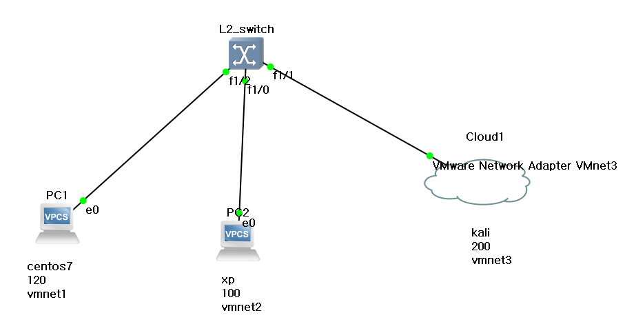
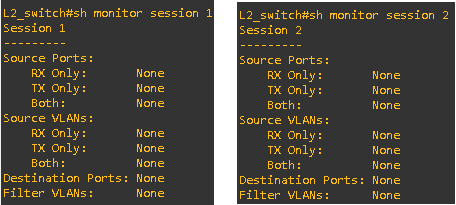
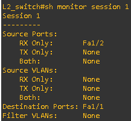
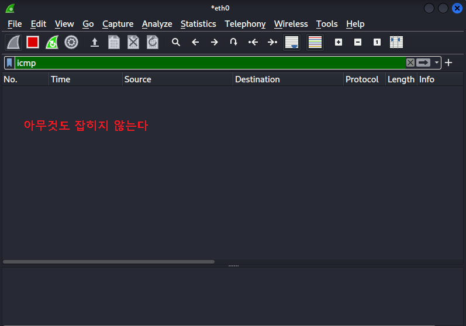
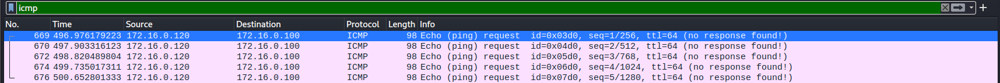

## 포트 미러링

- SPAN(Switch Port ANalyzer)
  - Cisco Catalyst 스위치에서 사용되는 Port Mirroring 기술
  - SPAN을 위한 소스 Port와 목적지 Port 쌍을 모니터 세션(monitor session)이라고 함  소스 Port 는 다중 설정 가능  목적지 Port 는 하나만 설정 가능  하나의 스위치에서 설정할 수 있는 모니터 세션은 2개까지 지원 됨
  - 모니터링 방식  Port Monitoring, VLAN Monitoring, ...
  - 미러링하고자 하는 트래픽의 방향 지정 가능  RX : 수신 트래픽만 미러링  TX : 송신 트래픽만 미러링  Both : 송수신 트래픽 모두 미러링(기본 값)

- SPAN 종류
  - Local SPAN : 소스 SPAN 포트와 목적지 SPAN 포트가 동일한 스위치에 있을 경우
  - RSPAN(Remote SPAN) : 소스 SPAN 포트와 목적지 SPAN 포트가 서로 다른 스위치에 있을 경우

- SPAN 실습

  - 실습 네트워크 구성

  - SPAN 설정(소스 : VPC1,2 / 목적지 : kail linux)

  - kali linux 에서 Wireshark 로 패킷 모니터링

  - 트래픽 방향 RX, TX, BoTh 번갈아 해보며 모니터링

    



- 통신 확인

  ```
  PC 확인
  PC1> ip 172.16.0.110 255.255.255.0
  Checking for duplicate address...
  save
  PC1 : 172.16.0.110 255.255.255.0
  
  PC1> save
  Saving startup configuration to startup.vpc
  .  done
  
  PC2> ip 172.16.0.120 255.255.255.0
  Checking for duplicate address...
  save
  PC1 : 172.16.0.120 255.255.255.0
  
  PC2> save
  Saving startup configuration to startup.vpc
  .  done
  
  통신 확인
  PC1> ping 172.16.0.120
  84 bytes from 172.16.0.120 icmp_seq=1 ttl=64 time=0.764 ms
  
  PC1> ping 172.16.0.200
  84 bytes from 172.16.0.200 icmp_seq=1 ttl=64 time=0.893 ms
  ```

- span 구성

  - L2_switch

    ```
    L2_switch#sh monitor session 1
    L2_switch#sh monitor session 2
    ```

    

  - span 설정

    ```
    *f1/2 로 receive 되는 패킷만 미러링
    
    L2_switch(config)#monitor session 1 source interface fastEthernet 1/2 rx
    
    *미러링된 프레임을 f1/1 으로 전달할것 
    
    L2_switch(config)#monitor session 1 destination interface fastEthernet 1/1
    
    * span 설정 다시 확인
    
    L2_switch#sh monitor session 1
    ```

    

  - 와이어샤크 확인

    ```
    *설정 전
    ping
    vpc1 -> vpc 2
    ping 172.16.0.100
    
    ping
    vpc2 -> vpc1
    ping 172.16.0.120
    ```

    

    ```
    *설정 후
    ping
    vpc1 -> vpc 2
    ping 172.16.0.100
    
    ping
    vpc2 -> vpc1
    ping 172.16.0.120
    ```

    > kali linux에서 확인

    

    

    

