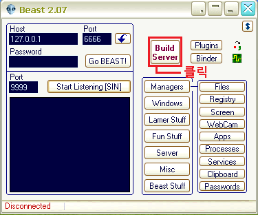
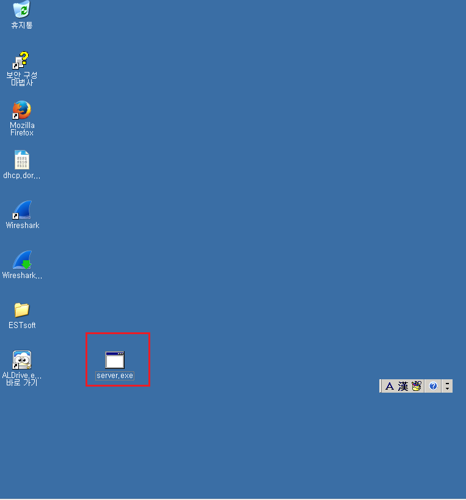
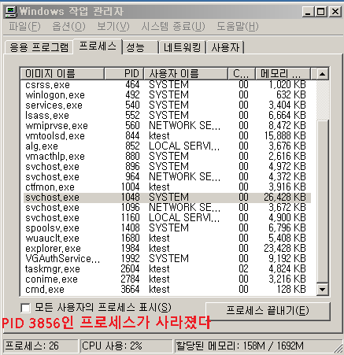

## Direct - backdoor

- 구성도

  - beast를 이용한 실습 환경구성

    

  -  Listen port 확인 후 Save Server

    

  - 바탕화면에 server.exe 생성 확인

    

  - 공유 폴더를 이용하여 공격대상에게 옮긴다

    

    

  - 공격대상에서 server.exe 실행

    

    > 실행후 작업관리자에서 svchost.exe가 실행된것을 확인

- 상대 컴퓨터에 디렉터리 생성하기

  - 공격자로 backdoor 접근

    

  - 공격대상 컴퓨터 드라이브 내용 보기

    > Managers -> Files

    

  - C 드라이브 찾기

    

    

  - 폴더 생성후 공격대상자에서 확인

    

    

    

- 상대 컴퓨터 화면 보기

  - Managers -> Screen

    

  - start

    

  - plugin 전부 체크하고 업로드 하고 재시작

    

  - 화면 확인

    

- 상대 컴퓨터 클립보드 복사

  - 공격대상에서 메모장에 텍스트 복사

    

  - Managers -> clipboard

    

  - 복사한 내용 확인

    

- 상대 컴퓨터 기능 제한

  - Lamer stuff

    

  - Lock Mouse

    

- 대상자에 불편함을 주거나 장난

  - fun stuff

    

  - 대상자에게 chat 하기

    

    

  - 대상자에서 확인

    

- 에러 형태 메세지 보내기

  - Misc

    

  - 원하는 아이콘을 선택하고 send 누르기

    

  - 대상자에서 확인

    

- 입력하는 키보드 정보를 기록하고 빼기

  - keylogger

    

  - get log

    

    

  - 기록할 파일 생성

    

    

  - 내용 확인

    

- 실시간 log 확인

  - Live Keys

    

    

- 블루스크린 공격

  - crash

    

  - 대상자에서 확인

    

##  Reverse - backdoor

- 구성도

- 환경 구성

  - reverse connection

    

    

  - notifications 에서 주소 설정 후 저장

    

  - 공유 폴더를 통해 r_server.exe 옮기기

    

  - 포트 번호 확인 및 스타트

    

  - 대상자에서 r_server.exe 실행후 확인

    

  - 아이콘 더블 클릭하여 연결

    

## Trojan Horse

- 구성도

- 실습

  - beast -> binder

    

  - add file

    

  - Bind Files

    

    

    

  - start Listening

    

  - 신너구리 실행

    

  - 연결확인

    

    

  - netstat

    ```
    netstat -an
    ```

    

## Rootkit

- 작업관리자에서 백도어를 보이지 않게 숨겨준다

- 공격대상자에서 작업관리자 실행

  - 보기 -> 열선택 -> PID 체크

  

  

  

- rootkit 을  c 드라이브에 압축 해제 후 cmd로 실행

  ```
  >cd c:\FU_Rootkit
  >cd EXE
  ```

  

  ```
  >fu -ph 3856
  ```

  

## injection 

- No Injection : 악성코드를  실행 파일(exe)로 생성 > 찾기가 쉬움

  > ex) 신너구리.exe (너구리.exe + r_server.exe) -> svchost.exe

- Injection : 다른프로그램의 부속모듈로 위장 실행 모듈(dll)로 생성되어 Target Process로 Injection 수행(프로세스 은닉)

  > ex) 신신너구리.exe  (너구리.exe + r_server_2.exe) ->

- 설정

  - beast 실행

  - build server -> Basic -> Reverse Connection, injection in notepad.exe 

    

    

  - Notifications ->  Get IP -> Save Server

    

  - 

  

  