## PAM

- Linux 인증 모듈 PAM(Pluggable Authentication Modules)

  - 응용 프로그램에서 사용자 인증을 수행할 수 있게 공통적인 인증 방법을 제공하는 인증 모듈

  - 인증 모듈의 교체 및 추가/삭제가 용이

  - 개발자가 작성한 코드에 의한 인증이 아닌 시스템 관리자가 직접 응용프로그램의 인증 동작을 제어

    > 응용 프로그램(서비스)에서 PAM을 호출하여 인증 처리 요청

    >  응용 프로그램 개발자가 사용자 인증에 신경 쓰지 않아도 되고, 시스템 관리자가 직접 응용 프로그램의 인증 동작을 세밀하게 제어 가능

  - 다양한 인증 모듈을 호출하여 사용자 인증 과정을 수행 후 모듈 결과에 맞는 행동을 함

  - 모듈의 종류가 다양하며 인증 절차에 확실한 개념이 필요

  - 라이브러리 형태로 구동(windows 응용 프로그램의 DLL과 같은 라이브러리)

  - 악의적으로 이용할 경우 인증 설정 파일을 이용하여 인증을 수행하지 않고 계정에 접근이 가능

- PAM 동작 원리

  - 프로그램에서 사용자 인증 필요 시 PAM 라이브러리 함수 호출 

  - PAM 호출 시 호출한 응용프로그램의 인증 설정 파일 검사 

    > 설정 파일이 존재하지 않을 경우 기본 설정 파일(other) 사용

    > 설정 파일은 사용자 인증을 검사하기 위해 필요한 유형을 가지며 이를 기초로 적절한 모듈 호출

    > 구문에 맞는 인증 모듈을 통해 여러 가지 검사 수행

  - 모듈의 인증 결과에 의해 결과 메시지가 결정되어 응용프로그램에 전달

- PAM 인증 절차

  1) 사용자가 서비스를 이용 받기 위해 접근

     > PAM 의 영향을 받는 서비의 목록

     ```
     -- 해당 목록에 없으면 PAM 의 영향을 받지 않는다 
     
     # cd /etc/pam.d
     [root@localhost pam.d]# ls
     ```

     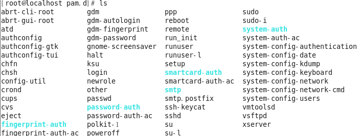

  2. 프로세스(로컬, 데몬)은 PAM에 인증 요청

  3. PAM은 개별 서비스 인증을 수행하기 위해 요청한 /etc/pam.d 하위에서 요청한 프로세스 이름에 해당하는 설정 파일 검사 

     ```
     -- su 를 사용할때 인증 요청 아래파일을 참조에하여 인증을 진행 
     
     # vim /etc/pam.d/su
     ```

     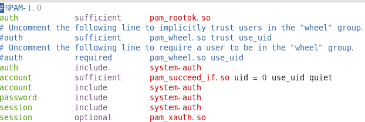

     ```
     -- 비슷한 다른파일도 확인 : 비슷하다
     
     # vim /etc/pam.d/sshd
     ```

     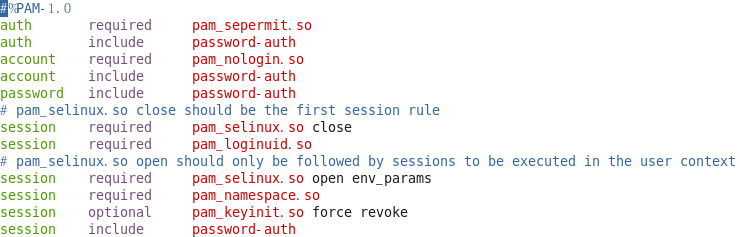

     ```
     -- 인증 관련 모듈 저장
     
     [root@localhost pam.d]# ls /lib64/security/
     ```

     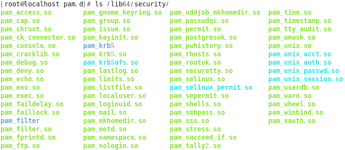

  4. 설정 파일의 구문에 의해 PAM 라이브러리 호출 및 결과 메시지 생성 후 프로세스에 반환

     ```
     /etc/pam.d/~ 의 파일에 구성된 순서대로 인증을 진행하고 결과를 프로세스에 성공/실패로 반환한다 
     ```

  5. 프로세스는 반환된 결과에 의해 적절한 행동 수행

     ```
     [ktest@localhost ~]$ su - test01
     암호:
     su: incorrect password=
     ```

## 실습

- pam_permit.so

  - 모듈 설명

    > 인증 결과 무조건 성

    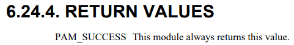

  - 모듈 적용방식

    ```
    [root@localhost ~]# vim /etc/pam.d/su
    ```

    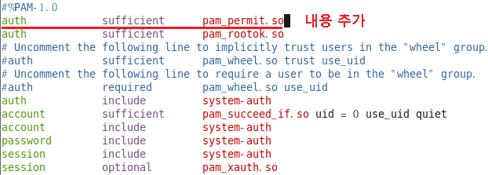

  

  - 확인 (모듈 적용전)

    > root 제외하고 원래 일반사용자는 su 사용시 root(수퍼유저) 비번 입력

    ```
    [ktest@localhost ~]$ su - root
    ```

    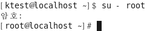

  - 확인(모듈 적용 후)

    ```
    [ktest@localhost ~]$ su - root
    ```

    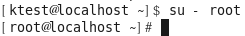

- pam_deny.so

  - 모듈 설명

    > 무조건 인증 거부

    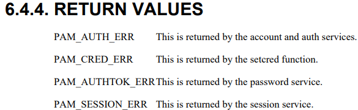

  - 모듈 적용 방식(requisite)

    ```
    [root@localhost ~]# vim /etc/pam.d/su
    ```

    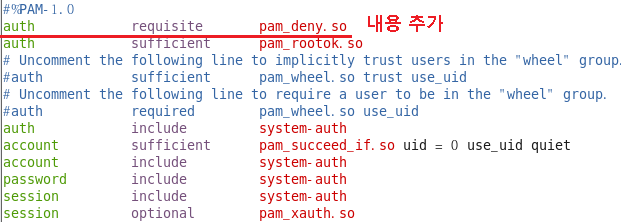

  - 확인

    ```
    [root@localhost 바탕화면]# su - ktest
    ```

    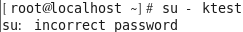

  - 모듈 적용 방식(required)

    ```
    [root@localhost ~]# vim /etc/pam.d/su
    ```

    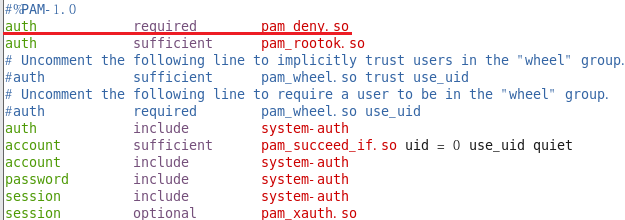

  - 확인

    ```
    [ktest@localhost ~]$ su - test01
    ```

    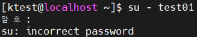

  - requisite와 required 차이점

    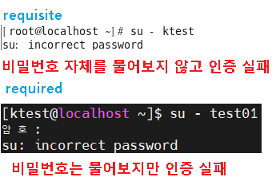

- pam_rootok.so

  - 모듈 설명

    > root 인 경우 모듈성공

    > root 가 아닌 경우 인증 실패

    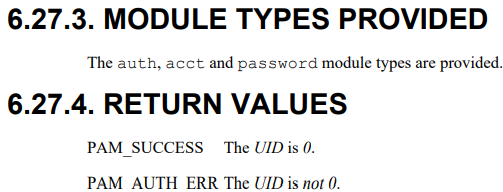

  - 모듈 적용 방식(sufficient)

    ```
    [root@localhost ~]# vim /etc/pam.d/su
    ```

    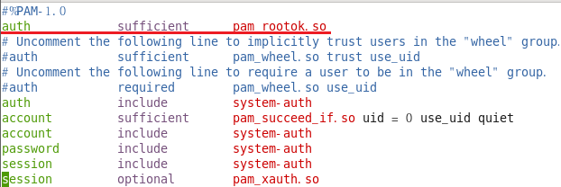

    -1666175149776-38.png)

  - 모듈 적용 방식(required)

    ```
    [root@localhost ~]# vim /etc/pam.d/su
    ```

    

  - 확인

    ```
    [root@localhost 바탕화면]# su - ktest
    ```

    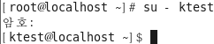

    > required 이기 때문에 root 계정이어도 아래 조건들을 확인 하기때문에 비밀번호를 물어본다

    ```
    [ktest@localhost ~]$ su - root
    ```

    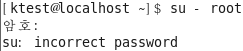

    > root 계정이 아니기 때문에 아래 조건들이 맞아도 인증 실패한다

- pam_wheel.so

  - 모듈 설명

    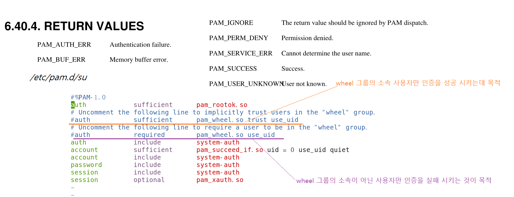

  - 모듈 적용 방식(sufficient)

    ```
    [root@localhost ~]# vim /etc/pam.d/su
    ```

    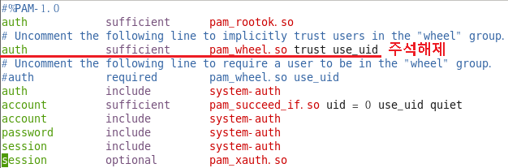

  - 확인

    ```
    사용자    소속그룹
    ktest     ktest
    test02    wheel
    
    test02 사용자를 새로 생성하면서 소속그룹을 wheel 그룹으로 지정 
    
    [root@localhost pam.d]# useradd test02 -g wheel
    [root@localhost pam.d]# grep test02 /etc/passwd
    [root@localhost pam.d]# grep ktest /etc/passwd
    ```

    

    ```
    --pam_wheel.so 에 모듈실패(sufficient) , 비밀번호 맞으면 su 서비스 성공 
    
    [ktest@localhost ~]$ su - root
    ```

    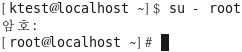

    ```
    --pam_wheel.so 에 모듈성공
    
    [test02@localhost ~]$ su - root
    ```

    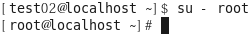

  - 모듈 적용 방식(required)

    ```
    [root@localhost ~]# vim /etc/pam.d/su
    ```

    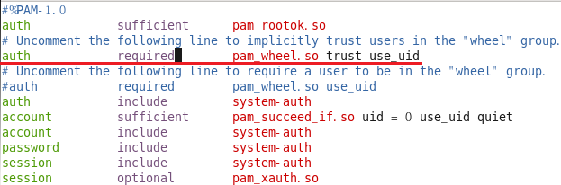

  - 확인

    ```
    --pam_wheel.so 에 모듈실패(required) , 비밀번호 맞아도 su 서비스 실패
    
    [ktest@localhost ~]$ su - root
    ```

    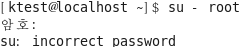

    ```
    --pam_wheel.so 에 모듈성공(required)  비밀번호 입력까지 해야 su 서비스 성공 
    
    [test02@localhost ~]$ su - root
    ```

    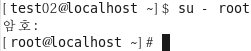

- pam_succeed_if.so

  - 모듈은 모든 타입에서 사용 가능

  - 모듈의 인자로 조건을 설정하며, 조건이 참일 경우 성공을 반환

  - ex) auth        sufficient        user = evernick use_uid quiet

    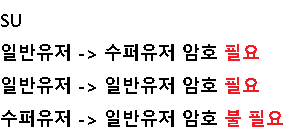

  - 모듈 적용 방식(sufficient)

    ```
    [root@localhost ~]# vim /etc/pam.d/su
    ```

    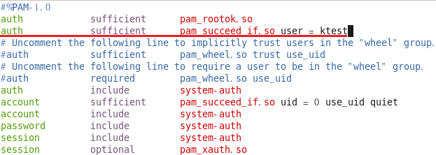

  - 확인

    
    
    ```
    test01 
    ```

    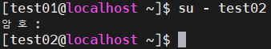

    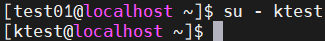

    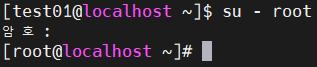
    
    ```
    test02
    ```

    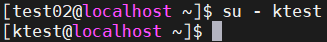

    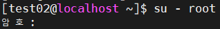

    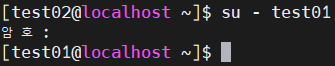
    
  - pam 사용에 대한 기록은 /var/log/secure 에 저장
  
    ```
    # grep pam /var/log/secure
    ```
  
    
  
  - 모둘 적용 방식(required)
  
    ```
    [root@localhost ~]# vim /etc/pam.d/su
    ```
  
    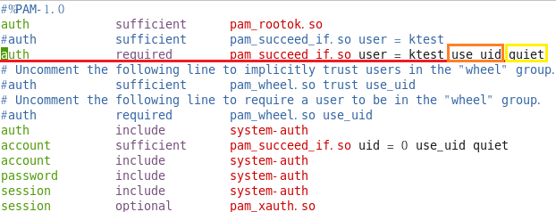
  
    > *use_uid: (사용자의 ID) 로그인한 사용자 ktest  인경우만 적용*
    >
    > *quiet :  /var/log/secure에  log 남기지 말것* 
  
  - 확인
  
    ```
    -- su 대상 ktest
    
    [test01@localhost ~]$ su - root
    ```
  
    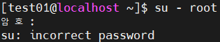
  
    ```
    [test01@localhost ~]$ su - ktest
    ```
  
    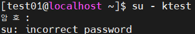
  
    ```
    -- su 를 시도 하는 사용자가 ktest
    
    [ktest@localhost ~]$ su - root
    ```
  
    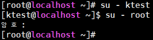
  
    ```
    [ktest@localhost ~]$ su - test02
    ```
  
    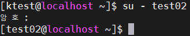

- pam_access.so

  - 모듈은 모든 type에서 사용 가능

  - 사용자 계정 및 위치(호스트, 도메인) 등을 이용하여 접근 제어 

  - ex) account required pam_account.so

  - 로그인 접근 제어 테이블의 내용을 참조

  - Login Access Control Table : /etc/security/access.conf

  - 실습 구성도

    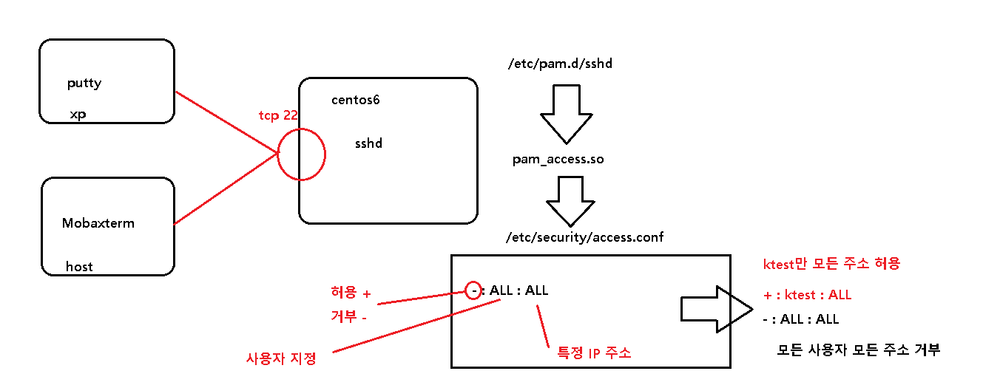

  - 모듈 적용 방식

    ```
    [root@localhost pam.d]# vim /etc/pam.d/sshd
    ```

    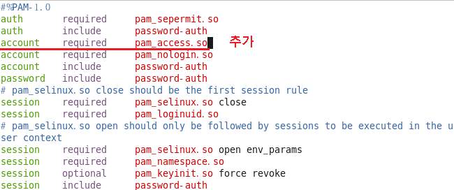

  - 추가 설정

    ```
    [root@localhost pam.d]# vim /etc/security/access.conf
    ```

    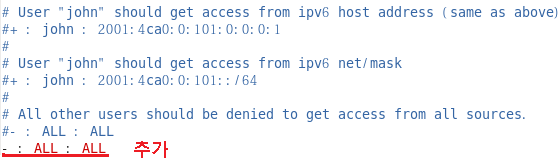

  - 확인

    ```
    host]mobaxterm
    ```

    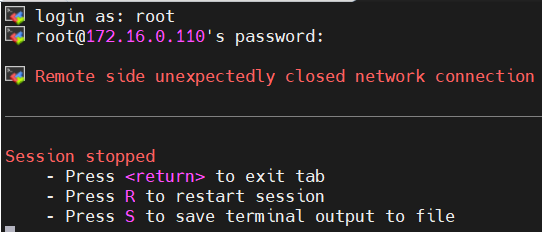

    ```
    xp]putty
    ```

    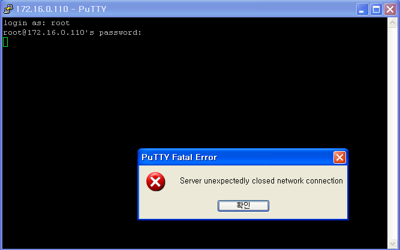

  - 추가 설정 ( ktest만 허용)

    ```
    [root@localhost pam.d]# vim /etc/security/access.conf
    ```

    

  - 확인

    ```
    host] mobaxterm -> root로 접속
    ```

    

    ```
    host] mobaxterm -> ktest로 접속
    ```

    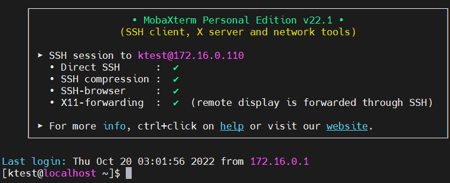

    ```
    xp]putty -> root로 접속
    ```

    

    ```
    xp]putty -> ktest로 접속
    ```

    

  - 추가설정 (ktest 는 XP에서만 접속 가능)

    ```
    [root@localhost pam.d]# vim /etc/security/access.conf
    ```

    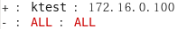

  - 확인

    ```
    host] mobaxterm -> ktest로 접속
    ```

    

    ```
    xp]putty -> ktest로 접속
    ```

    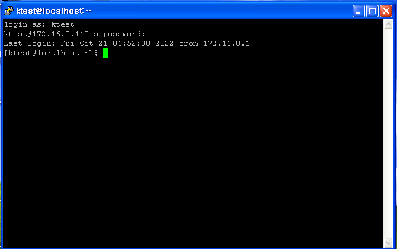

- pam_time.so

  - 모듈은 account type에서만 사용 가능

  - 로그인할 위치 및 시간을 지정하여 시간에 따라 로그인을 제어

  - ex) account required pam_time.so

  - 설정 파일 : /etc/security/time.conf

    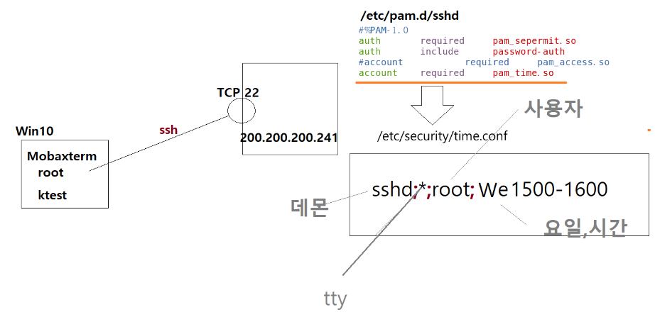

  - 모듈 적용 방식

    ```
    [root@localhost pam.d]# vim /etc/pam.d/sshd
    ```

    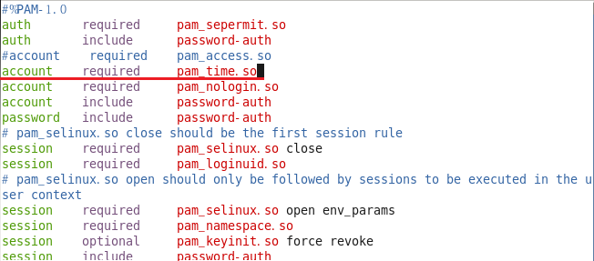

  - 추가설정

    ```
    [root@localhost pam.d]# vim /etc/security/time.conf
    ```

    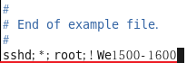

  - 확인

    ```
    ssh root 접근 확인
    ```

    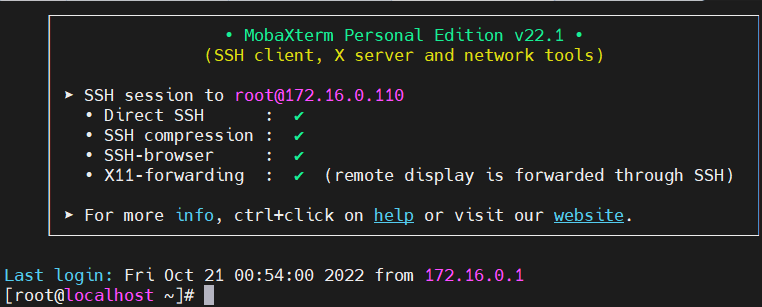

    ```
    ssh ktest 접근 확인
    ```

    

  - 날짜변경후 다시 확인

    ```
    [root@localhost pam.d]# date -s "2022-10-26 15:30"
    ```

    

    ```
    ssh root 접근 확인
    ```

    

    ```
    ssh ktest 접근 확인
    ```

    

- pam_listfile.so

  - 모듈은 모든 타입에서 사용 가능

  - 지정한 경로에 있는 파일(file)의 주체(item)가 존재하는지 유무에 따른 행동(sense) 반환

  - 파일에 존재하는 계정만 성공 반환(접근 허용) 시(white list) 

    > auth required pam_listfile.so item=user sense=allow file=/etc/white_list onerr=fail

  - 파일에 존재하는 계정만 실패 반환(접근 거부) 시(black list)

    > auth required pam_listfile.so item=user sense=deny file=/etc/balck_list onerr=succeed

    

  - 모듈 적용 (white list)

    ```
    [root@localhost pam.d]# vim /etc/pam.d/sshd
    ```

    

    > 사용자 허용 /etc/white_list /etc/white_list 파일 없으면 실

  - 추가 설정

    ```
    [root@localhost pam.d]# vi /etc/white_list
    ```

    

  - 확인

    ```
    ssh
    host]Mobaxterm -> ktest 접속
    ```

    

    ```
    ssh
    host]Mobaxterm -> root 접속
    ```

    

    ```
    ssh
    host]Mobaxterm -> test01 접속
    ```

    

  - 추가설정 ( white_list 파일이 없다면)

    ```
    [root@localhost pam.d]# mv /etc/white_list /etc/white_list.bak
    ```

    

    

  - 모듈 적용(black list)

    ```
    [root@localhost pam.d]# vim /etc/pam.d/sshd
    ```

    

  - 추가 설정

    ```
    [root@localhost pam.d]# vi /etc/black_list
    ```

    

  - 확인

    ```
    ssh
    host]Mobaxterm -> root 접속
    ```

    

    ```
    ssh
    host]Mobaxterm -> ktest 접속
    ```

    

- pam_unix.so

  - 모듈은 모든 타입에서 사용 가능

  - 패스워드를 확인하거나 변경되는데 사용 되며, /etc/passwd , /etc/shadow 파일 참조 - 타입에 따른 행동

    > auth type : 사용자가 입력한 암호를 확인

    > account type : (암호 설정에 따른) 암호를 변경해야 하는지 확인하며 변경 시점인 경우 변경 시 까지 접근 거부

    > password : 사용자 암호 변경 수행(try_first_pass 옵션이 유용하며, nullok 옵션 시 암호 공백 사용 가 능)

    > sessions : 계정 로그인에 대한 정보를 시스템에 알림

  - 로그인 인증을 수행하는 대부분의 서비스에 공통 설정 파일에 기본 호출(system-auth, password-auth)

  - 사용자가 암호를 변경하는 방법 : passwd

    ```
    [root@localhost pam.d]# vim /etc/pam.d/passwd
    ```

    

    ```
    [root@localhost pam.d]# vim /etc/pam.d/system-auth
    ```

    

  - 이전 암호 저장해 놓은 파일

    ```
    [root@localhost pam.d]# cat /etc/security/opasswd
    
    현재는 내용이 없다
    
    비밀번호 3번정도 변경후 다시 확인
    ```

    

- pam_cracklib.so

  - 모듈은 password 타입에서만 사용 가능

  - 사용자 암호 정책을 확인

    > 입력받은 암호를 /etc/lib64/cracklib_dict에 있는 사전 정보와 비교

    > 새로운 암호를 /etc/security/opasswd에 저장되어 있는 이 전 암호 목록과 비교

  - 시스템 보안 차원에서 패스워드 글자 수를 제한할 수 있음

  - 비밀번호 사전

    ```
    비밀 번호 변경 할 때
    
    [ktest@localhost ~]$ passwd
    ktest 사용자의 비밀 번호 변경 중
    ktest에 대한 암호 변경 중
    (현재) UNIX 암호:
    새  암호:test7575
    잘못된 암호: 사전에 있는 단어를 기반으로 합니다
    
    사전에 있는 단어를 어디서?
    /usr/lib64/cracklib_dict.pwi
    /usr/lib64/cracklib_dict.hwm
    /usr/lib64/cracklib_dict.pwd
    ```

  - 비밀번호 변경 횟수 제한

    ```
    [root@localhost pam.d]# vim /etc/pam.d/passwd
    ```

    

    ```
    [root@localhost pam.d]# vim /etc/pam.d/system-auth
    ```

    

    

  - 비밀번호 길이, 포함된 문자, 숫자...

    ```
    minlen : 암호 최소 길이
    dcredit : 암호 숫자 필요 (-1 : 무조건 하나 포함 , 기타숫자는 필요한 갯수) 
    ucredit : 암호 영문 대문자 필요 (-1 : 무조건 하나 포함 , 기타숫자는 필요한 갯수) 
    lcredit : 암호 영문 소문자 필요 (-1 : 무조건 하나 포함 , 기타숫자는 필요한 갯수) 
    ocredit : 암호 특수문자 필요    (-1 : 무조건 하나 포함 , 기타숫자는 필요한 갯수) 
    ```

    ```
    -- passwd 명령어로 test 사용자가 암호 변경시 복잡도 설정
    # vim /etc/pam.d/system-auth
    ```

    

    ```
    변경시도
    
    8글자로 변경
    tkdrb113 (숫자 합친거) 비밀번호 변경 됨
    rladudwo          비밀번호 변경 안됨
    
    9글자로 변경
    rladudwo          비밀번호 변경 안됨
    
    minlen=10
    
    credit : 암호 최소화 길이를 결정하는 요소
    d,u,l,o 
    
    소문자로만 이루어졌다 credit 1이 감소
    minlen=10 - lcredit 1 = 9글자
    rladudwo 	(X) 
    rladudwos  	(O)
    
    소문자,숫자 	      credit 2가 감소
    minlen=10 - lcredit 1,dcredit1 = 8글자
    
    
    소문자,숫자,대문자,특수문자  credit 4 감소
    minlen=10 - lcredit 1,dcredit 1,ocredit 1, ucredit 1 = 6글자
    
    ku@A2  (X)
    equ@A2 (O)
    ```

    ```
    credit 추가
    credit -1 들어간다는 것은 의무적으로 포함 되어야 한다
    ```

    

    ```
    숫자로만 비밀번호 입력시
    903190339
    ```

    

    ```
    dcredit=-1 ucredit=-1 ocredit=-1 : 최소 9글자(3credit) 에  숫자,대문자,특수문자 필수
    ```

    

    ```
    최소 10글자 대/소/숫/특 
    6 
    dcredit -1 이 붙으면 무조검 표기 해야하는 의무가 +1 -1 
    ocredit -1 이 붙으면 무조검 표기 해야하는 의무가 +1 -1 
    ucredit -1 이 붙으면 무조검 표기 해야하는 의무가 +1 -1
    
    Gu@aolyt1
    
    최소길이 -(대,소,특,숫)-(대,특,숫)=
    
    10-(+1)-(+1)-(+1)-(+1)-(-1)-(-1)-(-1)=9
    ```


- pam_motd

  - 모듈은 session type에서만 사용 가능

  - motd 파일의 내용을 출력 (message of the day)

  - ex) session optional pam_motd.so motd=/etc/motd

  - 로그인 하는 사용자에게 터미널 접근시 보여주는 메시지

  - banner

  - 모듈설정 

    > telnet server service 설정

    ```
    telnet-server 에서 테스트
    
    CentOS 6]
    텔넷 서버 설치 
    # yum -y install telnet-server
    
    설정파일 수정
    # vim /etc/xinetd.d/telnet
    ```

    

    ```
    telnet 서비스를 제어하는 수퍼데몬 재시작 
    
    [root@localhost 바탕화면]# service xinetd restart
    ```

  - 서비스 확인

    ```
    [root@localhost 바탕화면]# vim/etc/motd 
    ```

    

    ```
    텔넷 접속
    
    host]mobaxterm
    ```

    

  - 모듈 설정

    ```
    설정에 필요한 motd file 생성
    
    [root@localhost 바탕화면]# vim /etc/motd2
    ```

    

    ```
    [root@localhost 바탕화면]# vim /etc/pam.d/login
    ```

    

    > optional : 해당 모듈은 서비스 성공/실패 와 관련이 없을때 , 성공/실패 메시지 무시

    

  - 테스트

    ```
    telnet
    host]mobaxterm
    ```

    

    ```
    CentOS6:GUI]
    tui 모드로 변경 
    [root@localhost 바탕화면]# init 3
    ```

    

    ```
    CentOS6:GUI]
    gui 모드로 변경 
    [root@localhost 바탕화면]# init 5
    
    로그인시 나오지 않음
    
    gui 로그인 담당
    
    /etc/pam.d/gdm-password
    /etc/pam.d/gdm
    
    [root@localhost 바탕화면]# vim/etc/pam.d/gdm-password
    ```

    

    ```
    [root@localhost 바탕화면]# vim//etc/pam.d/gdm
    ```

    

    ```
    재로그인 후 확인
    
    ```

  -1666337823166-14.png)

- PAM 설정 실습

  - root는 콘솔, 원격 서비스를 이용하여 로그인 할 수 없음(root에 대한 직접적인 접근은 무조건 차단)

    ```
    root 를 이용한 모든 접근을 차단 
    
    /etc/pam.d/login         CLI(콘솔) 접근 (run-level : init 3)
    /etc/pam.d/gdm-password  GUI 접근       (run-level : init 5)
    /etc/pam.d/sshd          sshd  접근
    
    root 가 아닌경우 모두 모듈 성공 
    auth required pam_succeed_if.so user != root 
    ```

    

    

    

### PAM 을 이용한  google OTP

- OTP

  - 1회용 비밀번호

  - 하드웨어 / 소프트웨어

  - 정해진 암호가 아닌 특정 알고리즘에 의해 수시로 생성되는 비밀번호

  - 많이 사용하는 방식은  시간동기화

    > 임의의 비밀번호를 생성하기위해선 랜덤하게 적용할 값

    > 주로 현재 시간이 주 요소 됨

    > 시간문제 때문에 인증이 안되는경우가 있어 OTP 생성시 간격을 1~2분 여유

- google OTP 어플 >  스마트폰 다운로드

  .png)

- 2 Factor 인증

  - google-autheticator + 일반 비밀번호

  - 환경 설정

    ```
    --SELINUX 체크 
    
    [root@localhost ~]# sestatus
    ```

    

    ```
    구글인증모듈 설치
    
    [root@localhost ~]# yum -y install google-authenticator
    ```

    

    > 설치가 안되기 때문에 따로 repository를 설치해야한다

    ```
    epel repository 를 설치
    
    [root@localhost ~]# ls /etc/yum.repos.d/
    ```

    

    ```
    [root@localhost ~]# yum -y install epel-release
    ```

    

    ```
    구글인증모듈 다시 설치
    
    [root@localhost ~]# yum -y install google-authenticator
    ```

    

    

    ```
    sshd 서비스에 구글인증모듈 추가
    
    [root@localhost ~]# vim /etc/pam.d/sshd
    ```

    

    ```
    sshd 설정 파일 수정
    
    [root@localhost ~]# vim /etc/ssh/sshd_config
    ```

    

    ```
    sshd 서비스 재시작 
    
    [root@localhost ~]# systemctl restart sshd
    ```

  - 인증 설정

    ```
    [root@localhost ~]# google-authenticator
    
    Do you want authentication tokens to be time-based (y/n)y
    
    어플실행하여 QR코드 스캔 >  계정이 추가됨 메시지
    ```

    .png)

    

    

    

    ```
    -- 관련 정보 업데이트 
    Do you want me to update your "/root/.google_authenticator" file? (y/n)y
    
    
    -- 중간자 공격 방지를 위해 30초에 한번 로그인 제한
    Do you want to disallow multiple uses of the same authentication
    token? This restricts you to one login about every 30s, but it increases
    your chances to notice or even prevent man-in-the-middle attacks (y/n)
    
    By default, a new token is generated every 30 seconds by the mobile app.
    In order to compensate for possible time-skew between the client and the server,
    we allow an extra token before and after the current time. This allows for a
    time skew of up to 30 seconds between authentication server and client. If you
    experience problems with poor time synchronization, you can increase the window
    from its default size of 3 permitted codes (one previous code, the current
    code, the next code) to 17 permitted codes (the 8 previous codes, the current
    code, and the 8 next codes). This will permit for a time skew of up to 4 minutes
    between client and server.
    Do you want to do so? (y/n) y
    
    매 30초 마다 3번 허용 
    If the computer that you are logging into isn't hardened against brute-force
    login attempts, you can enable rate-limiting for the authentication module.
    By default, this limits attackers to no more than 3 login attempts every 30s.
    Do you want to enable rate-limiting? (y/n) y
    ```

    ```
    시간 동기화
    # rdate -s time.bora.net
    
    서비스 재시작
    # systemctl restart sshd
    ```

  - 테스트

    ```
    ssh
    host]mobaxterm
    ```

    

### admin group 의 구성원만 su 를 사용하여 바로 root 로 전환

- 모듈 설정

  ```
  [root@localhost ~]# vim /etc/pam.d/su
  ```

  

- 그룹에 사용자 추가

  ```
  test01 사용자의 2차 그룹을 admin으로 설정
  
  [root@localhost 바탕화면]# groupadd admin
  [root@localhost 바탕화면]# usermod test01 -G admin
  [root@localhost 바탕화면]# grep test01 /etc/group
  ```

  

- test01,test02 su 비교 테스트

  ```
  [test01@localhost ~]$ su - root
  ```

  

  > 비밀번호 입력을 안해도 로그인 가능

  ```
  [test02@localhost ~]$ su - root
  ```

  

  > 비밀번호 입력을 해야 로그인 가능
