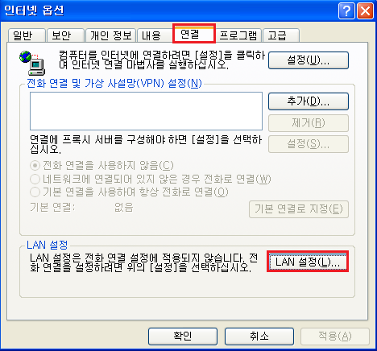
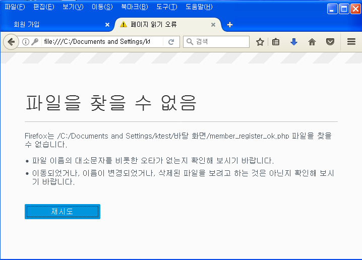
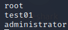

## Web Service

- 초기 WEB Service
  - 정적인 서비스 제공

  - WEB 서비스로 제공되는 모든 데이터가 서버에 존재함

    > 사용자 구분이 필요 없음 → 인증 필요 없음

  - 공격 형태

    > main page 변조

    > 서버의 정보를 네트워크로 불법 공유 → 와레즈(warez) 사이트

- 현재 WEB Service
  - 동적인 서비스 제공 → WAS(Web Application Server)

  - 사용자가 직접 웹 데이터를 생성/전달 할 수 있음(사용자 등록, 로그인, 금융거래 ...)

    > WEB Server에 보관된 데이터의 중요성이 높아짐

    > 사용자 구분이 필요 함 → 익명인증, Form Based 인증, Session 인증 ...

  - 공격 형태

    > WAS, DB의 취약점을 활용하여 서버에 저장된 개인 사용자의 정보를 동의 없이 탈취, 사용자의 권한을 도용, Server의 기능을 도용하는 형태의 공격으로 발전 함

- 현재 WEB Hacking 발생의 최대 취약점
  - 클라이언트 측에서 임의의 입력 값을 서버에 전달 할 수 있음

## Web Hacking

#### 모의해킹 단계 

- 계획 수립 및 도구 선택(정보 수집)
  - 침투 테스트 단계 및 일정, 진행 인원, 시기 ...
  - 침투 테스트에 사용할 도구(WEB Scanner, WEB Proxy ...) 선택


- Information Gathering(정보 수집)
  - 침투 대상에 관련된 간접, 직접적인 정보 수집
  - 침투 대상의 웹 로직 분석 및 MAP 작성

- 취약점 분석
  - 체크리스트 수립 및 수집된 정보를 바탕으로 발생 가능한 위협 분석
  - Injection Vector(공격 가능 위치) 분석

- 취약점 진단
  - 분석된 취약점에 대해 실제 모의 공격을 수행하여 취약도 확인

- 보안 대책 수립 및 실행
  - 진단 결과 취약점 발생의 원인 파악 및 피해범위 산정
  - 보안 대책 수립 및 실행 → Secure coding 및 WAF(Web Application Firewall) 도입 ...

- 재 진단
  - 보안 구축 후 진단된 취약점이 해결되었는지 확인

- 보고서 작성

#### 테스트 환경 구성

- 구성도

  

## WebProxy

- WEB Proxy
  - WEB 클라이언트와 서버의 통신을 중계하는 프로그램

  - 중간에서 통신을 중계하기 위해 HTTP 데이터를 De-Encapsulation해서 Re-Encapsulation하여 전달 함

    > 중계하는 과정에서 HTTP 헤더 및 데이터를 변조할 수 있음

  - 공격에 필요한 WEB 데이터를 생성하거나 변조하기 위한 목적으로 사용 됨

  - Interrupt 기능을 통해 포워딩 할 시기를 결정할 수 있음

- WEB Proxy Tool
  - 기본적인 Proxy기능과 침투 테스트를 위해 필요한 추가 기능(Spidering, Scanning, Encoding/Decoding)이내장되어 있음
  - Burp Suite, Paros, Achilles, Web Scarab, Fiddler ...

- JRE(Java Runtime Environment)
  - Burp Suite, Paros 등의 WEB Proxy는 JAVA 기반으로 동작 → JRE 다운로드

  - Oracle 홈페이지에서 JRE 다운로드

    > http://www.oracle.com/technetwork/indexes/downloads/index.html?ssSourceSiteId=ocomen

.png)

#### IE(Internet Explorer)

- 프록시 설정

  ```
  인터넷 옵션(도구) → 연결 탭 → LAN 설정 → 프록시 서버 사용 체크(주소 : 127.0.0.1, 포트 : 8080)
  ```

  

  

  

- 주의

  - 동시에 프록시 프로그램을 여러 개 구동하면 안됨

  - 프록시 설정이 되어있는 경우 프록시 프로그램이 동작하지 않으면 통신이 진행되지 않음

- 웹서버 접속 시도

  > 실패

  

- 파로스 실행후 웹서버 접속 시도

  

  

#### Fire Fox

- 프록시 설정

  ```
  도구 -> 설정 -> 고급 -> 네트워크 -> 연결 -> 설정
  ```

  

  

  

- 웹서버 접속 시도

  

- 파로스 실행후 웹서버 접속 시도

  

  

## 정보수집

#### 수동적 정보수집

- Foot Printing

  - 침투 대상에 직접 적으로 접근하지 않아도 수집 가능한 정보를 획득 함

  - Open Source 정보(OSINT) 수집

    > OWASP, WASC, Netcraft, Achive, Whois ...

- OWASP(The Open WEB Application Security Project)
  - 전 세계 웹 어플리케이션 보안을 위한 프로젝트

  - 웹에 관한 정보노출, 악성 파일 및 스크립트, 보안 취약점 등을 연구 함

    > 웹 보안에 관한 다양한 점검 리스트, 가이드, Tool ...

  - 3년, 4년마다 웹 보안 위협 Top 10 List를 발표 함

    > https://www.owasp.org/index.php/Category:OWASP_Top_Ten_Project

    > 이전 List와 비교하여 보안 위협의 변화를 확인할 수 있도록 함

#### 능동적 정보수집

- Scanning

  - 침투 대상인 웹 서버에 설치된 서비스 확인, 알려진 취약점 확인 ...

    > Port Scan, Vulnerability Scan ...
  - 웹 구조 파악 및 로직 분석  미러 사이트 구성 및 서버의 contents와 기능 수집

- Port Scan
  - 웹 서비스 동작 유무 및 함께 동작하는 서비스 확인

    > 차 후 함께 동작중인 서비스의 취약점을 이용하여 WEB Server에 침투 가능

- Vulnerability Scan
  - 웹 서비스를 수행하는 시스템의 운영체제 정보, 웹 서버 종류, 버전 정보 확인 등

    > Banner Grabbing, Finger Printing(HTTPrint), 취약점 점검 도구 활용

#### 정보수집 실습

##### Port Scan

- nmap

```
┌──(root㉿kali)-[~]
└─# nmap -sX 172.16.0.111
```


##### Banner grabbing

- scanning 을 통해서 80번 포트가 뭔가 하는거 같다

  ```
  ┌──(root㉿kali)-[~]
  └─# telnet 172.16.0.111 80
  ```

  

  ```
  HEAD / HTTP/1.1 입력후 엔터 두번
  http 헤더의 일부를 보내고 오류 발생
  ```

  

##### FingerPrinting


##### WEB Spidering

- WEB Spidering
  - 웹 어플리케이션의 구조와 기능을 파악
  - 첫 요청(메인 페이지)부터 모든 링크를 따라 요청/응답을 반복하여 웹 서버의 구조를 파악 함

- Auto Spidering
  - 자동화된 도구를 이용하여 수행 함

  - 주의

    > 복잡한 스크립트에 의해 동적으로 생성되는 경우 미탐 가능성이 높음

    > 정확한 입력값을 요구하는 경우 미탐 가능성이 높음

    > Session이 종료되지 않도록 해야 함

  - LOG를 많이 유발 함

- User-Directed Spidering
  - 테스터가 직접 Spidering을 진행 함

    > Proxy, Spidering Tool를 통해 진행하면 접근한 URL이 모두 저장 되며 테스터가 접근한 페이지의 취약성 여부를 점검 함

  - 자동화 도구가 미탐한 부분을 탐지할 수 있음

  - 숨겨진 Contents 발견 가능

    > 백업 파일, 백업 아카이브, 서버에서 제거되지 않은 기본 파일 및 예전 버전의 파일 ...

- 실습

  - 파이어폭스에서 프록시 사용 설정 확인

    

  - 파로스 실행후 파이어 폭스에서 웹서버 접속 

    

    

  - 파로스로 스파이더링

    

    

    

##### Web Vulnaerability Scan


##### Web Application MAP

-1666773640267-39.png)

##### web 기능 분석 

- WEB 기능 분석
  - 특정 URL을 통해 발생하는 응답과 연속된 동작을 기반으로 서버가 수행하는 기능을 추측 함

  - 예) member_login.php → member_login_check.php(user_id=xxx, user_pw=xxx)

  - → Login Success : member_login_ok.php

  - → Login Fail : member_login.php(alret)

  - member_login_check.php의 Source 유추

    

- Injection Vector 탐색
  - WEB 서버에 공격 코드를 주입할 수 있는 위치
  - 입력값을 발생시킬 수 있는 위치
  - URL 파일 경로
  - 요청의 매개변수
  - HTTP 헤더(메시지 헤더)

## 데이터 검증

- 데이터 검증(Validation)
  - 서버에 전달되는 입력 값의 검증을 위해 Client 또는 Server에서 실행되는 데이터 확인 과정

  - 종류 

    > Client Side Validation

    > Server Side Validation

  - 두 가지 방식을 적절히 혼용하는 것이 좋음

- Client Side Validation
  - 클라이언트의 입력을 클라이언트 측에서 검증 후 서버에 전달 함
  - Browser에서 제공되는 기능, HTML, Javascript 등을 이용하여 검증 후 검증된 데이터를 서버로 전송 함
  - 장점 → 서버의 부하가 없음
  - 단점 → 검증 결과가 쉽게 조작될 수 있음(Bypassing Client Side Validation)

- Server Side Validation
  - 클라이언트의 입력을 서버 측에서 검증 후 받아들임
  - SSS(ASP, PHP, JSP ...)로 검증 후 또는 변환 후 검증된 데이터를 서버로 전송 함
  - 장점 → 검증된 데이터의 신뢰도가 높음
  - 단점 → 서버의 부하가 높아 짐, 필터링 우회가 가능한 경우 조작된 데이터를 받아들일 수 있음

## ByPassing Client Side Validation

- Bypassing Client Side Validation
  - Client Side Validation 우회
  - 클라이언트 측에서 검증 코드가 실행되므로 공격자에 의해 조작될 수 있음

- Source Code 직접 변조
  - 소스 코드를 다른 파일로 저장한 후 데이터 검증 코드를 조작 함
  - 소스 코드 내의 URL등의 경로를 절대 경로로 변경해야 함

- Proxy Tool을 이용한 우회
  - 요청 또는 응답 메시지를 Proxy의 Interrupt 기능으로 획득한 후 변조하여 전달 함

  - 요청

    > 검증된 데이터를 다시 조작하여 전달

  - 응답

    > 데이터 검증 코드를 삭제 후 소스코드를 전달 받음

    > 조작된 소스코드에 의해 데이터 검증이 일어나지 않음

    > Cache를 주의해야 함

#### SourceCode 변조 실습

- 입력값 제한 확인

  

- 회원가입페이지 > 페이지 소스 보기 또는 다른 이름으로 저장

  

- 코드 수정

  

- 12글자 이상 넣고 회원가입 시도 

  


- 추가로 검증하는 부분 확인 

  ```
  <link rel="stylesheet" href="test_files/style_contents.css" type="text/css">
  		<script>
  			function ck(){				
  				if(document.mform.user_id.value == "" || document.mform.user_id.value.length < 4 || document.mform.user_id.value.length > 12){
  					alert("아이디를 다시 입력하세요.");
  					mform.user_id.focus();
  					return false;
  				}
  				
  입력한 아이디가 없거나 또는 4글자 이하이거나 또는 12글자 이상인경우 아이디를 다시 입력하세요를 팝업				
  ```

- 코드 수정

  

- 코드 수정후 다시 시도

  

- 멤버가입관련 페이지 경로 오류 발생

  

- 소스코드 확인

  

  

  

- 코드 수정

  

- 다시 가입 시도

  

  

- DB 에 접속하여 회원 가입 여부 확인

  ```
  # mysql -u root -pP@ssw0rd
  mysql> use WebTest;
  mysql> show databases;
  ```

  

  ```
  mysql> select * from member;
  ```

  

#### Proxy Tool을 이용한 우회

- 웹브라우저 프록시 사용 체크

  

- paros 실행 후 웹서버 접속

- 회원가입 입력

  

- paros 에서 trap > trap request 체크

  

- 회원가입

  

- paros로 회원정보 확인

  

- DB에서 회원가입 확인

  

## Web 인증 공격

- 웹서버(IIS)에 기본인증 구현

  - 관리도구 > 인터넷 정보 서비스 관리

  

  - 2003-00 > 웹사이트 > 기본 웹사이트 > 속성

  

  - 디렉터리 보안 > 인증 및 액세스 제어 > 편집

  

  - 익명 액세스 가능 체크 해제  > 인증된 액세스 > 기본 인증 체크 - 2003 서버의 사용자 / 비밀번호

  

  

  - 항목 중지 > 시작

    

- 웹서버 확인

  

-  접속

  

  

- 기본인증 sniffing

  - 와이어샤크

    

    

## Bruteforcing

- 무차별 대입 하면 시간이 오래걸림

- dictionary attack 으로 대체

  - dictionary file

    ```
    user
    
    # vim  userlist.dict
    ```

    

    ```
    password
    
    # vim passlist.dict
    ```

    

  - 패스워드 크래킹

    ```
    # hydra -L userlist.dict -P passlist.dict 172.16.0.101 http-get
    ```

    

## 방어

- gpedit.msc

  

  - 컴퓨터 구성 > Windows 설정 > 보안 설정 > 계정 정책 > 계정 잠금 정책 

    

  - 보안설정 수정

    

    

    

  - passlist.dict 수정

    ```
    일부러 암호를 틀리게 해야 하므로 맞는암호를 삭제하고 3번이상 틀리게 해야되니까 암호가 3개이상 잘못된 암호로 수정
    
    # vim passlist.dict
    ```

    

  - 패스워드 크래킹 

    ```
    # hydra -L userlist.dict -P passlist.dict 172.16.0.101 http-get
    ```

  - 계정 잠금 확인

    

    

## Parameter Bruteforcing

- Parameter Brute Forcing
  - Web 요청 시 클라이언트가 서버로 전달하는 Parameter 값을 무작위로 대입하는 공격
  - 권한이 없는 다른 정보 획득 가능 - 인증 우회 용도로도 사용 가능

- Burp Suite intruder
  - 웹 응용 프로그램에 대한 자동화 공격 수행 도구

  - HTTP 요청 정보에 대한 지식이 있는 상태에서 다양한 알고리즘을 통해 요청을 생성

  - 활용 방안

    > 패스워드 대입 공격을 통한 취약성 점검

    > SQL injections, XSS(Cross-Site Scripting) 공격 테스트를 위한 매개 변수 조작

#### 실습

- burpsuite 실행 테스트

  

- 기존 데이터베이스 사용자를 추가 , 비밀번호 4글자

  ```
  # mysql -u root -pP@ssw0rd
  mysql> use WebTest;
  mysql> desc member;
  +----------+-------------+------+-----+---------+----------------+
  | Field    | Type        | Null | Key | Default | Extra          |
  +----------+-------------+------+-----+---------+----------------+
  | no       | int(11)     | NO   | PRI | NULL    | auto_increment |
  | u_id     | varchar(20) | NO   | UNI | NULL    |                |
  | u_pass   | varchar(50) | NO   |     | NULL    |                |
  | u_name   | varchar(20) | NO   |     | NULL    |                |
  | nickname | char(20)    | YES  |     | NULL    |                |
  | age      | int(11)     | YES  |     | NULL    |                |
  | email    | char(50)    | YES  |     | NULL    |                |
  | reg_date | datetime    | NO   |     | NULL    |                |
  +----------+-------------+------+-----+---------+----------------+
  
  mysql> insert into member values (
      -> 1,
      -> 'test01',
      -> 4111,
      -> 'test',
      -> 'dlsrlrla',
      -> 33,
      -> 'test01@test',
      -> now()
      -> );
      
  mysql> select * from member;
  ```

  

- 파이어폭스 프록시 확인

  

- burp suite option 확인

  

  

  

- proxy > intercept > intercept on/off 로 동작 제어

  > off 상태로 하기

- WebTest 페이지로 로그인 : test01/비밀번호 막넣기

- intercept on 으라 하고 로그인 버튼 클릭

  

- burp suite 설정하기

  - action > send to intruder 

    

  - intruder > payload

    

    

  - positions :  bruteforcing 이 가능한 부분 

    

  - brute forcing 범위 설정

    

- bruteforcing 시작

  

- bruteforcing  결과

  

