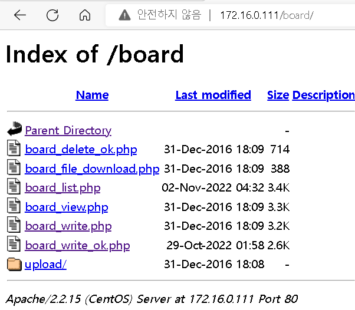
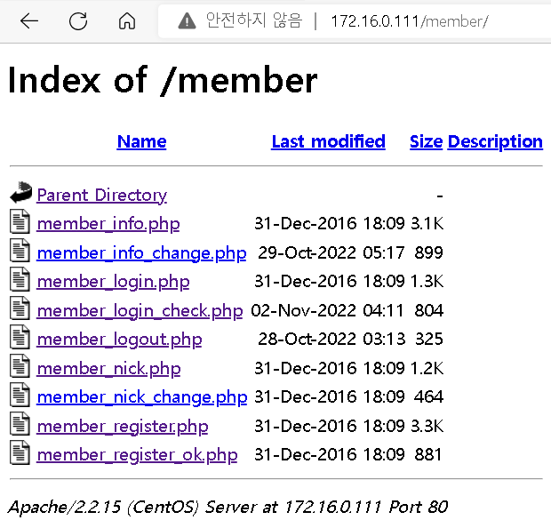
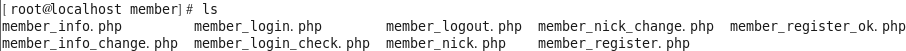
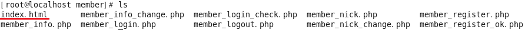
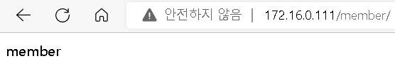
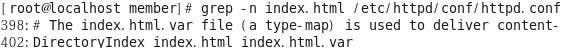
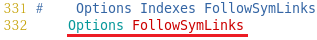
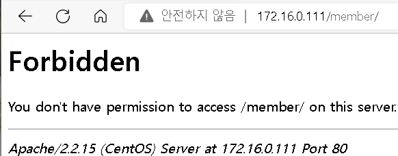

## Directory Listing

- http://172.16.0.111/board/



- http://172.16.0.111/member/



- 웹서버의 하위 디렉터리 별로 index.html 이 없으면 디렉터리내의 모든 내용이 보여진다

  ```
  [root@localhost html]# cd /var/www/html/member/
  [root@localhost member]# ls
  ```

  

  ```
  [root@localhost member]# echo member > /var/www/html/member/index.html
  [root@localhost member]# ls
  ```

  

  

- httpd 설정 파일

  ```
  [root@localhost member]# grep -n index.html /etc/httpd/conf/httpd.conf
  ```

  

- 차단

  ```
  이전 실습 원복 후
  
  # vim /etc/httpd/conf/httpd.conf
  ```

  

- 서비스 재시작후 확인

  ```
  # service httpd restart
  ```

  