## Wireshark를 이용한 네트워크 패킷 분석

#### LAND Attack 분석

- 출발지와 목적지가 동일한 패킷 분석

  - kail에서 wireshark를 실행하고 공격하여 확인

    ```
    root@kali:~# hping3 -a 200.200.200.30 200.200.200.30 --icmp --flood
    ```

    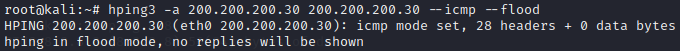

  - wireshark에서 확인

    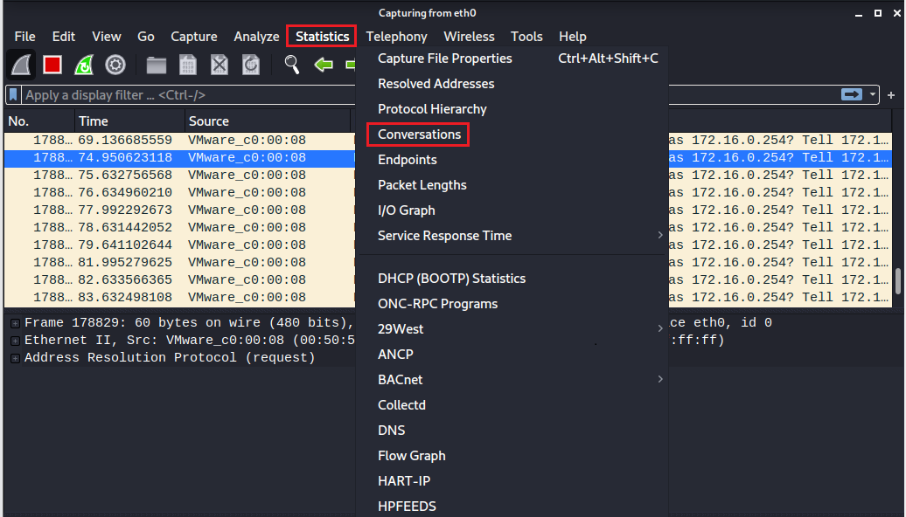

    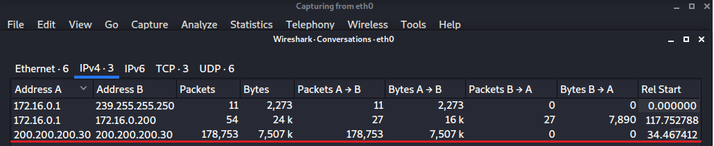

#### UDP Port Scanning 분석

- 실습준비

  - 통신 확인 

    ```
    ping 
    kail -> 2003
    ```

    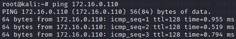

  - 스캐닝

    ```
    root@kali:~# nmap -sU 172.16.0.110
    ```

    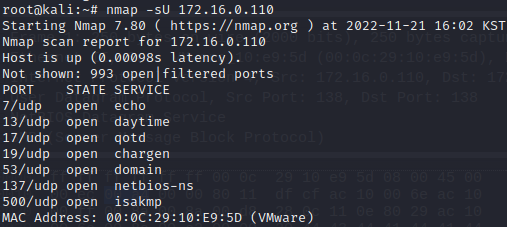

  - wireshark 확인

    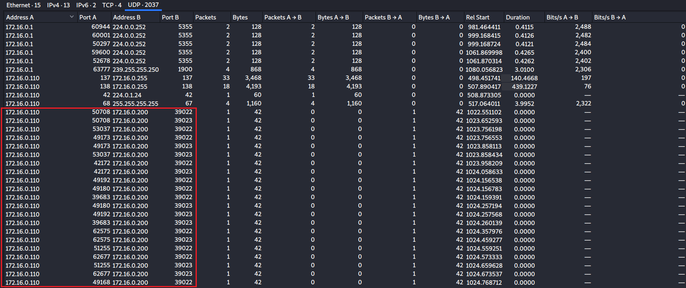

    port 번호를 계속 변경하면서 접속하는 것으로 보아 스캐닝을 의심 할 수 있다

  

#### Synflooding 분석

- 실습준비

  - 통신확인

  - 공격

    ```
    # hping3 --rand-source 172.16.0.111 -p 80 -S --flood 
    ```

    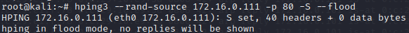

  - wireshark로 확인

    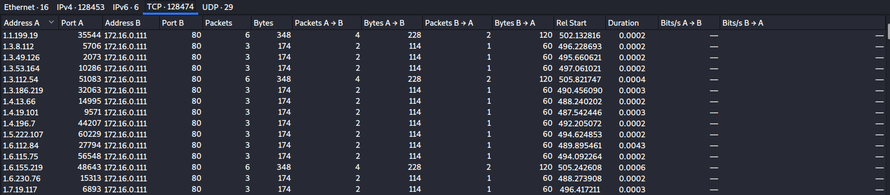

#### arp spoofing 분석

- 중간자 공격의 시작
- 대상 IP 주소에 대한 MAC 주소를 사칭
- ARP( 대상 IP 주소에 대한 맥주소를 확인)
  - ARP Request : 대상 IP 주소에 대한 맥주소를 확인 요청
  - ARP Reply : 대상 IP 주소에 대한 맥주소를 확인 요청에 대한 응답

- ARP Reply 를 반복하여 공격대상의 ARP Cache 를 변조 -> ARP Cache Poisoning

- 실습준비

  - 가상머신 3대 준비

    ```
    Kali : 0.200
    xp : 0.101
    2003: 0.101
    ```

  - wireshark 실행

  - XP 에게 kali : 2003 의 MAC 주소를 가지고 있다고 spoofing

    ```
    # arpspoof -t 172.16.0.101(xp) 172.16.0.110(2003)
    ```

    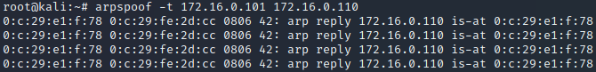

  - 2003 에게 kali : XP 의 MAC 주소를 가지고 있다고 spoofing 

    ```
    # arpspoof -t 172.16.0.110(2003) 172.16.0.101(xp)
    ```

    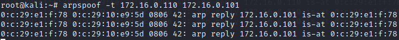

  - wireshark 확인

    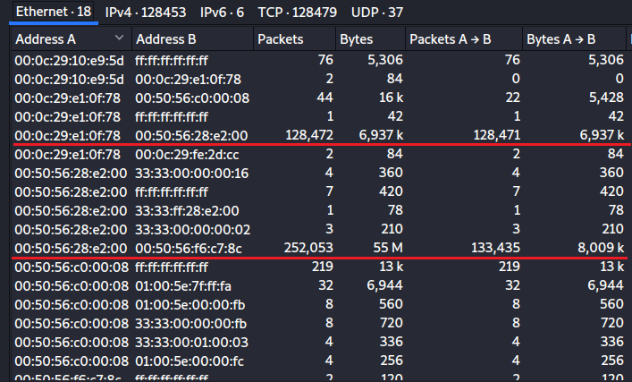