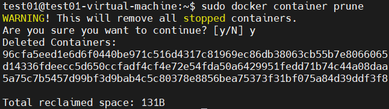
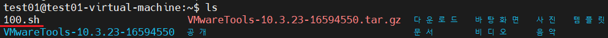

## docker : container

#### docker container lifecycle

#### docker image pull > container run > 특정 app 실행

#### status : UP 인  container 에 attach 

#### container rename


#### docker image 대비 container 의 diff(변경) 내용 을 확인

- 환경 확인

  ```
  $ sudo docker container ps -a
  ```

  

  ```
  $ sudo docker container rename test33 test03
  ```

  

  ```
  $ sudo docker container ps
  ```

  

- test04 container attach

  ```
  $ sudo docker container attach test04
  ```

  

- 프롬프트에서 나오기

  ```
  ctrl + p , ctrl + q 
  ```

  

- 기존 이미지 대비 컨테이너 수정 확인 : 명령어 history 가 아님

  ```
  $ sudo docker container diff test04
  ```

  

- 다시 해당 컨테이너로 attach

  ```
  $ sudo docker container attach test04
  #  A /1.sh
  [root@c9ef0366ae2d /]# ls /
  ```

  

#### 사용하지 않는 container 를 prune(제거) 

```
$ sudo docker container ps -a
```


```
$ sudo docker container prune
```



```
$ sudo docker container ps -a
```


#### 가동중인 container 에 attach(접근)하여 파일을 cp(복사)

```
$ sudo docker image ls
```


- container run

  ```
  $ sudo docker container run -it --name test01 centos:latest /bin/bash
  ```

- 파일 생성 후 프롬프트 를 escape ( ctrl + q + q )

  ```
  [root@6f6519321da5 /]# vi t.sh
  아무 내용 작성 후 저장
  zvcxzvcz
  ```

- ps -a

  ```
  $ sudo docker ps -a
  ```

  $ sudo docker ps -a | grep test01

  ```
  $ sudo docker ps -a | grep test01
  ```

  

- 컨테이너 내부에 생성된 파일을 host로 복사

  ```
  $ sudo docker container cp test01:/t.sh /home/test01/100.sh
  $ cd ~
  $ ls
  ```

  

  ```
  $ cat ./100.sh
  ```

  

#### docker 를 이용한 mariadb 설치

- docker image 검색

  ```
  test01@test01-virtual-machine:~/바탕화면$ sudo docker search mariadb
  ```

  

- docker image pull

  ```
  $ sudo docker pull mariadb
  ```

  

  ```
  $ sudo docker image ls | grep mariadb
  ```

  

- docker 이미지 를 컨테이너로 run (create + start)

  ```
  $ sudo docker container run --name mariadb_test -d -p 3306:3306 --restart=always -e MYSQL_ROOT_PASSWORD=P@ssw0rd mariadb:latest
  
  -e : 접속비밀번호같은 초기환경설정용 
  --restart : 명령의 실행결과에 따라서 재시작 
  always : 항상 재시작 , exit 로 나가도!!! 
  ```

- docker 컨테이너 실행 확인 

  ```
  $ sudo docker container ls | grep mariadb
  ```

  

  ```
  $ sudo docker container ps -a | grep mariadb
  ```

  

- attach

  ```
  $ sudo docker container attach mariadb_test
  
  - 접근 안됨 , -d : detach , 백그라운드 실행
  ```

- ps -a

  ```
  $ sudo docker container ps -a
  ```

  

- 이미 실행되어 있는 컨테이너에 명령을 사용할때

  ```
  $ sudo docker container exec -it mariadb_test /bin/bash
  ```

- 데이터베이스에 접속

  ```
  # mysql -u root -p
  ```

  

- exit를 하여도 컨테이너가 살아있다 , --restart = always

  ```
  MariaDB [(none)]> exit
  root@7d4fd426591a:/# exit
  $ sudo docker container ps -a
  ```

  

-  attach vs exec 

  - asudo  , ubuntu 콘솔하고 콘테이너의 process 를 연결 - 이미 실행이 되어있어야 함

    ```
    $ sudo docker container attach 컨테이너이름/ID
    ```

  - exec: 새로운 프로세스를 생성

    ```
    $sudo docker container exec -it 컨테이너이름orID /bin/bash
    ```

    

  
