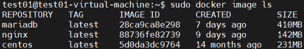

## docker : image build

#### nginx 의 container 의 html 파일을 추가하여 새로운 image 로 저장

- container run

  ```
  $ sudo docker container run --name web_01 -d -p 80:80 nginx:latest
  
  -d : detach 
  detach 실행 
  실행시 입출력 터미널이 빠져있음 -it 
  ```

  

- ps -a

  ```
  test01@test01-virtual-machine:~$ sudo docker container ps -a
  ```

  

- 서비스 확인

  

- web_01 container 에 attach

  ```
  test01@test01-virtual-machine:~$ sudo docker container attach web_01
  
  반응이 없어서 ctrl + c 또는 ctrl +z 
  ```

  

- 의도하지 않은 컨테이너의 종료가 있었다

  ```
  $ sudo docker container ps -a
  ```

  

  ```
  $ sudo docker container start 0dc62d0c7af6   -> nginx의 컨테이너 id
  $ sudo docker container ps -a
  ```

  

- detach 모드로 실행된 컨테이너에 접근할때는 exec : 이미 실행된 컨테이너에서 해당명령을 실행

  ```
  $ sudo docker container exec -it web_01 /bin/bash
  ```

- webserver contents 디렉터리를 찾기

  ```
  # find / -name html
  ```

  

  ```
  # ls -al /usr/share/nginx/html/
  ```

  

- web_01 컨테이어 html 파일 확인

  ```
  # cat /usr/share/nginx/html/index.html
  ```

  

- 기존 index.html 이름 변경으로 백업 후 새로운 index.html 을 만들기

  ```
  # mv ./index.html ./index.html.bak
  ```

  

- index.html 파일 생성

  ```
  # echo web_01 > index.html
  # cat index.html
  ```

  

  

- ctrl + p  + q

  ```
  $ sudo docker container ps -a
  ```

  

- 현재 컨테이너(기존 이미지에 추가된)의 내용을 새로운 이미지로 commit 

  ```
  $ sudo docker image ls
  ```

  

  ```
  $ sudo docker commit -a "dlsrlrla" web_01 web_01:1.0
  ```

  

  ```
  $ sudo docker image ls
  ```

  

- 이미지의 내부 설정을 확인

  ```
  $ sudo docker image inspect web_01:1.0
  ```

  

#### 새로 생성된 image 를 reference 하여 새로운 컨테이너를 생성 

- 기존 컨테이너 종료후 새롭게 만들어진 이미지로 컨테이너를 생성

  - 80 포트 중복 문제 해결

    ```
    $ sudo docker container ps -a
    ```

    

  - web_01:1.0 이미지를 참조하여 컨테이너 실행 

    ```
    $ sudo docker image ls
    ```

    

    ```
    $ sudo docker container run --name web_02 -d -p 80:80 web_01:1.0
    ```

    

    ```
    $ sudo docker container ps
    ```

    

#### 새로 생성된 이미지로 컨테이너 생성시 포트번호 다르게 

- 구성도

  .png)

- 이미 포트 할당되어 있어서 실행 불가

  ```
  $ sudo docker container run --name web_02_clone -d -p 80:80 web_01:1.0
  ```

  

  ```
  $ sudo docker container ps -a
  ```

  

- 기존 create 됐지만 start 안된 컨테이너 삭제

  ```
  $ sudo docker container rm web_02_clone
  ```

- 새로운 포트로 컨테이너 시작

  ```
  $ sudo docker container run --name web_02_clone -d -p 8080:80 web_01:1.0
  ```

- 컨테이너 정보 확인

  ```
  $ sudo docker container ps -a
  ```

  

  