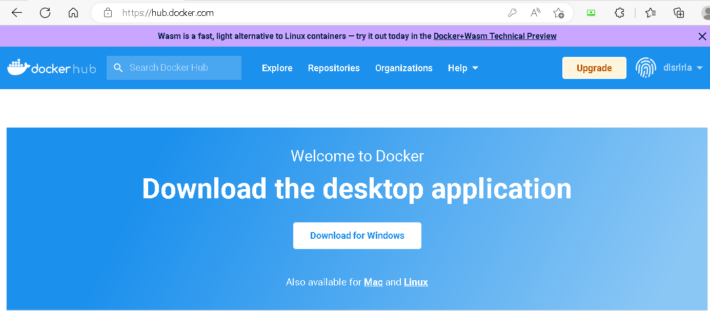
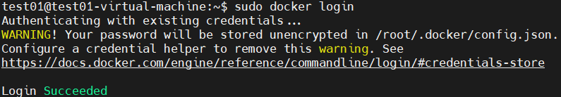
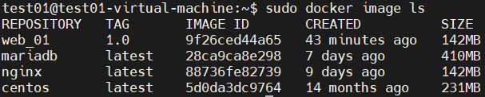
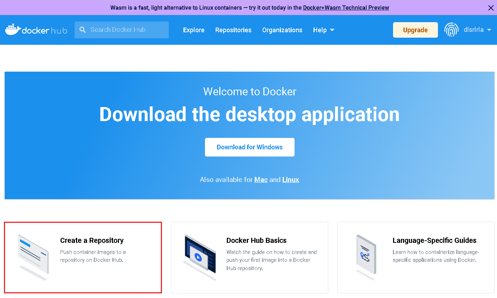
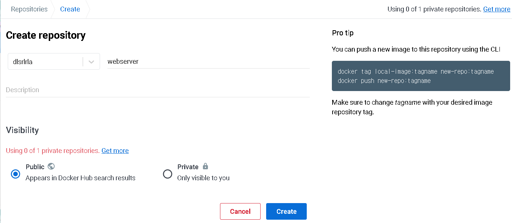
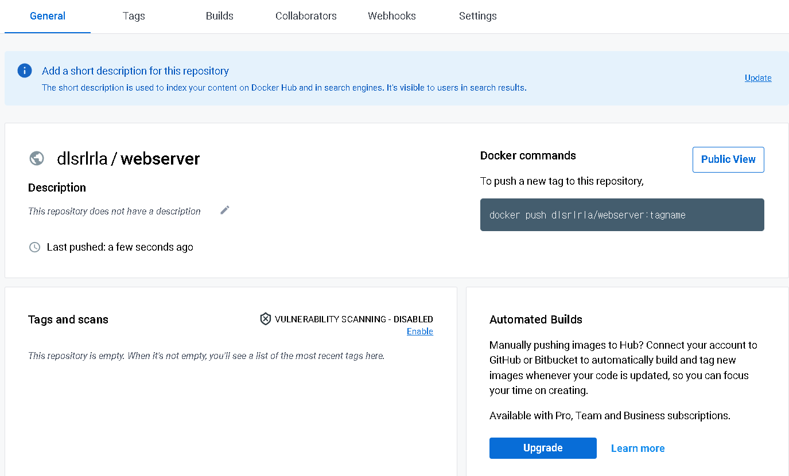
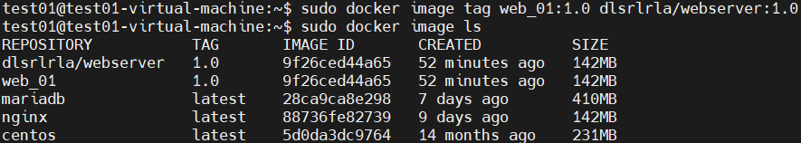
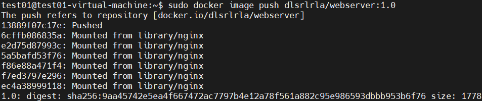
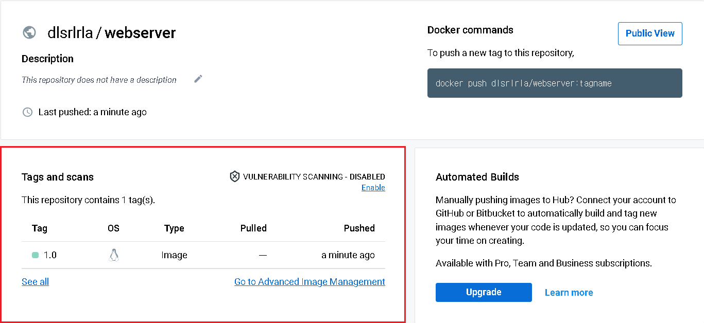
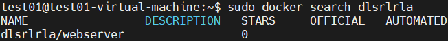

## docker : image upload

- [hub.docker.com](http://hub.docker.com/) 로그인

  

- docker hub 에 가입후 ubuntu 터미널에서 로그인 

  ```
  $ sudo docker login
  ```

  

- 이미지 목록 확인

  ```
  $ sudo docker image ls
  ```

  

- repository  생성

  

  

  

- image tagging

  - tag 를 이용하여 repository 에 맞게 지정

    ```
    $ sudo docker image tag web_01:1.0 dlsrlrla/webserver:1.0
    $ sudo docker image ls
    ```

    

- image push

  - 추가된  tag 를 지정하여 자신의 저장소(repository) 에 push

    ```
    $ sudo docker image push dlsrlrla/webserver:1.0
    ```

    

    

- image search

  - 주의 : 본인의 리포지터리 명을 입력

    ```
    $ sudo docker search dlsrlrla
    ```

    