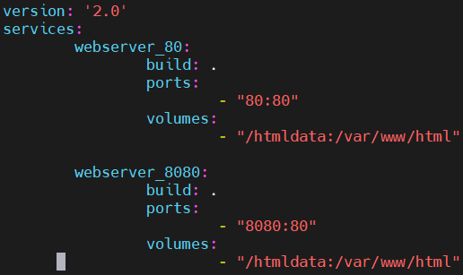

## docker : compose

<b>정의</b>

- 여러개의 컨테이너를 모아서 관리하기 위한 툴
- 여러개의 어플리케이션이 연결되면 그 관계 형성
- 컨테이너 구성 정보를 yaml, yml 파일로 설정
  - 서비스 , 네트워크 , 볼륨  부분을 하나의 파일로 설정

⇒ orchestration (오케스트레이션) 

<b>용도</b>

- 관련 어플리케이션들을 동시 / 지속적인 배포가 가능하도록

#### 실습

- 실습구성도

  

- 실습환경 설정 

  - 컨테이너 중지 후 삭제

    ```
    $ sudo docker container stop $(sudo docker ps -a -q)
    $ sudo docker container rm $(sudo docker ps -a -q)
    ```

  - docker-compose 설치

    ```
    sudo curl -L "https://github.com/docker/compose/releases/download/1.27.2/docker-compose-$(uname -s)-$(uname -m)" -o /usr/local/bin/docker-compose
    ```

    

  - docker compose 사용하도록 설정

    ```
    ## docker-compose 실행 테스트
    
    $ sudo docker-compose --version
    test01@test01-virtual-machine:~$ sudo docker-compose --version
    sudo: docker-compose: 명령이 없습니다
    
    ## docker-compose 실행파일을 찾아서 
    
    ~$ sudo find / -name docker-compose
    find: ‘/run/user/1000/gvfs’: 허가 거부
    /usr/local/bin/docker-compose
    test01@test01-virtual-machine:~$ sudo ls -al /usr/local/bin/docker-compose 
    -rw-r--r-- 1 root root 12218192  4월  8 09:36 /usr/local/bin/docker-compose
    
    ##  docker-compose 파일이 실행되도록 퍼미션 부여 
    ~$ sudo chmod a+x /usr/local/bin/docker-compose
    ~$ sudo ls -al /usr/local/bin/docker-compose 
    -rwxr-xr-x 1 root root 12218192  4월  8 09:36 /usr/local/bin/docker-compose
    
    ##  docker-compose  실행 버전 확인
    $ which docker-compose
    /usr/local/bin/docker-compose
    $ sudo docker-compose --version
    docker-compose version 1.27.2, build 18f557f9
    ```

  - 도커파일 1: Dockerfile(dfile) 작성후 image build

    ```
    ## Dockerfile 작성
    
    $ sudo vim ./dfile_01
    
    FROM centos:7
    LABEL title="centos with httpd"
    RUN yum -y update && yum -y install httpd
    ```

    

    ```
    ## Docker image build 
    
    $ sudo docker image build -t httpd:s01 /home/test01 -f dfile_01
    ```

    

    ```
    ## Docker image 확인
    
    $ sudo docker image ls
    ```

    

  - 도커파일 2: docker-compose 가 참조할 Dockerfile 

    ```
    ~$ vim Dockerfile
    
    FROM httpd:s01
    EXPOSE 80
    VOLUME ["/var/www/html/images"]
    CMD ["/usr/sbin/httpd","-D","FOREGROUND"]
    ```

    

  - docker-compose 를 위한 yml 파일

    ```
    ## yml 파일 작성
    
    $ vim docker-compose.yml
    
    version: '2.0'
    services:
            webserver_80:
                    build: .
                    ports:
                            - "80:80"
                    volumes:  
                            - "/htmldata:/var/www/html"      --> docker host 의 /htmldata 디렉터리를 컨테이너의 /var/www/html 로 마운트 
    
            webserver_8080:
                    build: .
                    ports:
                            - "8080:80"
                    volumes:
                            - "/htmldata:/var/www/html"     --> docker host 의 /htmldata 디렉터리를 컨테이너의 /var/www/html 로 마운트 
    ```

    

  - 웹서버에서 보여질 html 파일 만들기

    ```
    $ sudo mkdir /htmldata
    $ cd /htmldata
    $ sudo vim ./index.html
    
    webtest
    ```

    

  - docker-compose 실행

    ```
    $ cd ~
    $ ls
    ```

    

    ```
    $ sudo docker-compose up
    ```

    

  - 확인

    ```
    http://172.16.0.201
    ```

    

    ```
    http://172.16.0.201:8080/
    ```

    

- docker-compose 실행 II

  - 터미널 하나 더 실행 하여 docker-compose 를 종료

    ```
    $ sudo docker-compose down --rmi all
    ```

    

  - 다시 docker-compose 를 실행

  - 2번째 터미널에서 bash 로 접근

    ```
    $ sudo docker container ps -a
    ```

    

    ```
    $ sudo docker exec -it test01_webserver_80_1 bash
    # ls
    ```

    

    ```
    # cd /var/www/html/
    # ls
    # cat index.html
    ```

    

  - 8080 포트 쪽 컨테이너도 동일 하게 확인

    ```
    $ sudo docker exec -it test01_webserver_8080_1 bash
    # cd /var/www/html/
    # ls
    # cat index.html
    ```

    

  - docker compose down 실행하여 compose 한 내용을 정리

    ```
    $ sudo docker-compose down --rmi all
    ```

    

    

