## docker : volume

<b>필요성</b>

- container 가 실행된다는 것은 영구적인 개념 X , 임시
- container 가 종료되면 데이터는 사라진다 > 영구저장을 위해서!!!
- volume 이라는 개념을 도입하는 방법
  - host 의 디렉터리를 docker 에서 관리하여 마운트 하도록 별도의 이름을 생성하여 지정

#### 실습

- 실습구성도

  -1669705911975-19.png)

- -v 옵션을 이용하여 볼륨 추가 

  - -v 옵션을 이용하여 볼륨 추가 하면서 컨테이너를 실행

  - 도커의볼륨명:컨테이너의 디렉터리 명

    ```
    $ sudo docker container run -itd -v vol_01:/vol_01 -p 80:80 nginx:latest
    ```

  - container 로 bash shell로 접근후 생성된 vol 확인

    ```
    $ sudo docker exec -it confident_bell bash
    /# ls
    ```

    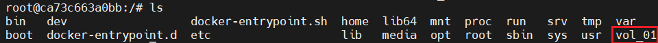

- 볼륩에 접근 하여 파일 남기기

  ```
  /# cd /vol_01/
  /vol_01# echo hihi > ./1.txt
  /vol_01# ls
  /vol_01# cat 1.txt
  ```

  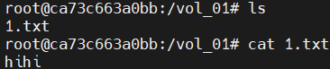

- container prompt escape

  ```
  Ctrl + p + q
  
  /vol_01# read escape sequence
  ```

-  volume 정보 확인

  ```
  test01@test01-virtual-machine:~/바탕화면$ su -
  암호: 
  root@test01-virtual-machine:~#
  root@test01-virtual-machine:~# docker volume inspect vol_01
  ```

  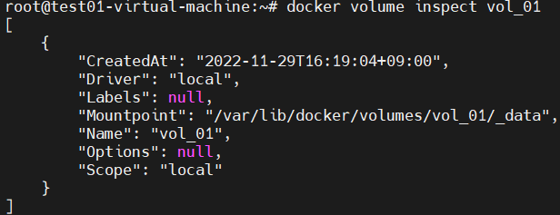

- docker volume mount point 확인

  ```
  ~# cd /var/lib/docker/volumes/vol_01/_data
  /var/lib/docker/volumes/vol_01/_data# ls
  /var/lib/docker/volumes/vol_01/_data# cat 1.txt 
  /var/lib/docker/volumes/vol_01/_data#
  ```

  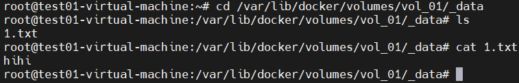

- 다른 컨테이너 실행시 docker volume 공유가 가능한지 확인 

  ```
  $ sudo docker container run -itd -v vol_01:/vol_01 -p 8080:80 nginx:latest
  $ sudo docker container ps -a
  ```

  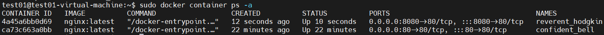

- 컨테이너에 접근 하여 학인

  ```
  $ sudo docker exec -it web_02 bash
  root@d7d343c6e418:/# ls 
  ```

  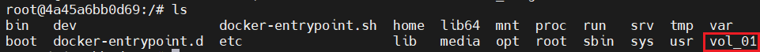

  ```
  /# cd /vol_01/
  /vol_01# ls  
  /vol_01# echo hello > 2.txt
  /vol_01# ls
  ```

  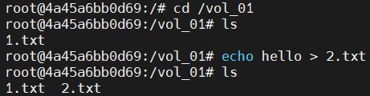

- volume 을 공유하고 있는 컨테이너에서도 확인 가능한지 확인

  ```
  :~$ sudo docker exec -it confident_bell bash
  /# ls /vol_01/
  /# cat /vol_01/2.txt
  ```

  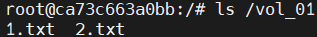

  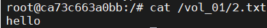

#### docker Volume 을 직접 생성 

- docker volume 을 미리 생성

  ```
  $ sudo docker volume create vol_02
  $ sudo docker volume ls
  ```

  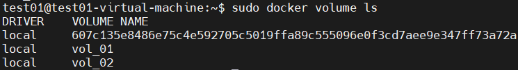

- 해당 볼륨에 host 에서 접근하여 파일을 미리 생성 

  ```
  $ sudo docker volume inspect vol_02
  ```

  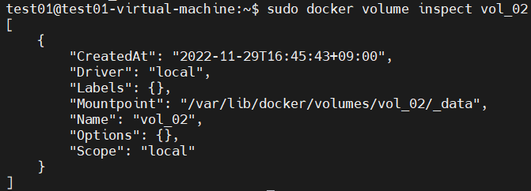

  ```
  # cd /var/lib/docker/volumes/vol_02/_data/
  # echo vol2test > hi.txt
  # ls
  ```

  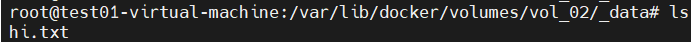

- 컨테이너에 mount

  - 8888:80 으로 생성하여 docker volume test

    ```
    $ sudo docker container run -itd -v vol_02:/vol_02 -p 8888:80 nginx:latest
    $ sudo docker container ps -a
    ```

    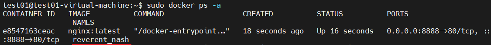

    ```
    $ sudo docker exec -it reverent_nash bash
    # cd /vol_02/
    # ls
    # cat hi.txt 
    ```

    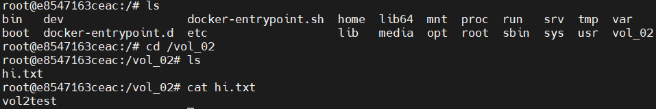

## bind mount

- 호스트 디렉터리의 절대경로 마운트 경로 사용
- docker  볼륨과의 차이점은 docker 의 관리를 받는가 ?

#### 실습 : bind mount 와 docker volume 의 차이 

- 사용할 디렉터리를 생성

  ```
  $ sudo mkdir /docker_bind_mount
  ```

- container 실행시 9999:80  으로 web_04

  ```
  $ sudo docker container run -itd -v /docker_bind_mount:/bind_mount --name web_04 -p 9999:80 nginx:latest
  $ sudo docker container ps -a
  ```

  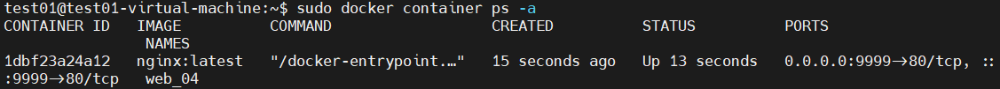

  ```
  $ sudo docker exec -it web_04 bash
  /# ls
  ```

  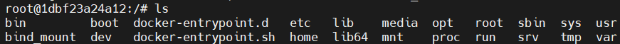

  ```
  /# cd /bind_mount/
  /bind_mount# echo bind_mount > b.txt
  /bind_mount# cat b.txt 
  ```

  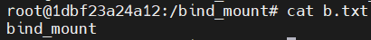

  ```
  Ctrl + p + q
  root@07408bdd387f:/bind_mount# read escape sequence
  test01@test01-virtual-machine:~/바탕화면$ sudo cat /docker_bind_mount/b.txt 
  ```

  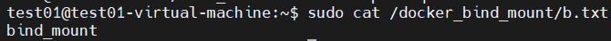

## Dockerfile 을 이용한 volume mount 

- 호스트 의 절대경로를 직접 컨테이너에서 마운트

#### 실습 : image build 할 Dockerfile 에 volume 부분을 추가 

- 이전 실습 환경 정리

  ```
  $ sudo docker container rm $(sudo docker ps -a -q)
  ```

- Docker file 생성 

  - Dockerfile 생성

    ```
    $ cd ~
    $ vim Dockerfile
    
    FROM centos:7
    LABEL title="centos7 with httpd"
    RUN yum -y update && yum -y install httpd
    EXPOSE 80
    VOLUME ["/vol_04"]
    CMD ["/usr/sbin/httpd","-D","FOREGROUND"]
    ```

    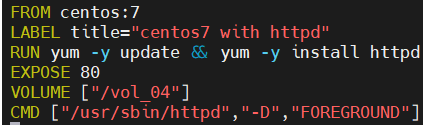

  - image build 

    ```
    $ sudo docker build -t httpd-test /home/test01
    ```

    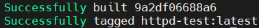

    ```
    $ sudo docker image ls | grep httpd
    ```

    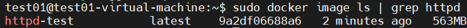

    ```
    $ sudo docker container run -itd --name web_01 -p 80:80 httpd-test:latest
    $ sudo docker container ps -a
    ```

    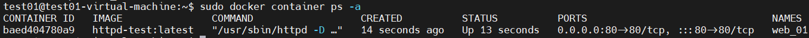

    ```
    http://172.16.0.201
    ```

    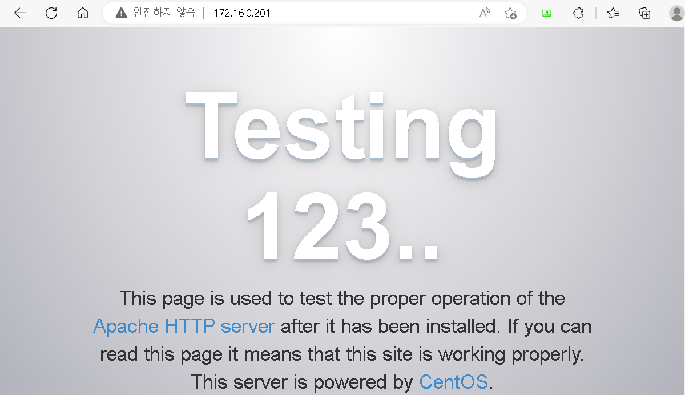

- Docker Volume 확인

  - container 진입하여 볼륨 생성되었는지 확인

    ```
    $ sudo docker exec -it web_01 bash
    # ls 
    ```

    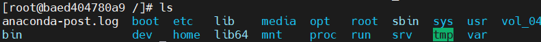

    ```
    [root@a2fb7ff2654c /]# echo vol_04 > /vol_04/4.txt
    ```

  - 컨테이너 정보 확인

    ```
    $ sudo docker container inspect web_01
    ```

    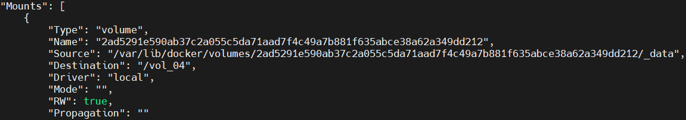

  - 수퍼유저 전환

    ```
    test01@test01-virtual-machine:~$ su -
    # cd /var/lib/docker/volumes/2ad5291e590ab37c2a055c5da71aad7f4c49a7b881f635abce38a62a349dd212/_data
    # cp ../4.txt
    ```

  - 컨테이너 에 접속하여 확인

    ```
    $ sudo docker exec -it web_01 bash
    # ls /vol_04
    ```

    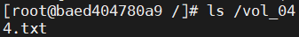

    

    

