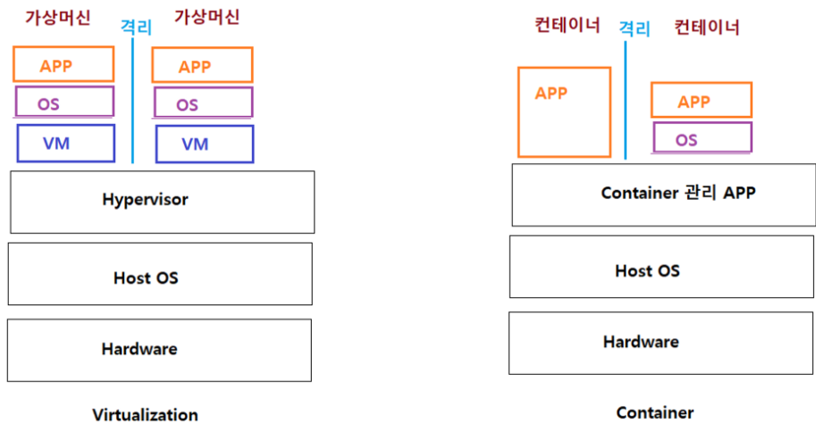

## docker : Virtualization & Container

- hypervisor 의 정의

  Container

  

- host OS 안에 논리적인 구획(Container) 를 만들고 APPLICATION 실행에 필요한 요소(라이브러리.._) 를 모아서 별도의 서버인것 처럼 실행

- 종류

  - LXC(Linux Container)

    https://linuxcontainers.org/

  - Docker

    https://www.docker.com/

  - POD

    https://www.redhat.com/ko/topics/containers/what-is-kubernetes-pod

- Docker

  - APPLICATION 실행에 필요한 환경을 하나의 image 로 생성
  - 이미지를 이용하여 다양한 환경에서 실행
  - Docker 만 설치할수 있으면 어떤 OS 환경에서도 동일한 환경의 어플리케이션을 실행 가능

### 리눅스 커널의 기능

- 디바이스 관리

  - 리눅스의 장치는 파일화

    

- 프로세스 관리

  

  

- 메모리 관리

  

  

#### curl

https://curl.se/


- curl 명령어
  - 주로 리눅스에서 curl 이라는 http 메시지를 쉘상에서 요청하여 결과를 확인하는 명령어 http를 이용하여 경로의 데이터를 가져온다.
  - 리눅스 커맨드 창에서 http 통신 요청을 했을 때 리턴 되는 값을 확인 할 수 있다 다른 프로토콜도 지원함
- curl 장점
  - 리눅스 커맨드 창에서 http 통신 요청을 했을 때 리턴 되는 값을 확인 할 수 있다.
  - OS가 Window일 경우 다양한 브라우저를 통해 특정 url 요청할 경우 확인할 수 있으나 서버에 직접 붙는 PC가 아니라면 http통신 요청을 확인할 수 있는 명령어 이다.
  - 파일도 다운로드 가능함 (주로 많이 사용됨)

## docker : image

**docker image 를 pull(가져온후) image 를 기반으로 container 를 run(실행)**

- 도커 이미지 컨테이너 구조

  

## 실습

#### 도커 무작정 따라하기

```
test01@test01-virtual-machine:~$ sudo docker container run ubuntu:latest /bin/echo "hellowrld"
```


#### 도커 실행 환경을 확인

```
test01@test01-virtual-machine:~/바탕화면$ sudo docker system
```


```
test01@test01-virtual-machine:~/바탕화면$ sudo docker system info
```


#### 도커의 저장소 사용 확인

```
test01@test01-virtual-machine:~/바탕화면$ sudo docker system df
```


#### docker image pull(가져오기) > container run(실행) > 확인

- 대상 application : nginx (webserver)

- 이미지 분류 - 이미지명:태그 ubuntu:latest

- image pull(가져오기) 후 목록 확인

  ```
  $ sudo docker image pull nginx
  ```

  

- docker 이미지 목록 확인

  ```
  test01@test01-virtual-machine:~/바탕화면$ sudo docker images
  또는
  test01@test01-virtual-machine:~/바탕화면$ sudo docker image ls
  ```

  

- pull 한 docker image 을 기반으로 container 를 run(실행)

  ```
  sudo docker container run --name webserver -d -p 80:80 nginx:latest
  ```

  

- 웹브라우저에서 컨테이너의 run(실행) 여부 확인 (ubuntu 20.04)

  

  

  ```
  test01@test01-virtual-machine:~/바탕화면$ sudo docker container ps
  ```

  

- docker container 상태 확인

  ```
  sudo docker container stats webserver
  ```

  

  - 실행된 컨테이너 목록 확인

    ```
    test01@test01-virtual-machine:~/바탕화면$ sudo docker container ps
    ```

    

  - 사용중인 컨테이너를 중지

    ```
    test01@test01-virtual-machine:~/바탕화면$ sudo docker container stop
    ```

    

  - 컨테이너 이름을 이용하여 중지

    ```
    test01@test01-virtual-machine:~/바탕화면$ sudo docker container stop webserver
    ```

    

  - 현재 실행중인 컨테이너가 보인다

    ```
    test01@test01-virtual-machine:~/바탕화면$ sudo docker container ps
    ```

    

  - 컨테이너의 목록

    ```
    test01@test01-virtual-machine:~/바탕화면$ sudo docker container ps -a
    ```

    

- [http://localhost](http://localhost/) 로 접근하면 더이상 웹서버 접근불가

  

- 컨테이너 ID 를 이용하여 중지 시킬수도 있다

  ```
  test01@test01-virtual-machine:~/바탕화면$ sudo docker container stop faf5b49a8613
  ```

  

  

  

- 컨테이너 목록에서 삭제 후 확인

  ```
  $ sudo docker container ps -a
  ```

  

  ```
  $ sudo docker container rm webserver
  ```

  

  ```
  $ sudo docker container ps -a
  ```

  

#### 남아있는 컨테이너 목록 확인 후 컨테이너 삭제

- 목록 확인

  ```
  sudo docker container ps -a
  ```

  

- CONTAINER ID 를 이용하여 삭제

  ```
  sudo docker container rm c010edaa28b9 
  sudo docker container ps -a
  ```

  

#### 컨테이너 이미지 search 후 다운로드

- 이미지 search

  ```
  test01@test01-virtual-machine:~$ sudo docker search nginx
  ```

  

  ```
  test01@test01-virtual-machine:~$ sudo docker search centos
  ```

  

- 이미지 다운로드

  - centos image 다운로드

    ```
    $ sudo docker image pull centos:7
    ```

    

  - 다운로드 이미지 확인

    ```
    $ sudo docker image ls
    ```

    

  - image 상세 정보 확인

    ```
    $ sudo docker image inspect centos:7
    ```

    

#### nginx 이미지를 기반으로 컨테이너 실행후 삭제

- 이미지 가져오기

  ```
  $ sudo docker image pull nginx
  ```

- 이미지 목록 확인

  ```
  $ sudo docker image ls
  ```

  

- 컨테이너 실행

  ```
  sudo docker container run --name webserver -d -p 80:80 nginx:latest
  ```

  

- 컨테이너 실행 확인

  ```
  sudo docker container ps -a
  ```

  

- 컨테이너가 실행된 상태에서 이미지 삭제를 시도 컨테이너가 참조중

  ```
  sudo docker image rm nginx:latest
  ```

  

- 컨테이너 동작 중지

  ```
  sudo docker container ps -a
  sudo docker container stop webserver
  ```

- 동작 중지 확인

  ```
  sudo docker container ps -a
  ```

  

- 사용중인 컨테이너의 목록

  

  **사용중인 것이 없어서 아무것도 안나온다**

- 삭제할 이미지의 ID 또는 리포지터리 이름 확인

  ```
  sudo docker image ls
  ```

  

- 이미지 삭제 시도

  ```
  sudo docker image rm 88736fe82739 
  ```

  

  **또 다시 에러 발생**

- 이미지 삭제시 참조된 컨테이너 삭제 후 할것

  ```
  sudo docker container ps -a
  ```

  

  ```
  sudo docker container rm webserver
    
  sudo docker image rm 88736fe82739
  ```

  

- 이미지 삭제 확인

  ```
  sudo docker image ls nginx
  ```

  

#### docker 이미지 전체 삭제

- garbage collection
  - 안쓰는 거 정리
  - 디스크 공간의 메모리 절약
  - 사용하지 않는 요소들을 찾아서 삭제

```
sudo docker image prune 
```


- 무조건 삭제 시 사용

  - 모든 이미지 삭제 시도

    ```
    sudo docker image rm $(sudo docker images -q)
    ```

    

  - 강제로 삭제 해야 하는 경우 -f 옵션을 사용한다

    ```
    sudo docker image rm -f $(sudo docker images -q)
    ```

  - docker 이미지 확인

    ```
    $ sudo docker images
    ```

    