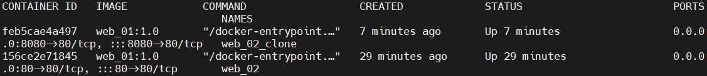
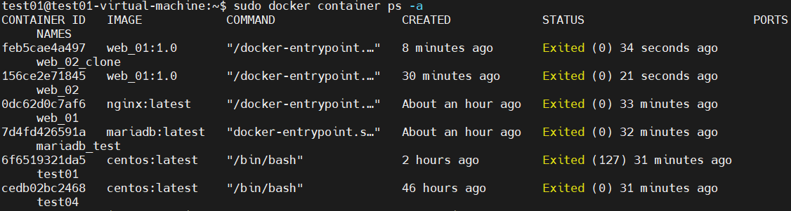
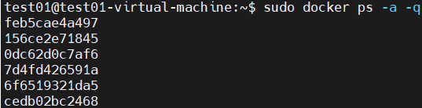
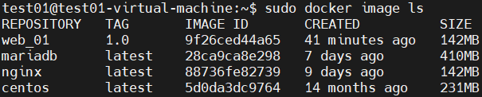
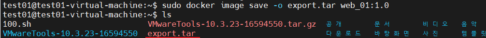
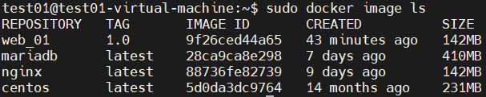

## docker : image export

- 실습전 환경 정리

  ```
  $ sudo docker container ps -a
  ```

  

  ```
  $ sudo docker container stop feb5cae4a497
  $ sudo docker container stop 156ce2e71845
  ```

  

  ```
  $ sudo docker ps -a -q
  ```

  

  ```
  $ sudo docker container rm $(sudo docker container  -a -q)
  ```

  

- docker  image 를 tar 로 묶어준다

  ```
  $ sudo docker image ls
  ```

  

  ```
  $ sudo docker image save -o export.tar web_01:1.0
  $ ls
  ```

  

- docker image 삭제

  ```
  $ sudo docker image rm web_01:1.0
  ```

  

- tar 로 묶어놓은 docker image  다시 load

  ```
  $ sudo docker image load -i export.tar
  ```

  