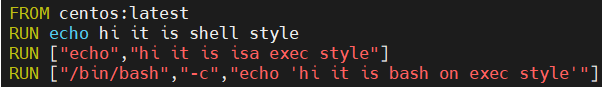

## build with Dockerfile

#### Dockerfile

- 첫글자 대문자 D

- docker  image 를 작성 할수 있는 파일


#### 실습 환경 설정

```
$ cd ~
$ pwd
/home/test01
$ mkdir sample
$ ls -ld /home/test01/sample/
drwxrwxr-x 2 test01 test01 4096  4월  6 11:38 /home/test01/sample/
$ sudo touch /home/test01/sample/Dockerfile
```

#### Dockerfile 편집 I

- image build 를 위한 Dockerfile 편집

  ```
  $ sudo vim /home/test01/sample/Dockerfile
  
  FROM centos:latest
  ```

  

- 작성된 Dockerfile 을 기반으로 image 를 build 한다

- Build an image from a Dockerfile

  ```
  $ sudo docker build -t sample:1.0 /home/test01/sample/
  ```

  

  ```
  $ sudo docker image ls | grep sample
  ```

  

- 원본이미지와 사본이미지를 비교

  ```
  $ sudo docker image ls | grep 231
  ```

  

- 이름이 다른 도커파일 생성

  ```
  $ mv ./sample/Dockerfile ./docker.conf
  ```

- 별도 파일명으로 build

  ```
  $ sudo docker build -t sample:2.0 ./ -f docker.conf
  ```

  

  ```
  $ sudo docker image ls
  ```

  

#### Dockerfile 편집 II

- 설명

  

- 편집

  ```
  $ vi Dockerfile 
  FROM ubuntu:latest
  RUN apt-get update && apt-get install -y -q nginx
  CMD ["nginx","-g","daemon off;"]
  ```

  

- image build

  ```
  $ sudo docker build -t webapp:1.0 .
  ```

  

- 확인

  ```
  docker history 를 이용하여 이미지 생성 순서 확인
  
  $ sudo docker image history webapp:1.0
  ```

  

#### Dockerfile 편집 III

- Dockerfile backup

  ```
  $ cp Dockerfile Dockerfile.v1
  ```

- 편집

  ```
  RUN : 새로운 이미지 생성을 위한 명령어
  
  $ sudo vim Dockerfile
  FROM centos:latest
  RUN echo hi it is shell style
  RUN ["echo","hi it is isa exec style"]
  RUN ["/bin/bash","-c","echo 'hi it is bash on exec style'"]
  ```

  

- image build

  ```
  image build : run  할때 마다 이미지 생성
  
  $ sudo docker build -t run-sample .
  ```

  

- 이미지 목록 확인

  ```
  $ sudo docker image ls
  ```

  

#### Dockerfile 편집 IV

- Dockerfile backup v2

  ```
  $ mv ./Dockerfile ./Dockerfile.v2
  ```

- 편집

  ```
  CMD : 이미지를 바탕으로 생성된 컨테이너에서 실행될 명령어
  daemon off : 포그라운드 실행 옵션
  
  $ vim Dockerfile
  
  FROM ubuntu:latest
  RUN apt-get -y update && apt-get -u upgrade
  RUN apt-get -y install nginx
  EXPOSE 80    
  CMD ["nginx","-g","daemon off;"]
  
  daemon off 옵션 안주면 컨테이너를 foreground 에서 실행 할수가 없음
  EXPOSE 포트번호 지정
  ```

  

- image build

  ```
  $ sudo docker build -t cmd-sample .
  $ sudo docker build -t cmd-sample . -f ./Dockerfile
  ```

  

- image ref 하여 run

  ```
  $ sudo docker container run -p 8080:80 --name web_03 -d cmd-sample 
  ```

  

- container 목록 확인

  ```
  $ sudo docker container ps -a
  ```

  

