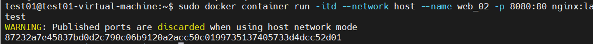

## docker : network

- 실습 환경 설정

  - 기존 컨테이너 삭제

    ```
    $ sudo docker container rm 이름
    $ sudo docker container ps -a
    ```

    

#### docker network 구조

- network driver

  ```
  $ sudo docker network ls
  
  Driver : maclan , overlay , container 
  ```

  

- 네트워크 드라이버 종류 확인

  ```
  $ sudo docker network inspect bridge
  ```

  

- image 확인

  ```
  $ sudo docker image ls | grep nginx
  ```

  

- nginx:latest image 를  reference  하여 container 를 run web_01,web_02

  ```
  $ sudo docker container run -it --name web_01 -d nginx /bin/bash
  ```

  

  ```
  $ sudo docker container run -it --name web_02 -d nginx /bin/bash
  ```

  

- 컨테이너 실행 확인

  ```
  $ sudo docker container ps -a
  ```

  

## bridge

- 실습 구성도

  

- 네트워크 변경 사항 확인

  ```
  $ sudo docker network inspect bridge
  ```

  

- 컨테이너 중지 후 삭제

  ```
  $ sudo docker container stop web_01
  $ sudo docker container stop web_02
  $ sudo docker container rm web_01
  $ sudo docker container rm web_01
  ```

- 외부에 노출

  ```
  $ sudo docker container run -itd --name web_01 -p 80:80 nginx:latest
  $ sudo docker container run -itd --name web_02 -p 8080:80 nginx:latest
  $ sudo docker container ps -a
  ```

  

- 해당 컨테이너에 쉘을 연결

  ```
  $ sudo docker exec -it web_01 bash
  ```

- web_01 컨테이너에서 작업

  ```
  # apt -y update
  ```

  

  ```
  # apt -y install net-tools
  ```

  

  ```
  # ifconfig
  ```

  

- network 에서의  NAME,DRIVER 를 구분

  ```
  network 에서의  NAME,DRIVER 를 구분
  새로운 네트워크 생성 : web-network,BRIDGE
  
  $ sudo docker network create --driver=bridge web-network
  ```

  

  ```
  $ sudo docker network ls
  ```

  

  ```
  $ sudo docker network inspect web-network
  ```

  

- 컨테이너를 실행 BRIDGE 8888:80 으로 연결되는 web_03 container를 생성

  ```
  $ sudo docker container run -itd --network web-network --name web_03 -p 8888:80 nginx:latest
  ```

  

  ```
  $ sudo docker container ps -a
  ```

  

  ```
  $ sudo docker network inspect web-network
  ```

  

- 해당 컨테이너에 쉘을 연결

  ```
  $ sudo docker exec -it web_03 bash
  ```

- web_01 컨테이너에서 작업

  ```
  # apt -y update
  # apt -y install net-tools
  # ifconfig
  ```

  

- 각 bridge driver 에 연결된 네트워크 확인 

  ```
  $ sudo docker network inspect web-network
  ```

  

  ```
  $ sudo docker network inspect bridge
  ```

  

- web_03 container 의  네트워크 연결을 disconnect 

  ```
  $ sudo docker network disconnect web-network web_03'
  $ sudo docker network inspect web-network
  ```

  

- 컨테이너 상태 확인

  ```
  $ sudo docker container ps -a
  ```

  

- NAMES:bridge 에 연결

  ```
  $ sudo docker network connect bridge web_03
  ```

- 네트워크 연결 확인

  ```
  $ sudo docker network inspect bridge
  ```

  

- 해당 컨테이너에 쉘을 연결

  ```
  $ sudo docker exec -it web_03 bash
  ```

#### 다른 bridge 네트워크 (web-network) 의 컨테이너와 통신이 테스트

- web_03 컨테이너에  ping 이 가능 하도록 설치

  ```
  #apt install iputils-ping -y
  ```

- 같은 bridge 내의 컨테이너와 통신

  ```
  # ping 172.17.0.2
  ```

  

- web_03 container 를 다시 web-network 로 연결후

  ```
  $ sudo docker network disconnect bridge  web_03
  $ sudo docker network connect web-network web_03
  $ sudo docker exec -it web_03 bash
  ```

- bridge 의 172.18.0.1, 172.17.0.1 , 172.17.0.2 , 172.17.0.3 과 통신이 가능한지 확인

  ```
  $ ping 172.17.0.1
  $ ping 172.17.0.2 
  $ ping 172.17.0.3 
  $ ping 172.18.0.1
  ```

  

- 외부로 통신 테스트

  ```
  $ ping 8.8.8.8
  ```

  

## host

- 실습구성도

  .png)

- 이전 실습 환경 초기

  - 컨테이너 중지 후 삭제

    ```
    $ sudo docker container stop web_01
    $ sudo docker container stop web_03
    $ sudo docker container rm web_01
    $ sudo docker container rm web_03
    ```

  - 컨테이너 확인

    ```
    $ sudo docker container ps -a
    ```

    

- 컨테이너 생성 후 웹서버 동작 확인

  - network

    ```
    $ sudo docker network ls
    ```

    

  - container

    ```
    $ sudo docker container run -itd --network host --name web_01 -p 80:80 web_01:1.0
    ```

    

  - 웹브라우저엣 접속 확인

    ```
    http://172.16.0.201
    ```

    

  - web_01 컨테이너에 진입

    ```
    $ sudo docker attach web_01 (X) : 실행된 bash 같은 게 없음
    ```

  - 새로 bash 를 실행 하도록

    ```
    $sudo docker exec -it web_01 bash
    ```

    

    ```
    root@test01-virtual-machine:/# apt-get update 
    root@test01-virtual-machine:/# apt-get install net-tools
    ```

  - Docker Host 의 네트워크를 같이 사용한다

    ```
    root@test01-virtual-machine:/# ifconfig
    ```

    

- 네트워크 상태확인

  - ifconfig 시도후 veth가 보이지 않는다

    ```
    $ ifconfig
    ```

    

  - container 실행

    ```
    $ sudo docker container run -itd --network host --name web_02 -p 8080:80 nginx:latest
    ```

    

  - 웹브라우저에서 접속 확인

    ```
    http://172.16.0.201:8080
    ```

    

  - 확인해보니 컨테이너가 정상 실행되지 않음

    ```
    $ sudo docker container ps -a
    ```

    

  - 컨테이너 정리

    ```
    $ sudo docker container rm web_02
    ```


## none

- 컨테이너의 네트워크 기능을 사용하지 않는다
- 사용자 정의 네트워크 드라이버 를 사용하기 전에 대기 할때 사용
- 다른 네트워크에 연결되어야 네트워크 사용 가능

#### 실습

- 이전 실습 환경 정리

  ```
  $ sudo docker container ps -a -q
  $ sudo docker container rm -f $(sudo docker container ps -a -q)
  $ sudo docker container ps -a
  ```

  

- 컨테이너 생성 후 네트워크 정보 확인

  - 컨테이너 생성시 --network none

    ```
    $ sudo docker container run -itd --network none --name web_01 -p 80:80 nginx:latest
    ```

  - 네트워크 정보 확인 : IP주소 정보 보이지 않음

    ```
    $ sudo docker network inspect none
    ```

    

- 다른 네트워크 드라이버로 연결

  - 다른 네트워크드라이버로 disconnect 하고 다시 connect 하면 IP주소 부여 받음

    ```
    $ sudo docker network disconnect none web_01
    $ sudo docker network inspect none
    ```

    

    ```
    $ sudo docker network connect bridge web_01
    $ sudo docker network inspect bridge
    ```

    

## overlay

- 오버레이 네트워크(Overlay Network)의 정의
  -  기존 네트워크를 바탕으로 그 위에 구성된 또 다른 네트워크. 
  - 기존의 네트워크 위에 별도의 노드들(nodes)과 논리적 링크들(logical links)을 구성하여 이루어진 가상 네트워크 기존의 physical 혹은 logical하게 존재하는 topology위에 또 다시 다른 필요에 의해 논리적인 topology를 재구성하여 성능을 개선하고, 효율을 높이며 또한 다양한 기능을 제공 가능하게 하는 네트워크 
  - 다른 도커호스트와 네트워크를 공유
  - docker swarm 에서 동작

- 구성도

  

