## docker : compose

<b>정의</b>

- 여러개의 컨테이너를 모아서 관리하기 위한 툴
- 여러개의 어플리케이션이 연결되면 그 관계 형성
- 컨테이너 구성 정보를 yaml, yml 파일로 설정
  - 서비스 , 네트워크 , 볼륨  부분을 하나의 파일로 설정

⇒ orchestration (오케스트레이션) 

<b>용도</b>

- 관련 어플리케이션들을 동시 / 지속적인 배포가 가능하도록

#### 실습

- 실습구성도

  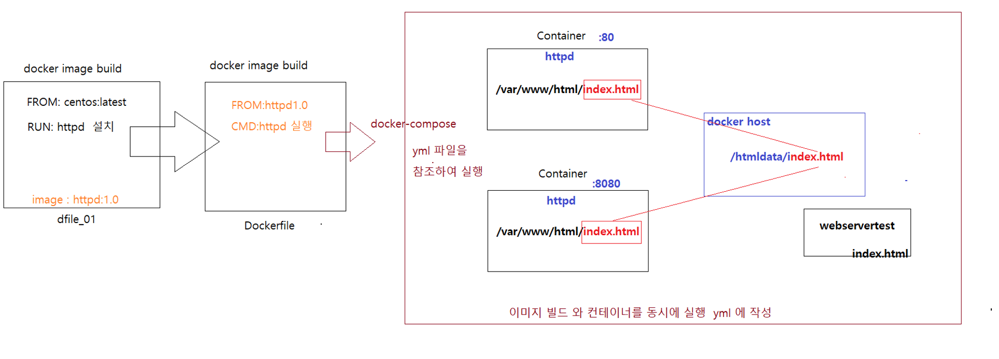

- 실습환경 설정 

  ```{0} 컨테이너 중지 후 삭제

  ```
         $ sudo docker container stop $(sudo docker ps -a -q)
         $ sudo docker container rm $(sudo docker ps -a -q)
         ```

  ```{0}docker-compose 설치

  ```
        sudo curl -L "https://github.com/docker/compose/releases/download/1.27.2/docker-compose-$(uname -s)-$(uname -m)" -o /usr/local/bin/docker-compose
        ```
        
        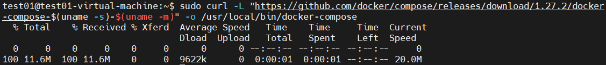

  ```{0}docker compose 사용하도록 설정

  ```
        ## docker-compose 실행 테스트
        ​
        $ sudo docker-compose --version
        test01@test01-virtual-machine:~$ sudo docker-compose --version
        sudo: docker-compose: 명령이 없습니다
        ​
        ## docker-compose 실행파일을 찾아서 
        ​
        ~$ sudo find / -name docker-compose
        find: ‘/run/user/1000/gvfs’: 허가 거부
        /usr/local/bin/docker-compose
        test01@test01-virtual-machine:~$ sudo ls -al /usr/local/bin/docker-compose 
        -rw-r--r-- 1 root root 12218192  4월  8 09:36 /usr/local/bin/docker-compose
        ​
        ##  docker-compose 파일이 실행되도록 퍼미션 부여 
        ~$ sudo chmod a+x /usr/local/bin/docker-compose
        ~$ sudo ls -al /usr/local/bin/docker-compose 
        -rwxr-xr-x 1 root root 12218192  4월  8 09:36 /usr/local/bin/docker-compose
        ​
        ##  docker-compose  실행 버전 확인
        $ which docker-compose
        /usr/local/bin/docker-compose
        $ sudo docker-compose --version
        docker-compose version 1.27.2, build 18f557f9
        ```

  ```{0}도커파일 1: Dockerfile(dfile) 작성후 image build

  ```
        ## Dockerfile 작성
        ​
        $ sudo vim ./dfile_01
        ​
        FROM centos:7
        LABEL title="centos with httpd"
        RUN yum -y update && yum -y install httpd
        ```
        
        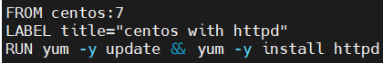
        
        ```
        ## Docker image build 
        ​
        $ sudo docker image build -t httpd:s01 /home/test01 -f dfile_01
        ```
        
        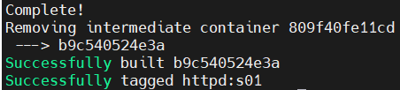
        
        ```
        ## Docker image 확인
        ​
        $ sudo docker image ls
        ```
        
        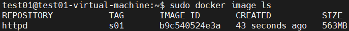

  ```{0}도커파일 2: docker-compose 가 참조할 Dockerfile 

  ```
        ~$ vim Dockerfile
        ​
        FROM httpd:s01
        EXPOSE 80
        VOLUME ["/var/www/html/images"]
        CMD ["/usr/sbin/httpd","-D","FOREGROUND"]
        ```
        
        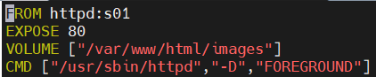

  ```{0}docker-compose 를 위한 yml 파일

  ```
        ## yml 파일 작성
        ​
        $ vim docker-compose.yml
        ​
        version: '2.0'
        services:
                webserver_80:
                        build: .
                        ports:
                                - "80:80"
                        volumes:  
                                - "/htmldata:/var/www/html"      --> docker host 의 /htmldata 디렉터리를 컨테이너의 /var/www/html 로 마운트 
        ​
                webserver_8080:
                        build: .
                        ports:
                                - "8080:80"
                        volumes:
                                - "/htmldata:/var/www/html"     --> docker host 의 /htmldata 디렉터리를 컨테이너의 /var/www/html 로 마운트 
        ```
        
        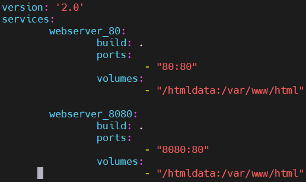

  ```{0}웹서버에서 보여질 html 파일 만들기

  ```
        $ sudo mkdir /htmldata
        $ cd /htmldata
        $ sudo vim ./index.html
        
        webtest
        ```
        
        

  ```{0}docker-compose 실행

  ```
        $ cd ~
        $ ls
        ```
        
        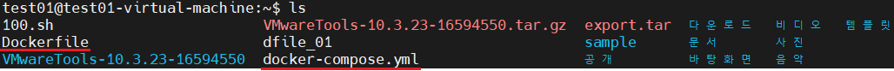
        
        #### 
        $ sudo docker-compose up
        ####
        
        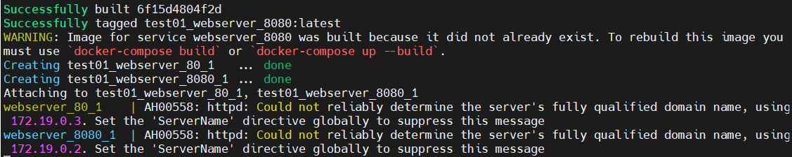

  ```{0} 확인

  ```
         http://172.16.0.201
         ```
        
         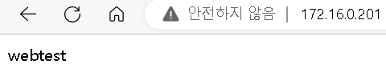
        
         ```
         http://172.16.0.201:8080/
         ```
        
         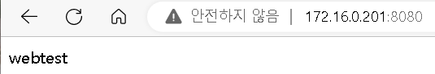

- docker-compose 실행 II

  ```{0}터미널 하나 더 실행 하여 docker-compose 를 종료
  
  ```
        $ sudo docker-compose down --rmi all
        ```
      
        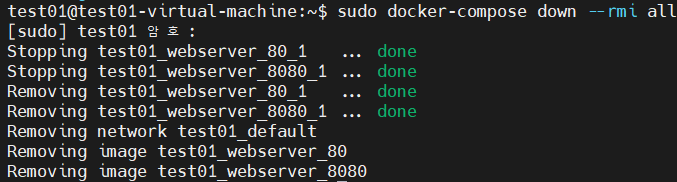

  ```{0} 다시 docker-compose 를 실행
  
  ```{0}2번째 터미널에서 bash 로 접근
  
  ```
        $ sudo docker container ps -a
        ```
      
        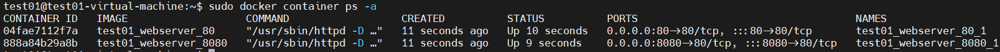
      
        ## 
        $ sudo docker exec -it test01_webserver_80_1 bash
        # ls
        ##
      
        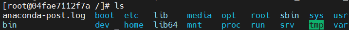
      
        ```
        # cd /var/www/html/
        # ls
        # cat index.html
        ```
      
        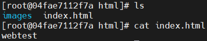

  ```{0} 8080 포트 쪽 컨테이너도 동일 하게 확인
  
         #### 
         $ sudo docker exec -it test01_webserver_8080_1 bash
         # cd /var/www/html/
         # ls
         # cat index.html
         ####
  
         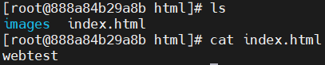
  
  ```{0} docker compose down 실행하여 compose 한 내용을 정리
  
  ```
         $ sudo docker-compose down --rmi all
         ```
      
         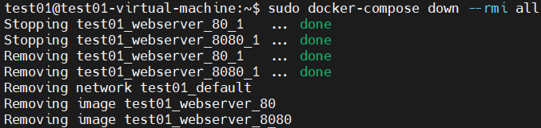

  
  ​       

