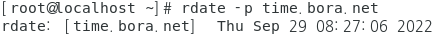
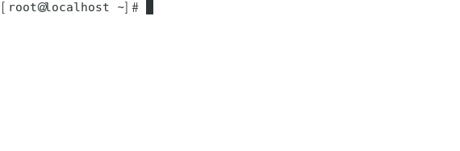
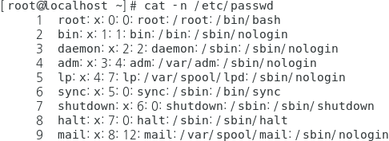
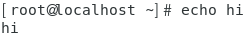
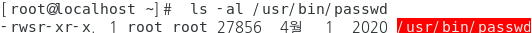
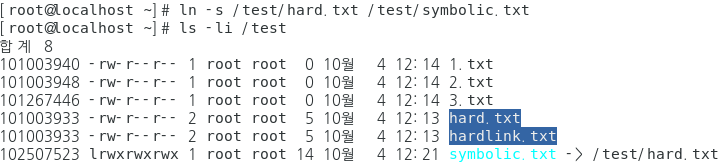
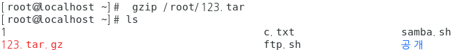

### history

- 사용 명령어 목록 확인

  ```
  [root@localhost ~]# history
  ```

  

- 최근 사용명령어 갯수 지정

  ```
  [root@localhost ~]# history 4
  ```

  


### mkdir, rmdir

- mkdir

  - 디렉터리 생성

    ```
    [root@localhost ~]# mkdir /kh
    [root@localhost ~]# ls /
    ```

    


- rmdir

  - 디렉터리 삭제

    ```
    [root@localhost ~]# rmdir /kh
    [root@localhost ~]# ls /
    ```

    

### cd, pwd

- cd

  - 경로 변경

  ```
  [root@localhost ~]# cd ./kh
  ```

  

- pwd

  - 현재 작업중인 디렉터리 출력
  
  ```
  [root@localhost kh]# pwd
  ```
  
  

### ls

- 작업중인 디렉터리의 파일 / 디렉터리 목록

```
[root@localhost ~]# ls
```


- 숨김파일 표시 (파일명의 시작이 . 으로 표시된 파일)

```
[root@localhost ~]# ls -a
```


- 상세정보 확인

```
[root@localhost ~]# ls -l
```


- 숨김파일과 상세 정보 모두 확인

  ```
  [root@localhost ~]# ls -al
  ```

  


### date, rdate

- date

  - 현재시간
  
    ```
    [root@localhost ~]# date
    ```
  
  
  
  - 시간 변경
  
    ```
    [root@localhost ~]# date -s '2022-11-11 11:11:11'
    ```


- rdate

  - 원격 시간 서버의 시간만 출력

    ```
    [root@localhost ~]# rdate -p time.bora.net
    ```

  

  - 원격 시간 서버와 동기화

    ```
    [root@localhost ~]# rdate -s time.bora.net
    ```


### which

- 명령어의 실제 디렉터리 경로

  ```
  [root@localhost ~]# which 원하는명령어
  [root@localhost ~]# which ls
  ```

  

### clear

- 화면 지우기

```
[root@localhost ~]# clear
		또는
	  ctrl + l
```



### shutdown, reboot, halt

- 바로 재시작

  ```
  [root@localhost ~]# shutdown -r now
  [root@localhost ~]# reboot
  [root@localhost ~]# init 6
  ```

- 몇분 후 재시작

  ```
  [root@localhost ~]# shutdown -r +m
  [root@localhost ~]# shutdown -r +5
  ```

  

- 지정된 시간 재시작

  ```
  [root@localhost ~]# shutdown -r 21:10
  ```

  

### touch, cat ,echo

- touch

  - 빈 파일 생성

    ```
    [root@localhost ~]# touch /root/a.txt
    ```

  

  - 이미 생성된 파일을 touch 하면 최근 접속 시간이 변경

    ```
    [root@localhost ~]# touch /root/a.txt
    [root@localhost ~]# ls -al /root/a.txt
    ```


- cat

  - 파일 읽기

    ```
    [root@localhost ~]# cat /etc/passwd
    ```

  

  - 파일 내용에 번호 출력

    ```
    [root@localhost ~]# cat -n /etc/passwd
    ```

    

  - cat 을 이용한 파일 생성

    ```
    [root@localhost ~]# cat > /root/c.txt
    내용   -> enter , ctrl + d
    ```

    


- echo

  - 입력한 문자열 출력
  
    ```
    [root@localhost ~]# echo hi
    ```

    
  
  - echo 를 이용한 파일 생성

    ```
    [root@localhost ~]# echo hi > /root/hi.txt
    ```
  
    

    ```
    [root@localhost ~]# echo hihi > /root/hi.txt    -> 새로운 내용으로 같은 파일에 적용하면 내용이 덮어씌워진다
    ```
  
    
  
  - 파일에 내용 추가
  
    ```
    [root@localhost ~]# echo hello >> /root/hi.txt
    ```
  
    

### head, tail			

- head

  - 파일 시작부터 기본 10행 출력

    ```
    [root@localhost ~]# head /etc/passwd
    ```

    

  - 원하는 n행 만큼 출력

    ```
    [root@localhost ~]# head -n /etc/passwd
    ```

    

- tail

  - 파일 끝부터 출력

    ```
    [root@localhost ~]# tail /etc/passwd
    ```

    

  - 실시간 확인

    ```
    [root@localhost ~]# tail -f /var/log/messages
    ```


### more , less , pipe(|)

- more 

  - 스페이스바로 화면이동

    ```
    [root@localhost ~]# more /etc/passwd
    ```

    

- less

  - 화살표로 화면 이동

    ```
    [root@localhost ~]# less /etc/passwd
    ```

    

- pipe(|)

  - 명령어 A | 명령어 B  

  - 명령어 A의 결과가 명령어 B의 argument(인자)

    ```
    [root@localhost ~]# ls -l /etc/ | more
    ```

    

### grep

- 특정한 단어를 검색 

  ```
  [root@localhost ~]# cat > /root/hi.txt 
  root
  ktest
  ROOT
  KTEST
  root
  ktest
  ROOT
  KTEST
  [root@localhost ~]# grep root /root/hi.txt 
  ```

  

- 검색된 행 갯수

  ```
  [root@localhost ~]# grep -c root /root/hi.txt
  ```

  

- 대소문자 무시하고 검색

  ```
  [root@localhost ~]# grep -i root /root/hi.txt 
  ```

  

- 해당 파일에서의 행번호

  ```
  [root@localhost ~]# grep -n root /root/hi.txt
  ```

  

### cp, rm, mv

- cp

  - 파일 복사

    ```
    [root@localhost ~]# mkdir /test
    [root@localhost ~]# cp /root/hi.txt /test
    [root@localhost ~]# ls /test/
    ```

    

    ```
    [root@localhost ~]# cp /root/hi.txt /test/hi2.txt
    [root@localhost ~]# ls /test/
    ```

    

  - 파일 복사시 허가권, 소유권

    ```
    [root@localhost ~]# ls -al /usr/bin/passwd
    ```

    

    ```
    [root@localhost ~]# cp /usr/bin/passwd /root/p
    [root@localhost ~]# ls -al /root/p
    ```

    

    ```
    [root@localhost ~]# cp -p /usr/bin/passwd /root/p
    [root@localhost ~]# ls -al /root/p
    ```

    

- rm

  - 파일 삭제

    ```
    [root@localhost ~]# rm /test/hi2.txt
    ```

    

  - 디렉터리 삭제

    ```
    [root@localhost ~]# rm -r /test
    ```

    

  

  - 파일, 디렉터리 모두 한번에 삭제

    ```
    [root@localhost ~]# mkdir /test
    [root@localhost ~]# touch /test/hi.txt
    [root@localhost ~]# touch /test/h2i.txt
    [root@localhost ~]# rm -rf /test
    ```

    

- mv 

  - 이동

    ```
    root@localhost ~]# mkdir /test
    ```

    

  - 이동하면서 파일 이름 변경

    ```
    [root@localhost ~]# mv /test/hi.txt /root/hi2.txt
    ```

    

### ln

- 링크파일

- i-node 번호

  - 파일에 부여되는 고유번호

    ```
    [root@localhost ~]# ls -li
    ```

    

- hard link

  - i-node 번호는 같고 이름이 다르다

  - 파일만 사용

    ```
    [root@localhost ~]# echo hard > /test/hardlink.txt
    [root@localhost ~]# ls -li /test
    ```

    
    
    ```
    [root@localhost test]# ln /test/hardlink.txt /test/hard.txt
    [root@localhost test]# ls -li /test/
    ```
    
    

- symbolic link

  - 파일, 디렉터리 모두가능

  - i-node 번호가 다름

  - 윈도우의 바로가기 느낌

    ```
    [root@localhost ~]# ln -s /test/hard.txt /test/symbolic.txt
    [root@localhost ~]# ls -li /test
    ```

    

- link count 

  - i-node 를 공유하는 파일의 갯수

    ```
    [root@localhost ~]# ls -li /test
    ```

    

### tar, gzip, bzip2


- tar

  - 절대경로로 묶은 경우 -> 최상위 제외 경로까지 같이 묶인다

    ```
    [root@localhost ~]# tar cvf /root/123.tar /root/1 /root/2 /root/3
    ```

    

  - 묶음 해제

    ```
    [root@localhost ~]# tar xvf /root/123.tar
    ```

    

  - 묶음 파일 정보 확인

    ```
    [root@localhost ~]# tar tvf /root/123.tar
    ```

    

  - 상대 경로로 묶은 경우

    ```
    [root@localhost ~]# tar cvf /root/123.tar ./1 ./2 ./3
    ```

    

- gzip

  - 묶여진 tar파일을 gzip 방식으로 압축

    ```
    [root@localhost ~]# gzip /root/123.tar
    ```

    

  - tar 파일+gzip 로 압축

    ```
    [root@localhost ~]# tar zcvf /root/123.tar.gz ./1 ./2 ./3
    ```

    

  - 압축해제

    ```
    [root@localhost ~]# tar zxvf /root/123.tar.gz
    ```

    

- bzip2

  - 묶여진 tar파일을 bzip2 방식으로 압축

    ```
    [root@localhost ~]# tar jcvf /root/123.tar.bz ./1 ./2 ./3
    ```

    

  - 압축해제

    ```
    [root@localhost ~]# tar jxvf /root/123.tar.bz
    ```

- 경로 지정하여 압축해제

  ```
  [root@localhost ~]# tar zxvf /root/123.tar.gz -C /home/ktest/
  ```

  


<br>

[맨 위로 이동하기](#){: .btn .btn--primary }{: .align-right}
