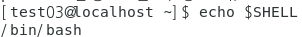
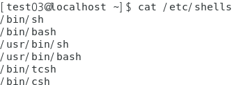

## 계정 및 그룹

- 계정
  - 사용자를 식별하고 인증을 받거나 로컬/네트워크 자원에 접근하는 것을 가능하게 해주는 객체

- 그룹

  - 비슷한 객체의 논리적인 집합
  - 권한을 편리하게 할당하기 위하여 사용
  - 하나의 그룹에 소속된 계정은 그룹의 권한을 그대로 상속 받음

- 사용 목적

  - 사용자 식별 → 인증/접근

  - 권한 할당 → 보안성 향상

  - 사용자 별 환경 제공

    > 인식할 수 있는 하드웨어 성능, 관리기능, 제공 서비스 등이 다름


## user

- 사용자 생성

  ```
  # useradd 사용자명 
  [root@localhost ~]# useradd test03
  [root@localhost ~]# cat /etc/passwd | grep test03
  ```

  

  - 로그인 할 수 있게 비밀번호 설정

    ```
    [root@localhost ~]# passwd test03
    ```

    

  - 일반 사용자는 다른 사용자 이름 변경  불가

    

- 현재 사용중인 shell 확인

  - UI 를 통하여 전달된 명령어를 해석하는 해석기

    ```
    [root@localhost ~]# echo $SHELL
    ```

    

  - 지원 하는 shell의 목록

    ```
    [root@localhost ~]# cat /etc/shells
    ```

    

  - vi 를 사용하여 test03의 shell 을 변경

    ```
    [root@localhost ~]# vi /etc/passwd
    ```

    

    ```
    [test03@localhost ~]$ echo $SHELL
    ```

    

- 사용자 삭제

  - userdel 사용자명

    ```
    [test03@localhost ~]# userdel test03
    ```

    

  - 사용자 삭제시 홈디렉터리 삭제

    ```
    [test03@localhost ~]# userdel -r test03
    ```

    

  

- 옵션

  

  ```
  [root@localhost ~]# useradd -u 1500 -d /h/test04 -c user04 -s /bin/csh test04
  ```

  

  - 그룹생성 후 생성된 그룹의 1차 그룹으로 유저 생성

    ```
    [root@localhost ~]# userdel -r test04 
    [root@localhost ~]# groupadd testgroup
    [root@localhost ~]# cat /etc/group | grep testgroup
    ```

    

    ```
    [root@localhost ~]# useradd -u 1500 -g testgroup -d /h/test04 -c user04 -s /bin/csh test04\
    [root@localhost ~]# cat /etc/passwd | grep test04
    ```

    

  - 2차 그룹으로 유저생성

    ```
    [root@localhost ~]# userdel -r test04
    [root@localhost ~]# useradd -u 1500 -G 1004 -d /h/test04 -c user04 -s /bin/csh test04
    [root@localhost ~]# cat /etc/passwd | grep test04
    ```

    

    ```
    [root@localhost ~]# cat /etc/group | grep test04
    ```

    

- usermod

  - 사용자 계정의 설정 변경

    

    ```
    [root@localhost ~]# cat /etc/passwd | grep test05
    ```

    

    ```
    [root@localhost ~]# usermod -u 2000 -g test02 -G ktest -d /home/test05 -s /bin/csh  test05
    ```

    

    

- /etc/shadow 파일

  - 사용자 계정의 암호화된 패스워드 및 정책 설정 정보가 저장된 파일

  - [root@KH-Linux~]# cat /etc/shadow

  - 같은 암호를 암호화 하여 보관하더라도 salt 값에 따라 hash value 가 달라진다

    

- /etc/skel 디렉터리
  - 사용자 계정의 홈 디렉터리에 제공 할 기본 환경설정 파일이 저장된 디렉터리
  - 사용자 홈 디렉터리의 초기 환경 제공을 위해 사용 됨
  - 사용자 계정을 생성 했을 때 skel 디렉터리에 있는 파일들이 자동으로 사용자 홈 디렉터리로 복사됨
  - [root@KH-Linux~]# ls –a /etc/skel

- passwd

  - 비밀번호 정보

    ```
    [root@localhost ~]# passwd -S root
    ```

    

  - 비밀번호 설정

    ```
    [root@localhost ~]# passwd test03
    ```

    

  - 비밀번호 삭제시 비밀번호 없이 로그인

    ```
    [root@localhost ~]# passwd -d test02
    ```

    

  - 사용자 비밀번호 잠금

    ```
    [root@localhost ~]# passwd -l test02
    ```

    

  - 비밀번호 잠금해제 

    ```
    [root@localhost ~]# passwd -u test02
    ```

    

  - -f 로 강제 시도

    ```
    [root@localhost ~]# passwd -uf test02
    ```

    

- /etc/default/useradd

  - 사용자 생성시 기본으로 적용되는 파일

    

- 사용자 정보 확인

  ```
  [root@localhost ~]# id
  ```

  

## group

- 소속그룹 확인

  - groups

    ```
    [root@localhost ~]# groups
    [root@localhost ~]# groups test02
    ```

    

  - 2차 그룹 확인

    ```
    [root@localhost ~]# cat /etc/group | grep wheel
    ```

    

- 그룹 삭제

  ```
  [root@localhost ~]# groupdel testgroup
  ```

- gid 지정하여 그룹 생성

  ```
  [root@localhost ~]# groupadd testgroup -g 2000
  ```

  

- 그룹명 ,gid  동시에 변경

  ```
  [root@localhost ~]# groupmod -n tgroup -g 1502 testgroup
  ```

  

- 그룹암호 설정

  ```
  [root@localhost ~]# gpasswd testgroup_pass
  ```

  

- 임시로 1차 그룹 변경

  ```
  test02으로 접속
  [test02@localhost ~]$ id
  [test02@localhost ~]$ newgrp testgroup
  ```

  

- 그룹 관리자

  - 그룹 관리자로 적용

    ```
    [root@localhost ~]# gpasswd -A test02 testgroup
    [root@localhost ~]# cat /etc/gshadow | grep test02
    ```

  

  - 그룹관리자 test02로 test03 등록

    ```
    [test02@localhost ~]$ gpasswd -a test03 testgroup
    ```

  

  

  - test01 로 testgroup 추가 했던 사용자 제거 테스트

    ```
    [test01@localhost ~]$ gpasswd -d test03 testgroup
    ```

  

  - 해당 그룹의 관리자 및 구성원 확인

    ```
    [root@localhost ~]# cat /etc/gshadow | grep testgroup
    ```

    

- 그룹 패스워드를 제거 : -r

  ```
  [root@localhost ~]# gpasswd -r testgroup
  [test01@localhost ~]$ newgrp testgroup
  ```

  

- etc/group 파일

  - 사용자 그룹의 기본 정보가 저장된 파일

  - [root@KH-Linux~]# cat /etc/group

    

    

## chage

- chage 명령어

  - 사용자 계정의 패스워드 설정 변경

  - [root@KH-Linux~]# chage [옵션] [계정명]

    

- 계정정보 확인

  ```
  [root@localhost ~]# chage -l test100
  ```

  

- /etc/login.defs 파일

  - 시스템에서 생성되는 전체 사용자 계정의 기본 정책이 설정된 파일 

  - [root@KH-Linux~]# cat /etc/login.defs

    

- 설정

  ```
  [root@localhost ~]# chage -m 5 -M 20 -W 3 -E 2022-10-11 test100
  
  -m : 암호를 바꿀 수 있는 최소 날 수
  -M : 암호를 바꿔야 하는 최대 날수
  -w : 암호 만료 경고
  -E : 계정만료
  계정만료(-E) vs 암호만료(-I) 시 -E 가 우선순위가 높다
  ```

  


<br>

[맨 위로 이동하기](#){: .btn .btn--primary }{: .align-right}