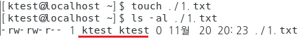
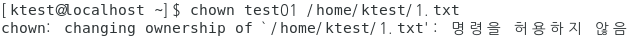
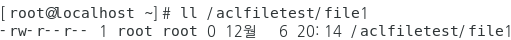
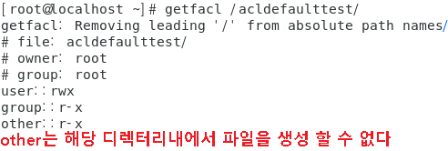

## Ownership

- 소유권(ownership)

  - 개체에 대한 소유자와 소유 그룹

  - Linux 시스템의 모든 개체(파일 및 디렉터리)는 소유자와 소유 그룹이 지정되어 있음

  - 파일 생성 시 파일을 생성한 계정이 파일의 소유자가 됨

  - 파일 생성 시 파일을 생성한 계정의 기본 그룹이 파일의 소유 그룹이 됨

  - 명령어를 이용해 소유자와 소유 그룹 변경 가능

  - 확인

    > [root@KH-Linux~]# ls -l [파일 이름]

    

#### 소유권 변경

<b>파일</b>

- 만든 사람이 소유



- 파일의 소유자 변경

  ```
  [ktest@localhost ~]$ chown test01 /home/ktest/1.txt
  ```

  

- root 계정으로 변경 시도

  ```
  [root@localhost ~]# chown test01 /home/ktest/1.txt
  [root@localhost ~]# ls -al /home/ktest/1.txt
  ```

  

- 소유 그룹 변경

  ```
  [root@localhost ~]# ls -al /home/ktest/1.txt
  -rw-rw-r-- 1 test01 test01 0 11월 20 20:23 /home/ktest/1.txt
  ```

  

  ```
  [root@localhost ~]# chgrp ktest /home/ktest/1.txt
  [root@localhost ~]# ls -al /home/ktest/1.txt
  ```

  

<b>디렉터리</b>

- 소유권 변경

  ```
  [ktest@localhost ~]$ mkdir ./test
  [ktest@localhost ~]$ touch ./test/1.txt
  [root@localhost ~]# chown test01:test01 /home/ktest/test/
  [root@localhost ~]# ls -ld /home/ktest/test
  ```

  

- 디렉터리안의 파일 소유권 확인

  ```
  [root@localhost ~]# ls -al /home/ktest/test/1.txt
  ```

  

- 하위 파일까지 소유권 변경

  ```
  [root@localhost ~]# chown -R test01:test01 /home/ktest/test/1.txt
  [root@localhost ~]# ls -al /home/ktest/test/1.txt
  ```

  

## Permission

- 허가권(Permission)
  - 멀티 유저 환경에서 개체(파일, 디렉터리 등)에 접근할 수 있는 자격

  - 개체를 읽거나(read), 쓰거나(write), 실행(execute)하는 행위

  - 소유자(user), 소유 그룹(group), 나머지 사용자(other) 단위로 권한을 부여 함

  - 확인

    > [root@KH-Linux~]# ls -l [파일 이름]

    

    

    

  - 파일 형식을 제외한 10자리의 문자

#### 일반 퍼미션

- 허가권 종류

  

- 파일의 퍼미션

  <b>r</b>

  - ktest는 other의 permission 적용

    ```
    [root@localhost ~]# touch > /home/ktest/test.txt
    [root@localhost ~]# ls -al /home/ktest/test.txt
    ```

    

    ```
    [ktest@localhost ~]$ vi /home/ktest/test.txt
    ```

    

  <b>w</b>

  - ktest 에서 소유권 변경후 편집 확인

    ```
    [root@localhost ~]# chown ktest:ktest /home/ktest/test.txt
    [ktest@localhost ~]$ ls -al /home/ktest/test.txt
    ```

    

    ```
    [ktest@localhost ~]$ echo hi > /home/ktest/test.txt
    [ktest@localhost ~]$ cat /home/ktest/test.txt
    ```

    

  <b>x</b>

  - 실행 - 현재경로 : ./파일명 , 절대경로 : 경로/파일명

    ```
    [ktest@localhost ~]$ ./test.txt
    ```

    

  - 실행 실패 이유는 실행퍼미인 x가 없기 때문

    ```
    [ktest@localhost ~]$ ls -al /home/ktest/test.txt
    ```

    

  - 실퍼미션 부여

    ```
    [root@localhost ~]# chmod u+x /home/ktest/test.txt
    [root@localhost ~]$ ls -al /home/ktest/test.txt
    ```

    

  - 다시 실행

    ```
    [ktest@localhost ~]$ ls -al /home/ktest/test.txt
    ```

    

- 디렉터리 퍼미션

  ```
  [root@localhost test01]# mkdir /home/ktest/d
  [root@localhost test01]# ls -ld /home/ktest/d
  ```

  

  

  <b>r</b>

  - 디렉터리에서 r 은 ls이다

    ```
    [root@localhost test01]# echo hello > /home/test01/d/d.txt
    ```

    

  <b>w</b>

  - 디렉터리에서 w는  touch이다

    ```
    [ktest@localhost d]$ touch /home/ktest/d/d2.txt
    ```

    

    
  
  - 삭제도 생성과 마찬가지로 거부당한다
  
    ```
    [ktest@localhost d]$ rm -rf /home/ktest/d/d.txt
    ```
  
    
  
  - d 디렉터리에 w 퍼미션 부여
  
    ```
    [root@localhost ~]# chmod o+w /home/ktest/d
    [root@localhost ~]# ls -ld /home/ktest/d
    ```
  
    
  
  - 다시 생성 시도
  
    ```
    [ktest@localhost ~]$ touch /home/ktest/d/d2.txt
    [ktest@localhost ~]$ ls /home/ktest/d
    ```
  
    	
  
  <b>x</b>
  
  - 디렉터리에서 x 는 cd 이다
  
    ```
    [root@localhost ~]# ls -al /home/ktest/d
    ```
  
    
  
    ```
    [ktest@localhost ~]$ cd /home/ktest/d
    ```
  
    

#### 퍼미션 부여

- symbolic(상대)

  ```
  [root@localhost d1]# chmod a-rwx ./d.txt
  [root@localhost d1]# ls -al ./d.txt
  ```

  

  ```
  [root@localhost d1]# chmod u+r,g+r,o+r ./d.txt
  ```

  

  ```
  [root@localhost d1]# chmod a=w ./d.txt
  ```

  

  ```
  [root@localhost d1]# chmod a+r ./d.txt
  ```

  

- numeric(절대) 

  **r = 4, w = 2, x = 1**

  ```
  [root@localhost d1]# chmod 777 ./d.txt
  ```

  

  ```
  [root@localhost d1]# chmod 000 ./d.txt
  ```

  

  ```
  [root@localhost d1]# chmod 755 ./d.txt
  ```

  

  ```
  [root@localhost d1]# chmod 644 ./d.txt
  ```

  

- umask

  - 파일 , 디렉터리 생성시 자동으로 생성되는 퍼미션

  - 기본 디렉터리는 777 , 파일은 666  에서 umask(022) 를 제외

    ```
    [root@localhost ~]# umask
    ```

    

    ```
    777-022 = 755 = rwxr-xr-x
    [root@localhost ~]# mkdir ./test
    [root@localhost ~]# ls -ld ./test
    ```

    

    ```
    666-022 = 644 = rw-r--r--
    [root@localhost ~]# touch ./test/test.txt
    [root@localhost ~]# ls -al ./test/test.txt
    ```

    

  - umask 값을 변경 : 임시로 변경됨

    ```
    [root@localhost ~]# umask 000
    ```

    

  - umask 영구변경

    ```
    # vi /etc/profile
    ```

    


## special permission

- 특수 권한(Special Permission)
  - 시스템 관리의 효율성을 높이기 위해 사용하는 특별한 권한

  - 보안의 취약점이 될 수 있으므로 꼭 필요한 경우가 아니면 사용하지 않는 것이 좋음

    

#### setuid 

- Setuid (4000 = u+s)
  - 파일을 실행하는 동안 해당 파일의 소유주의 권한으로 실행

  - 일반적인 실행은 파일을 이용하려는 사용자의 소유권에 의해 실행권한이 부여되지만, setuid 권한이 적용 되어 있는 파일은 실행되는 동안은 사용자가 아닌 파일의 소유주의 권한을 할당 받음

  - 실행 파일에만 설정이 가능 함

  - 소유자의 허가권에서 실행 권한이 x가 아닌 s로 표시 됨(예 : rwsr--r--)

  - 예 (passwd)

    > 패스워드를 변경하면 /etc/shadow 파일의 읽기 및 쓰기 권한을 가지고 있어야지 패스워드를 기록할수 있음

    > passwd 실행 파일에 setuid 권한이 부여 되어 있으므로 passwd 명령이 실행되는 동안은 소유주의 권한(root)으로 동작하게 됨

- 실습

  - passwd

    ```
    # ls -l /usr/bin/passwd 
    ```

    

  - permission : 4755 -> 755

    ```
    # chmod 755 /usr/bin/passwd
    # ls -l /usr/bin/passwd
    ```

    

  - 바뀐 퍼미션으로 비밀번호 변경(root 제외 테스트)

    ```
    퍼미션이 755 일때
    
    [test01@localhost ~]$ passwd
    ```

    

  - setuid 적용 후 다시 비밀번호 변경

    ```
    # chmod 4755 /usr/bin/passwd
               또는
    # chmod u+s /usr/bin/passwd 
    # ls -l /usr/bin/passwd
    ```

    

    ```
    [test01@localhost ~]$ passwd
    ```

    

#### setgid

- Setgid (2000 = g+s)

  - 파일을 실행하는 동안 해당 파일의 소속 그룹 권한으로 실행

  - 파일이 실행되는 동안은 사용자가 아닌 파일의 소속 그룹 권한을 할당 받음

  - 파일 및 디렉터리에서 설정 가능

  - 소속 그룹의 허가권에서 실행 권한이 x가 아닌 s로 표시 됨(예 : rwxr-sr--)

  - 디렉터리 적용

    > setgid가 적용된 디렉터리의 하위에 생성되는 디렉터리도 동일하게 setgid가 설정 됨

    > setgid가 적용된 디렉터리 안에서 새로운 디렉터리를 생성하면 setgid에 명시된 소속그룹으로 설정됨

- 실습

  - setgid 가 적용된 파일 찾기

    ```
    [root@localhost ~]# find / -perm -2000
    ```

    

  - /usr/bin/wall 의 setgid 를 변경

    ```
    [root@localhost ~]# chmod g-s /usr/bin/wall
    [root@localhost ~]# ls -l /usr/bin/wall
    ```

    

  - wall을 사용하여 message 전달시도

    ```
    [ktest@localhost ~]$ wall hi
    ```

    

  - setgid 복구 후 다시 시도하기

    ```
    [root@localhost ~]# chmod g+s /usr/bin/wall
    [root@localhost ~]# ls -l /usr/bin/wall
    ```

    

    ```
    [ktest@localhost ~]$ wall hi
    
    Broadcast message from ktest@localhost.localdomain (pts/1) (Fri Dec  2 12:46:03 2022):
    
    hi
    ```

    

#### stickbit 

- Sticky bit (1000 = o+t)
  - 모든 소유권에 모든 허가권을 부여하지만 삭제는 소유주만 가능 함
  - 디렉터리에 설정 함
  - 나머지 사용자(other)의 허가권에서 실행 권한이 x가 아닌 t로 표시 됨(예 : rwxr-xr-t) - /tmp, /var/tmp에 적용되어 있음
  - 기본 소유권과 허가권을 먼저 확인하기 때문에 기본 허가권에 삭제 권한이 있으면 삭제가 가능 함

- 실습

  - 디렉터리 안에서 ktest 로 만든 파일을 test01 로 삭제되는지 확인
  
    ```
    [root@localhost ~]# mkdir /stickytest
    [root@localhost ~]# chmod 777 /stickytest
    [ktest@localhost stickytest]$ touch ./1.txt
    [test01@localhost stickytest]$ rm -rf 1.txt
    [test02@localhost stickytest]$ ls -l
    ```
  
    
  
  - 1xxx 부여후 /stickytest 디렉터리 안에서 ktest 로 만든 파일을 test01 로 삭제되는지 확인
  
    ```
    [root@localhost stickytest]# chmod 1777 /stickytest
    [root@localhost stickytest]# ls -ld /stickytest/
    ```
  
    
  
    ```
    [ktest@localhost stickytest]$ touch ./1.txt
    [test01@localhost stickytest]$ rm -rf ./1.txt
    ```
  
    
  
    > stickbit 때문에 소유자가 다른 파일은 삭제 불가
  
    

## 확장 퍼미션 : ACL

- 확장 권한(ACL)

  - 기본적인 소유권과 허가권 외의 세부설정이 필요한 경우 사용되는 permission

  - 파일 및 디렉터리에 특정 소유자/소유 그룹의 권한을 부여할 때 사용 함

  - 파일 및 디렉터리의 세부 정보 중에서 권한 정보(rw-r--r--.)의 마지막 10번째 값으로 권한 ACL설정 여부를 확인 함

    

#### File ACL

- 디렉터리 및 파일 생성

  ```
  # mkdir /aclfiletest
  # touch /aclfiletest/file1
  ```

- getfacl : 확장 퍼미션 확인

  - 파일 및 디렉터리에 설정된 권한 ACL 확인

  - 사용법 - [root@KH-Linux~]# getfacl [옵션] <파일 이름>

    

    ```
    [root@localhost ~]# getfacl /aclfiletest/file1
    ```

    

    ```
    [root@localhost ~]# getfacl /aclfiletest/file1
    ```

    

- setfacl : 확장 퍼미션 부여

  - 파일 및 디렉터리에 설정된 권한 ACL 설정

  - 사용법 - [root@KH-Linux~]# setfacl <옵션> <정책> <파일 이름>

    

    ```
    [root@localhost ~]# setfacl -m u:ktest:rw /aclfiletest/file1
    ```

- 확인

  - 퍼미션 확인

    ```
    [root@localhost ~]# ll /aclfiletest/file1
    ```

    

  - w 퍼미션 확인

    ```
    ktest 로 vi 파일 편집
    
    [ktest@localhost ~]$ vi /aclfiletest/file1 
    ```

    

    

  - r 퍼미션 확인

    ```
    test01 로 vi 파일 편집
    
    [test01@localhost ~]$ vi /aclfiletest/file1 
    ```

    

- setfacl 설정후 그룹 퍼미션은 그룹의 아닌 추가된 사용자의 퍼미션으로 활용된다

  ```
  [root@localhost ~]# getfacl /aclfiletest/file1 
  ```

  

- mask 는 실제 사용가능한 퍼미션의 범위 

  - 최대 퍼미션을 부여하더라도 ktest 확장퍼미션 영향 없다

  - mask의 변화는  group 퍼미션에 영향 없다

    ```
    [root@localhost ~]# chmod 777 /aclfiletest/file1 
    [root@localhost ~]# getfacl /aclfiletest/file1 
    ```
  
    
  
  - mask 를 제어해서 ktest 의 퍼미션을 제한하는  첫번째 방법
  
    ```
    r퍼미션만 부여
    
    [root@localhost ~]# chmod 747 /aclfiletest/file1 
    [root@localhost ~]# getfacl /aclfiletest/file1 
    ```
  
    
  
    ```
    확인
    
    [ktest@localhost ~]$ vi /aclfiletest/file1
    ```
  
    
  
  - mask 를 제어해서 test01 의 퍼미션을 제한하는  두번째 방법
  
    ```
    [root@localhost ~]# setfacl -m u:test01:rw /aclfiletest/file1
    [root@localhost ~]# setfacl -m m::r /aclfiletest/file1 
    [root@localhost ~]# getfacl /aclfiletest/file1 
    ```
  
    

#### Directory ACL

- ktest 디렉터리 rwx 퍼미션 부여

  ```
  [root@localhost ~]# mkdir /acldirtest
  [root@localhost ~]# setfacl -m u:ktest:rwx /acldirtest
  [root@localhost ~]# getfacl /acldirtest
  ```

  

- ktest, test01로 접근하여 파일 생성되는지 확인

  ```
  ktest로 파일 생성
  
  [ktest@localhost ~]$ touch /acldirtest/file1
  [ktest@localhost ~]$ ll /acldirtest/
  ```

  

  ```
  test01로 파일생성
  
  [test01@localhost ~]$ touch /acldirtest/file1
  ```

  

#### Default ACL

- 디렉터리에 새로 생성되는 파일/디렉터리 에 기본적으로 부여

- 디렉터리 퍼미션 확인

  ```
  [root@localhost ~]# mkdir /acldefaulttest
  [root@localhost ~]# ls -ld /acldefaulttest/
  ```

  

  ```
  [root@localhost ~]# getfacl /acldefaulttest/
  ```

  

- other 중에 ktest만 파일을 생성할수 있도록 퍼미션을 부여

  ```
  [root@localhost ~]# setfacl -m u:ktest:rwx /acldefaulttest/
  [root@localhost ~]# getfacl /acldefaulttest/
  ```

  

- 파일/디렉터리 생성되는지 확인

  ```
  [ktest@localhost ~]$ mkdir /acldefaulttest/d1
  [ktest@localhost ~]$ touch /acldefaulttest/1.txt
  [ktest@localhost ~]$ ll /acldefaulttest/
  ```

  

- Default ACL 적용후 파일 과 디렉터리 생성 비교

  ```
  [root@localhost ~]# setfacl -m d:u:ktest:rwx /acldefaulttest/
  [root@localhost ~]# getfacl /acldefaulttest/
  ```
  
  
  
  ```
  [ktest@localhost ~]$ mkdir /acldefaulttest/d2
  [ktest@localhost ~]$ touch /acldefaulttest/2.txt
  [ktest@localhost ~]$ ll /acldefaulttest/
  ```
  
  
  
  ```
  Default ACL 적용전 생성된 파일 
  
  [ktest@localhost ~]$ getfacl /acldefaulttest/1.txt
  ```
  
  
  
  ```
  Default ACL 적용후에 생성된 파일
  
  [ktest@localhost ~]$ getfacl /acldefaulttest/2.txt 
  ```
  
  

#### R 옵션

- 하위 구조 까지 모두 확인 

  ```
  [root@localhost ~]# getfacl -R /acldefaulttest/
  ```

  

  

#### ACL 백업

하위구조 포함

```
# getfacl -R --skip-base /acldefaulttest/ > /root/backup-acl.bak
```

#### 기존 ACL 제거 및 초기화

```
[root@localhost ~]# setfacl -b /acldefaulttest/
[root@localhost ~]# getfacl /acldefaulttest/
```


#### 기존 ACL 복원

```
 pwd로 현재 위치 파악이 매우 중요하다
 
 [root@localhost ~]# cd /
 [root@localhost /]# pwd
```


```
[root@localhost /]# setfacl --restore=/root/backup-acl.bak
[root@localhost /]# getfacl /acldefaulttest/
```


<br>

[맨 위로 이동하기](#){: .btn .btn--primary }{: .align-right}
