## 파일 속성

- 파일 속성(file attribution)
  - 특정 파일 시스템에서 지원하는 파일의 속성 

  - 파일의 손상을 방지하여 보호하기 위한 목적으로 사용 됨

  - 허가되지 않은 사용자가 파일을 변경하지 못하게 하여 파일 보안을 제공 함

    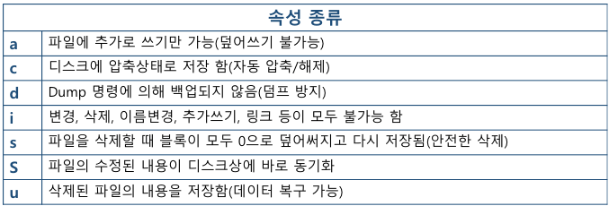

#### 실습

- 환경설정

  - 수퍼유저로 설정

  - attr1.txt 파일 생성 후 소유권을 ktest:ktest 로 변경

    ```
    [root@localhost ~]# cd /home/ktest
    [root@localhost ktest]# touch ./attr1.txt
    [root@localhost ktest]# ll ./attr1.txt
    ```

    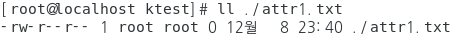

    ```
    [root@localhost test01]# chown test01:test01 ./attr1.txt 
    [root@localhost test01]# ll ./attr1.txt 
    ```

    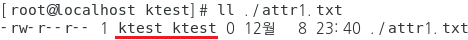

- 파일속성 확인

  ```
  [root@localhost test01]# lsattr ./attr1.txt
  ```

  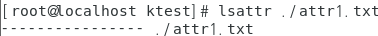

- i 

  - 변경, 삭제, 이름변경, 추가, 링크 모두 불가능

    ```
    [root@localhost ktest]# chattr +i ./attr1.txt 
    [root@localhost ktest]# lsattr ./attr1.txt
    ```

    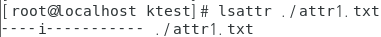

  - 소유자인 test01 로 파일을 변경~~ 기타 가능 한지

    ```
    파일 수정
    
    [ktest@localhost ~]$ vi /home/test01/attr1.txt
    ```

    

    ```
    이름 변경
    
    [ktest@localhost ~]$ mv ./attr1.txt ./attr2.txt
    ```

    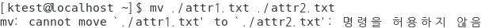

    ```
    삭제
    
    [ktest01@localhost ~]$ rm -rf ./attr1.txt
    ```

    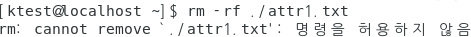

- 속성 회수 

  - 항상 슈퍼유저(root)로 한다

    ```
    [root@localhost test01]# chattr -i ./attr1.txt 
    [root@localhost test01]# lsattr ./attr1.txt 
    ```

    

  - 삭제되는지 확인

    ```
    [ktest@localhost ~]$ rm -rf ./attr1.txt
    [ktest@localhost ~]$ ls -al ./attr1.txt
    ```

    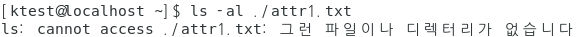

- a

  - 추가는 되지만 덮어 씌우기는 안된다

    ```
    [root@localhost test01]# touch /home/test01/appendtest.txt
    [root@localhost test01]# touch /home/test01/appendtest.txt
    [root@localhost test01]# touch /home/test01/appendtest.txt
    ```

    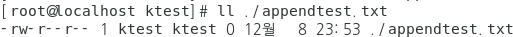

  - a 추가 후 속성 확인

    ```
    [root@localhost ktest]# chattr +a ./appendtest.txt 
    [root@localhost ktest]# lsattr /home/test01/appendtest.txt
    ```

    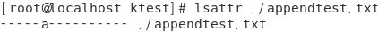

  - 덮어 씌우기 테스트

    ```
    [ktest@localhost ~]$ echo hi > ./appendtest.txt 
    ```

    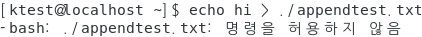

  - 내용 추가 테스트

    ```
    [ktest@localhost ~]$ echo hi >> ./appendtest.txt 
    [ktest@localhost ~]$ cat appendtest.txt 
    ```

    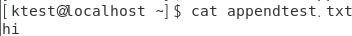

- R

  - 지정된 하위 디렉터리 까지 변경 

  - 환경설정

    ```
    [root@localhost ktest]# mkdir /home/test01/att_dir1
    [root@localhost ktest]# mkdir /home/test01/att_dir1/att_dir2
    [root@localhost ktest]# touch /home/test01/att_dir1/1.txt
    [root@localhost ktest]# touch /home/test01/att_dir1/att_dir2/2.txt
    ```

  - i 를 부여해서 확인

    ```
    [root@localhost ktest]# chattr -R +i /home/test01/att_dir1
    [root@localhost ktest]# lsattr -R /home/test01
    ```

    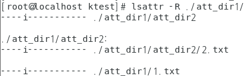

<br>

[맨 위로 이동하기](#){: .btn .btn--primary }{: .align-right}
