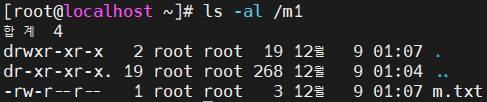
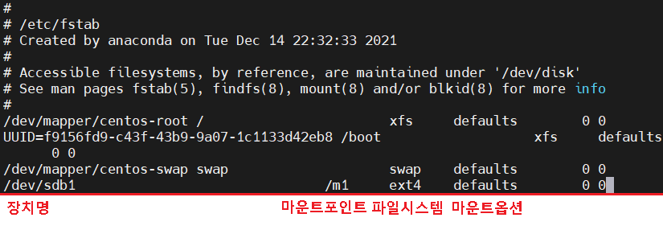

## Disk management : Linux

#### 실습 - 기본디스크:파티션

- 환경설정

  - 다른 가상머신에 있는 디스크파일(vmdk)을 복사하여 옮긴다

    

  - mini에 디스크 등록

    ```
    add > harddisk > SCSI > use an existing disk >
    existing  disk file : vmdk  추가 
    ```

    

    

    

    

    

    

    

#### partitioning(파티셔닝)

- fdisk

  

  물리적 하드디스크는 추가되는 순서로 /dev/sda , sdb ,sdc ...

- fdisk -l

  

- fdisk를 이용한 파티션 관리

  - n - 파티션 추가 

    ```
    [root@localhost ~]# fdisk /dev/sdb
    ```

    

    

  - 파티션타입 선택

    

  - 파티션 넘버 지정 및 sector 지정 

    

  - p - 정보 확인

    

  - d - 파티션 삭제

    

  - w - 저장

    

- 파일시스템

  - mkfs

    ```
    [root@localhost ~]# mkfs
    ```

    

  - 종류

    ```
    windows(NT) : FAT,FAT32,NTFS
    linux : ext4, xfs, FAT, FAT32, NTFS
    ```

  - ext4

    ```
    - journaling file sytem : 파일시스템의 입출력을 모두 기록 > 복구 장점
    ```

  - 파일 시스템 부여

    ```
    [root@localhost ~]# mkfs -t ext4 /dev/sdb1
    ```

    

- 마운트

  - 마운트 할 디렉터리 생성 및 파일 생성

    ```
    [root@localhost ~]# mkdir /m1
    [root@localhost ~]# echo hi > /m1/m.txt
    ```

    

  - 마운트하고 마운트 상태 확인

    ```
    [root@localhost ~]# mount /dev/sdb1 /m1
    [root@localhost ~]# df -h
    ```

    

  - 마운트 후 디렉터리 내용이 없다

    ```
    [root@localhost ~]# ls -al /m1
    ```

    

  - 해제하면 디렉터리 내용이 원래대로 돌아온다

    ```
    [root@localhost ~]# umount /m1
    [root@localhost ~]# ls -al /m1
    ```

    

  - 마운트 후 파일 생성

    ```
    [root@localhost ~]# mount /dev/sdb1 /m1
    [root@localhost ~]# touch /m1/test.txt
    [root@localhost ~]# ls /m1
    ```

    

  - 해제 한뒤 다시 확인

    ```
    [root@localhost ~]# umount /m1
    [root@localhost ~]# ls /m1
    ```

    

  - 다시 마운트하면 생성 했던 파일이 존재한다

- /etc/fstab

  - 재부팅을 할 경우 마운트 정보가 사라진다

    ```
    # init 6 또는 reboot
    [root@localhost ~]# df -h
    ```

    

  - /etc/fstab 파일을 수정하여 재부팅시에도 정보 저장

    ```
    [root@localhost ~] # vi /etc/fstab
    ```

    

  - 장치명대신에 UUID도 사용 가능하다

    ```
    UUID : 장치의 고유번호
    
    [root@localhost ~]# blkid
    ```

    

  - 재시작 후 확인

    ```
    [root@localhost ~]# reboot
    [root@localhost ~]# df -h
    ```

    

    

<br>

[맨 위로 이동하기](#){: .btn .btn--primary }{: .align-right}