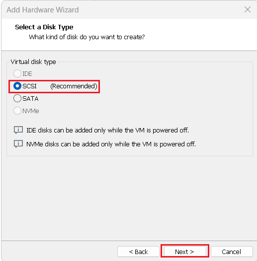
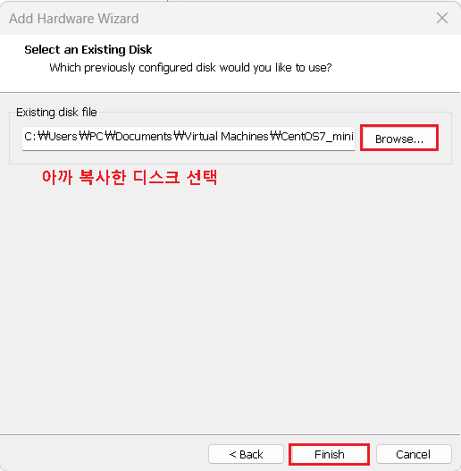
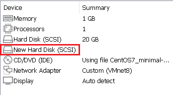

## Disk management : Windows

#### 실습 - 기본디스크:파티션

- 환경 설정

  - 다른 가상머신에 있는 디스크파일(vmdk)을 복사하여 옮긴다

    

  - 2003에 디스크 등록

    ```
    - vmware 
    
    setting > add > harddisk > SCSI > use an existing disk >
    existing  disk file : vmdk  추가 
    ```

    

    

    

    

    

    

    

  - 디스크 관리에서 확인

    ```
    실행 -> diskmgmt.msc
    ```

    

    

- MBR 방식

  

  - 주 파티션 : OS 가 설치가능한 파티션  총 4개 밖에 생성 불가 
  - 확장 파티션 : 추가 파티션이 필요한경우 사용
  - 확장파티션에 추가 파티션을 사용하려면 논리 파티션(드라이브) 를 사용
  - GUI 에서는 주 파티션 3개가 생성되면 마지막하나는 자동으로 확장파티션이 생성 됨

- Partitioning 

  - 주 파티션

    

    

    

    

    

    

    

  - 확장파티션

    

  - 논리 드라이브

    

    

- Filesystem 부여

  - 물리적 파일위치를 지정하는 방식을 정의, cluster(sector 몇개를 묶어서 사용할것인가?)

  - 파티션 >> 포맷 > NTFS 선택 > 확인

    

    

- mount

  - 사용자가 파티션을 찾을수 있도록 디렉터리 구조를 부여 

  - 드라이브 문자 할당

    

    

    

    

- GPT 방식

  - 주파티션 만 있음 이론상으로는 무한대로 생성가능 (확장 파티션이 없는 개념)

  

  

  

<br>

[맨 위로 이동하기](#){: .btn .btn--primary }{: .align-right}