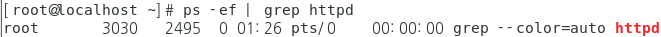

## process management

- process

  - 프로그램이나 명령어를 실행했을 때 메모리에 적재되어 실제로 동작하는 상태
  - 프로세스가 실행되면 프로세스 식별번호(PID, Process id)를 할당 받음
  - 최상위 프로세스는 항상 init 프로세스
  - 나머지 프로세스는 항상 부모 프로세스(PPID, Parent Process ID)를 가짐
  - 해당 프로세스를 동작 시킨 파일의 uid, gid를 획득하여 소유주 등의 프로세스 실행에 필요한 inode 정보및 실행된 터미널, 입력된 명령어, 시작 시간 등의 많은 정보 보유 함

  -1670860733947-1.png)

#### 프로세스 기본 관리 명령어

- ps : 프로세스의 정보 확인

  ```
  # ps -ef
  
  -e, A : 프로세스 전체 목록 출력
  -f    : PID, PPID 정보를 포함하여 출력
  ```

  

  - PID : 프로세스 식별자

  - PPID : 부모 프로세스

    > PPID = 0 인 경우는  부모 프로세스가 없는 경우이다

  - STIME : 프로세스 시작된 시간  

  - TIME : CPU 사용시간 

  - C : CPU 사용률 

- pstree : 프로세스의 상관관계를 계층적으로 확인

  ```
  # pstree -np
  
  -n : PID 순서대로 정렬하여 출력
  -p : PID 정보를 함께 출력
  ```

  

- pkill  :  관련프로세스를 모두 종료 

  ```
  프로세스 실행 
  
  # systemctl restart httpd
  # ps -ef | grep httpd
  ```

  

  ```
  # pkill httpd
  # ps -ef | grep httpd
  ```

  

- kill : 프로세스 종료

  ```
  # systemctl restart httpd
  # ps -ef | grep httpd
  ```

  

  ```
  kill -9 PID
  
  # kill -9 3070
  # ps -ef | grep httpd
  ```

  

- signal

  > 동작 중인 프로세스에게 전달하는 메시지의 의미를 가짐

  > 각 메시지마다 프로세스가 수행할 동작이 정의 되어 있음

  ```
  signal 종류 확인
  
  [root@KH-Linux~]# kill -l
  ```

  

- nohup
  - 쉘 스크립트 파일을 데몬 형태로 실행

  - 터미널 종료 후에도 프로세스의 실행을 유지해야 하는 경우 사용 

    ```
    [root@KH-Linux~]# nohup *.sh
    ```

#### 프로세스 구분

- foreground

  - 실행된 터미널에서 창에서 다른작업이 불가능

  - ctrl + z 로 종료 

    ```
    백그라운드로 동작중인 프로세스를 포그라운드로 전환
    
    [root@KH-Linux~]# fg %<작업 번호>
    ```

- background

  - 실행된 터미널에서 창에서 다른작업이 가능하다 

  - 보이지 않기 때문에 kill 이라는 명령어를 사용해야한다

    ```
    포그라운드로 동작중인 프로세스를 백그라운드로 전환
    
    [root@KH-Linux~]# bg %<작업 번호>
    ```

#### 프로세스 우선순위

- nice, snice 명령어로 관리 함

- 프로세스 우선순위 확인

  ```
  [root@KH-Linux~]# ps –el
  ```

  

  

- nice
  - 프로세스 동작의 우선순위를 설정

  - -20 ~ 20(낮을 수록 우선순위가 높음)

  - 프로그램을 실행하면 우선순위(nicer값)를 변경

  - 사용법

    ```
    [root@KH-Linux~]# nice -n [우선순위 값] [프로그램 이름 또는 PID]
    [root@KH-Linux~]# nice -[우선순위 값] [프로그램 이름 또는 PID]
    ```

- snice
  - 프로세스 동작의 우선순위를 설정

  - 실행중인 프로그램의 우선 순위(nice 값)를 변경

  - 사용법

    ```
    [root@KH-Linux~]# snice +/- [우선순위 값] [프로그램 이름 또는 PID]
    ```

    
