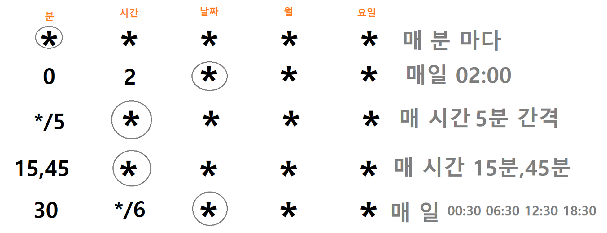
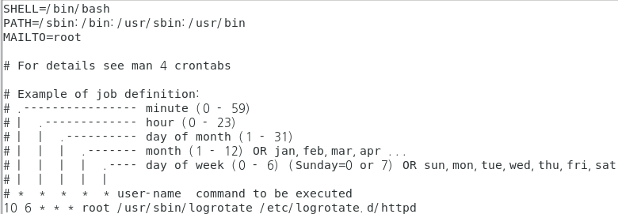
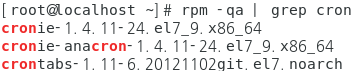
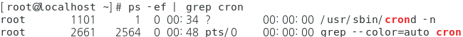
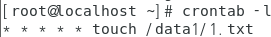
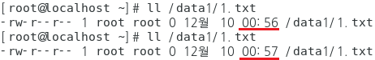
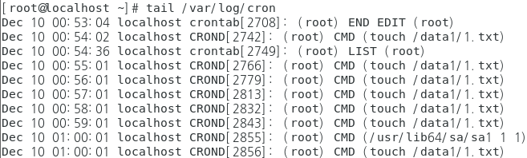
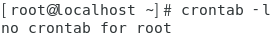

## scheduling management

- 스케쥴링 관리

  - 일정시간 간격으로 작업을 하도록 설정

- crontab 시간

  

  ```
  # vi /etc/crontab
  ```

  

- cronie 패키지 정보 

  - 프로세스 : crond

  - 목록 : crontab

  - 패키지 설치 여부

    ```
    [root@localhost ~]# rpm -qa | grep cron
    ```

    

  - 프로세스 실행 여부

    ```
    [root@localhost ~]# ps -ef | grep cron
    ```

    

#### 실습

- 실습환경 설정

  ```
  [root@localhost ~]# mkdir /data1
  [root@localhost ~]# touch /data1/1.txt
  [root@localhost ~]# rdate -s time.bora.net
  ```

- 스케쥴 확인

  - 스케쥴 목록

    ```
    # crontab -l
    ```

    

  - 편집

    ```
    # crontab -e
    
    * * * * * touch /data1/1.txt  --> 1분마다 실행
    ```

    

    

    ```
    [root@localhost ~]# crontab -l
    ```

    

  - 분 단위로 변경되는 것을 확인

    ```
    1분 마다 touch로 1.txt를 생성하기때문에 시간이 바뀐다
    
    [root@localhost ~]# ll /data1/1.txt 
    ```

    

  - crond 작업 내역 확인

    ```
    [root@localhost ~]# tail /var/log/cron
    ```

    

  - 작업취소 

    ```
    [root@localhost ~]# crontab -r
    [root@localhost ~]# crontab -l
    ```

    