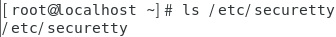
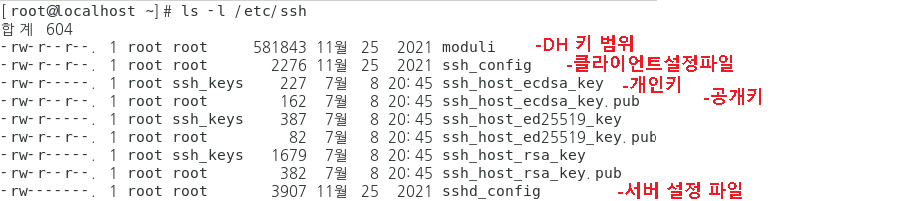

## 원격서비스

- 원격 서비스
  - 물리적으로 떨어져 있는 컴퓨터를 로컬 컴퓨터처럼 이용할 수 있게 하는 서비스 
  - 네트워크 연결을 통해 공유 컴퓨터의 자원을 이용할 수 있게 함

- 원격 서비스 용도

  - 초기 

    > 네트워크를 통한 컴퓨터의 자원을 공유하기 위한 방식으로 사용 됨

  - 현재

    > 고객 지원, 원격 관리, 원격 제어의 목적으로 많이 사용 됨

#### telnet

- **TCP 23**

- 기본적으로 **평문(plaintext)** 통신을 수행하므로 **보안이 약한 서비스** → 권장하지 않음

  - 라우터에서는 원격 관리 도구로 가끔 사용되는 데 거의 사용 안 하는 분위기

- 클라이언트는 byte 단위로 , 서버는 Line 전송

  - 서버 → 클라이언트

    -1670897425627-4.png)

    

  - 클라이언트 → 서버

    

    -1670897452758-6.png)

- telnet 은 기본값으로 일반사용자만 접속하도록 설정되어있다 - 보안문제

- 굳이 telnet을 사용 한다면 일반사용자로 접속하고 su - 를 수퍼유저로 전환하도록 추천 한다

```
server : 120] CentOS7

[root@localhost ~]# ls /etc/securetty
```



```
해당 파일을 백업 

-p : 퍼미션 유지

# cp -p /etc/securetty /etc/securetty.bak

수퍼유저 접속을 허용할 터미널 번호(tty)를 추가

# vi /etc/securetty
~
pts/0
pts/1
**pts/2**
pts/3
pts/4
pts/5
pts/6
pts/7

xinetd 의 제어를 받는 경우 

# systemctl restart xinetd

client : 101] xp

Kernel 3.10.0-1160.66.1.el7.x86_64 on an x86_64
localhost login: root
Password:
Last login: Thu Jul  7 18:02:47 from 172.16.0.100
[root@localhost ~]# tty
/dev/pts/2
```

#### SSH

- SSH(Secure Shell)
  - telnet 처럼 클라이언트와 서버와의 세션을 생성 함 → SSH Tunneling
  - shell연결 뿐만 아니라 다양한 Application이 상위 계층에 존재할 수 있음
  - 보안 세션을 제공하여 인증 및 데이터의 기밀성, 무결성을 보장 함
  - TCP port 22 이용
  - 종류 → SSHv1, SSHv2

- SSH의 version별 특징

  

- sshd 설정 파일 

  - 클라이언트 설정 파일 , 서버 설정 파일 구분 

    

  - MobaXterm을 이용한 ssh 테스트

    

  - 

