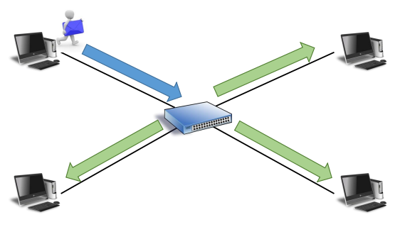

## 🗂️Layer-1 Physical

## 🗂️Cable & Connector

- 네트워크에서 물리적으로 장비를 연결하는 매체(media) 
- 네트워크 장비나 컴퓨터들 사이에서 전기적 신호를 전송 
- 네트워크 종류에 적합한 케이블을 선택해야 함 
- 케이블 종류에 따라 사용되는 커넥터의 종류가 달라짐

## 🗂️통신 Cable 종류

- 동축 케이블(Coaxial cable)

  

- 꼬임쌍선 케이블(Twisted-Pair cable)

  

- 시리얼 케이블(Serial cable)

  

- 광 케이블(Fiber-Optic cable)

  

## 🗂️꼬임 쌍선(TP) 케이블

- <b>핀 배치에 따른 Cable 종류</b>
  - Straight Cable

> 핀 배열이 다른 장비끼리 연결할 때 양쪽 수 커넥터를 똑같이 핀 배치

- Crossover Cable

> 핀 배열이 같은 장비끼리 연결할 때 양쪽 수 커넥터를 반대로 핀 배치

​    

## 🗂️Serial Cable

- ### <b>Serial Cable</b>
  
  - 직렬 케이블 
  - 예전 WAN통신에서 모뎀과 네트워크 장비를 연결하기 위해 사용 됨 
  - WAN을 구성하는 장비의 연결에 사용 됨 
  - Connector의 역할이 DCE 와 DTE 로 정해 져 있음 
  - DCE : Clock Signal 을 보내는 장비 
  - DTE : Clock Signal 을 받는 장비

## 🗂️Cable Type 명명 법

- <b>Cable Type 명명 법</b> 
  - 케이블의 종류, 속도, 신호의 종류를 알 수 있게 Type을 분류

① Bandwidth(Mbps) 

- 케이블을 통해 초당 전달할 수 있는 데이터의 양  전송 속도를 측정하는 단위 
- 기본 단위 : <u><b>Mbps</b>(bps : bit per second)</u>

② Signal Type 

- Baseband : Digital Signal → LAN, WAN(전용선)
- Broadband : Analog Signal → WAN(공용선)

③ Cable Type(Max Distance) 

- 케이블의 종류와 단일 케이블로 연결할 수 있는 최대 연장 거리
- Number(2 or 5) → Coaxial cable(2 : 185m, 5 : 500m) 
- T, Tx → Twisted-Pair cable(100m) 
- F, Fx → Fiber-Optic cable(Variable)

## 🗂️Hub & Repeater

- <b>Hub & Repeater</b> 
  - 신호를 재생시켜 좀더 먼 거리까지 신호를 전달하기 위한 장비
- <b>Repeater</b> 
  - port의 개수 : 2개 
  - 한쪽 port로 전달받은 신호를 재생시켜 반대쪽 포트로 전달 함 
  - 주로 거리 연장을 위해 사용 함 

- <b>Hub</b>
  - port의 개수 : 여러 개 
  - 한쪽 port로 전달받은 신호를 재생시켜 나머지 포트로 모두(flooding) 전달 함 
  - 다수의 포트를 이용하여 장비의 연결을 집중시키는 집선 장비로 사용 함 
  - ※ 집선 장비 : 선을 집중해서 모아 주는 장비

 

## 🗂️Hub 통신 방식

### 🗒️<b>Hub 통신 방식</b> 

- 모든 회선을 연결된 호스트들이 <b>공유</b>
- Hub에 연결된 호스트들은 회선을 사용하기 위해 <b>경쟁</b>하게 됨
- Hub는 Inbound Packet을 모든 포트로 <b>Flooding</b>함

### 🗒️<b>신호 전달 방식</b>

- #### Simplex 

  

  - 단 방향 신호 전달 방식

  - 한 방향으로만 신호 전달 가능

  - Ex) 방송국, 일방통행 도로

- #### Half-Duplex

  

  - 반 이중 신호 전달 방식

  - 양쪽 전송이 가능하지만 한 순간에 한 방향으로만 신호 전달 가능

  - Hub 의 기본 신호 전달 방식

  - Ex) 무전기, 1차선 도로

- #### Full -Duplex

  

  - 전 이중 신호 전달 방식 

  - 동시에 양 방향으로 신호 전달 가능 

  - Switch 의 기본 신호 전달 방식 

  - Ex) 전화기, 2차선 도로

## 🗂️충돌 가능 영역(collision Domain)

### 🗒️<b>Hub 통신의 문제점</b> 

- Half-Duplex 통신만 지원되므로 경쟁을 통해 매체를 이용하는 환경에서는 신호의 충돌(Collision)이 발생할 가능성이 존재 함 

- Collision Domain 
  - Half-Duplex 환경에서 동시에 양방향으로 Data가 전송되는 경우 충돌이 발생
  - <b>신호 충돌이 발생 가능한 영역을 Collision Domain이라 함</b>
  - Hub, Repeater 등 1계층 장비는 기본 Half-Duplex 방식을 사용

 

### 🗒️<b>해결 방법</b>

### CSMA/CD(Carrier Sense Multiple Access/Collision Detection)

- Collision Domain에서 매체 접근의 우선순위를 지정하여 충돌을 예방하고 충돌이 발생한 경우 해결방법을 제시하는 기법

- CSMA(Carrier Sense Multiple Access -매체 사용 감지)
  - <b>충돌 예방</b> 
  - 매체 감지 신호를 통해 매체 사용 가능 여부를 확인하고 신호를 전달 
  - 매체 사용(busy)을 감지하면 일정한 대기 시간 후 다시 확인하고 전달 함 

- CD(Collision Detection - 충돌 감지) 
  - <b>충돌이 감지된 경우 재 충돌을 방지</b> 
  - 충돌을 감지한 장비에서 충돌 감지 신호(JAM신호)를 전달하여 호스트에게 데이터 전송 중지를 알림 
  - 충돌 감지 신호(JAM 신호)를 전달받은 모든 장비는 임의의 대기 시간 후 순서에 따라 신호를 전달 함

 

[맨 위로 이동하기](#){: .btn .btn--primary }{: .align-right}
