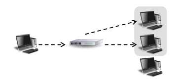

## 🗂️Layer 2 Data Link

## 🗂️MAC Address 

- <b>MAC Address</b> 
  
  - NIC(Network Interface Card)에 부여된 고유 식별 값 
  - Network 통신에서 인접 장비에 접근하기 위해 사용되는 장비의 고유 이름 
  - 공식 이름 : EUI(Extended Unique Identifier)
  
- <b>EUI-48(48bit Extended Unique Identifier)</b> 

  - 00-0E-35-05-80-6F (= 00:0E:35:05:80:6F = 000E-3505-806F) 

  - 16진수로 표현하며 1byte씩 구분하여 표기 함 

  - 상위 24bit → Company ID(=OUI) : 제조 업체의 식별 코드 

  - 하위 24bit → Extension ID : 장비(NIC)의 제조 번호 

    -하나의 OUI(00-0E-35)를 통해 생성될 수 있는 MAC주소의 개수 → 2 24 = 16,777,216 개

- <b>멀티 캐스트용 MAC주소 </b>
  
  - 상위 24bit가 <b>01:00:5e</b>로 시작되는 MAC 주소
  
- <b>브로드 캐스트용 MAC주소 </b>
  
  - 전체 MAC주소 중 제일 큰 값을 가지는 주소 
  - <b>FF:FF:FF:FF:FF:FF</b>

## 🗂️데이터 전송방식

데이터 전송방식 

- ### 🗒️<b>Unicast </b>
  
  - 단일(1:1) 장비로 데이터를 전송 
  
  - 원하는 대상에게만 데이터 전송 가능 
  
  - 다른 장비에 부하를 주지 않음 
  
    
  
- ### 🗒️<b>Broadcast </b>

  - 다수(1:N) 장비로 데이터를 전송  동일한 정보를 한번에 모든 장비로 전송 가능 

  - 너무 많이 발생하면 성능이 저하 됨 

    

- ### 🗒️<b>Multicast </b>
  
  - 특정그룹(1:특정그룹) 장비로 데이터를 전송 
  
  - 미리 약속된 그룹들이 있음 
  
  - 원하는 그룹을 만들어서 사용 가능
  
    

## 🗂️Ethernet Protocol

- <b>Ethernet Protocol</b> 
  - LAN을 위해 개발된 컴퓨터 네트워크 기술
  - 네트워크에 연결된 각 기기들이 고유의 MAC 주소를 가지고, 이 주소를 이용해 상호간에 데이터를 주고 받 을 수 있도록 만들어진 기술
  - LAN 네트워크의 90% 이상이 Ethernet 방식을 사용

- <b>Ethernet 종류</b>

  - <b>Ethernet v2 또는 DIX Ethernet(DIX 2) </b>

    -IEEE 표준화를 위해 진행 되었지만 기존의 v1과의 호환성을 위해 v2로 발표

  - <b>IEEE 802.3 </b>

    -EEE에서 DIX 사양에 기초하여 Ethernet을 위해 표준으로 제정한 프로토콜

- <b>Ethernet v2 vs IEEE 802.3</b>

  - 표준은 IEEE 802.3 이지만 <b>대부분의 통신에서 Ethernet v2 를 사용</b> 

  - 특별한 경우에만 IEEE 802.3 사용 

    -장비와 장비의 기능을 위해서 <b>장비 스스로 정보를 교환</b>해야 하는 경우

- <b>Ethernet v2 Frame</b>

  

- Preamble (8bytes) 

  - 데이터 신호 동기화 

    -동일한 패턴(101010...)의 신호를 7bytes 연속으로 보내서 데이터 전송을 알림

  -  2계층 header 의 시작을 알리는 역할

    -마지막 1byte의 1bit를 1로 만들어 2계층 Header가 시작됨을 알림(10101011) 

- Destination Address (6bytes) 
  - 목적지 MAC Address 
  - DMAC 이라 부르고 DA 로 표시함

- Source Address (6bytes) -
  -  출발지 MAC Address 
  - SMAC 이라 부르고 SA 로 표시함 
- <b>Type (2bytes) </b>
  - 정확한 명칭은 Ether Type Code 
  - 상위 계층의 Protocol 코드 값(IP : 0x0800 , ARP : 0x0806 등..) -
  - 최소 코드 값은 16진수값 0x0600(1536) 부터 사용됨

- <b>Payload (46~1500bytes) </b>
  - 상위 계층에서 내려온 데이터 
  - 2계층의 Payload는 최대 1500bytes(MTU)까지만 사용 가능 
- FCS (4bytes) 
  - Frame Checksum Sequence 
  -  오류 체크를 위한 값 
  -  Header부터 Payload까지의 값을 CRC32 알고리즘을 사용해서 계산한 결과값

## 🗂️Layer 2 장비

- <b>Bridge </b>

  - Full duplex 연결을 지원하며 신호 재생을 수행하는 장비

    

- <b>Switch(L2 Switch) </b>

  - Switching 동작을 수행할 수 있는 장비 

  - 2계층 프로토콜 정보를 해석하고 이용 가능한 장비 

  - MAC주소를 해석할 수 있기 때문에 목적지를 구별하여 데이터를 전달 함

    

## 🗂️Switch

- <b>Switching </b>
  - 데이터에 포함된 주소정보에 따라 데이터를 해당 출력 포트로 빠르게 접속시키는 기능 
  - 여러 전달경로에서 어느 방향으로 전달할 것인가를 선택하는 기능  
- <b>Switch </b>
  - Switching 기능을 수행하는 장비 
  - 근거리 통신망 구축 시 사용되는 단말기의 집선 장비 
  - 대부분 Full-Duplex 방식으로 동작하므로 Collision Domain이 형성되지 않음 
  - MAC 주소를 학습하고 구분할 수 있음 
  - 입력된 데이터를 지정된 포트로만 전달함

## 🗂️Switch 통신방식

- <b>Switch 통신 방식1 </b>

  - Switch로 데이터가 들어오면 SMAC 주소를 MAC Table에서 확인 

    > 없으면  MAC Table에 SMAC 주소를 기록(Learning)

    

- <b>Switch 통신 방식1 </b>

  - Switch로 데이터가 들어오면 SMAC 주소를 MAC Table에서 확인 

    > 없으면 MAC Table에 SMAC 주소를 기록(Learning) 

  - DMAC 주소를 MAC Table에서 확인 

    > 없으면 Flooding

    

- <b>Switch 통신 방식1 </b>

  - Switch로 데이터가 들어오면 SMAC 주소를 MAC Table에서 확인

    > 없으면 MAC Table에 SMAC 주소를 기록(Learning) 

  - DMAC 주소를 MAC Table에서 확인 

    > 없으면 Flooding 

    > 데이터를 받은 장비에서 자신의 데이터가 아니면 폐기

    

　　　　　

- <b>Switch 통신 방식1 </b>

  - 수신자가 다시 응답 데이터를 전송할 때 SMAC을 MAC Table에서 확인 

    > 없으면 MAC Table에 SMAC 주소를 기록(Learning)

    

- <b>Switch 통신 방식1 </b>

  - 수신자가 다시 응답 데이터를 전송할 때 SMAC을 MAC Table에서 확인 

    > 없으면 MAC Table에 SMAC 주소를 기록(Learning) 

  - DMAC 주소를 MAC Table에서 확인

    > 있으면 해당 Port로만 데이터 전송(Filtering/Forwarding)

    

- <b>Switch 통신 방식1 </b> 
  - MAC Table에 SMAC 주소가 있는 경우 학습하지 않음 
  - MAC Table에 DMAC 주소가 있는 경우 Flooding 하지 않고 <b>해당 목적지로만 데이터 전송 </b>(Filtering/Forwarding)

## 🗂️Switch 기본기능

- <b>Address Learning</b> : 2계층 주소(MAC주소)를 학습하는 기능

- <b>Filtering </b>: MAC Table에 일치하지 않는 경로로의 전송을 막아주는 기능

- <b>Forwarding</b> : MAC Table에 일치하는 경로로 전송해 주는 기능 

- <b>Flooding</b> : 모든 경로로 데이터를 전송해 주는 기능 

  - MAC Table에 없는 MAC 주소를 받은 경우 
  - Broadcast/Multicast 데이터를 받은 경우 
  - MAC Table이 가득 찬 경우 

- <b>Aging</b> 

  - MAC Table을 관리하기 위한 기법 

  - 한번 사용된 MAC주소가 일정 시간 사용되지 않으면 삭제 

  - Aging Time 기본 300초(5분) 

  - 다시 사용되면 Aging Time 초기화 

-  Loop avoidance : Loop를 회피할 수 있는 기능

## 🗂️Switching작동방식 

- Switch가 알아서 손실률을 보고 동적으로 방식을 변경 함

- Store and Forward

- 프레임을 모두 전송 받아 검사한 후 전달

- FCS부터 체크하기 때문에 안정성이 높아짐  속도가 떨어짐 

- Cut-Through 

  - 가장 빨리 전달하는 것(스위치의 기본값) 

  - 목적지 주소까지 확인한 후 바로 전달 

  - 안정성이 떨어짐 
  -  속도가 빠름 

- Fragment-Free 

  - 프레임을 최소사이즈 64byte까지만 검사한 후 전달 

  - 프레임의 64byte를 검사해서 FCS 가 있으면 Store and Forward 방식

  - FCS 가 없으면 Cut-Through

 

[맨 위로 이동하기](#){: .btn .btn--primary }{: .align-right}
