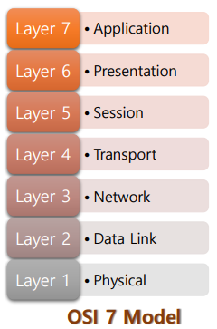
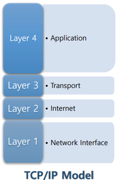
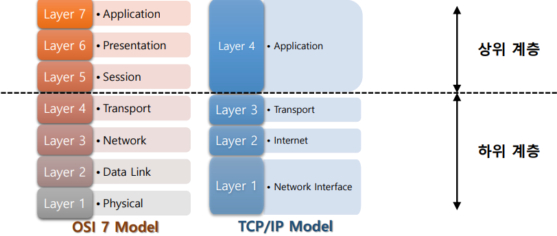
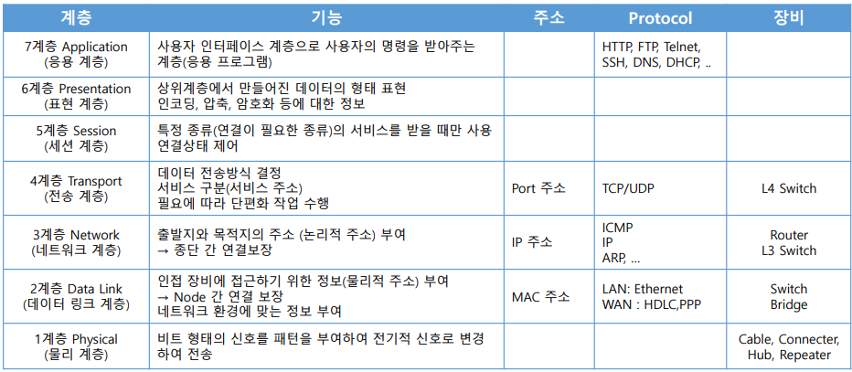
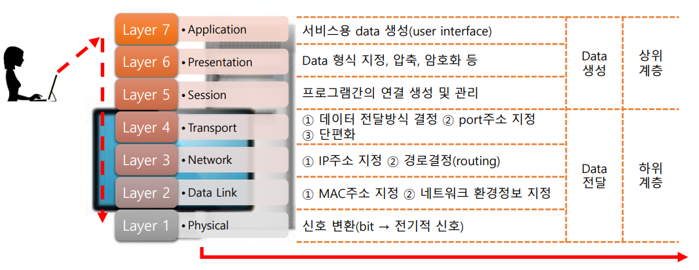
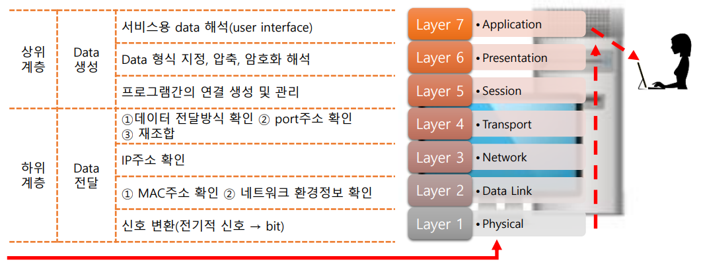
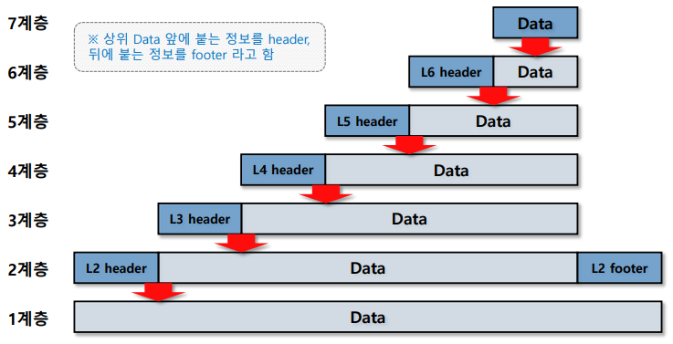
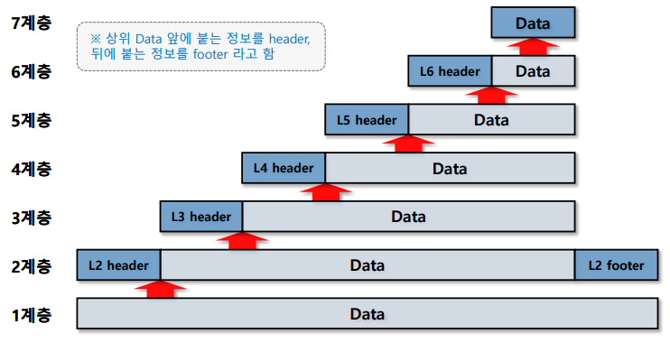
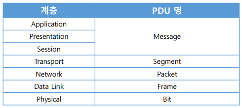

> ## 🗂️네트워크 모델이란?
>
> - 데이터를 만들 때 최상의 효율성과 안정성을 보장하기 위한 구조
> - 통신이 일어나는 절차를 각 기능별로 모듈화시켜 만들어놓은 계층적인 구조
> - 계층은 항상 순서대로 동작됨
> - 종류 : OSI 7Layer 참조모델, TCP/IP Mode
>      
>
> ## 🗂️네트워크 모델의 종류
>
> ### 🗒️OSI 7 Model
>
> ### 

> ● 국제 표준화 기구(ISO)에서 표준화를 위해 개발된 모델
>
> ● 현재 참조용으로 사용되고 있음
> 각 계층의 역할에 맞는 개발에 참조
>
> ● Troubleshooting 시 참조
> 학습 목적으로 사용
>
> ### 🗒️TCP/IP Model
>
> 
>
> ● 실제 통신에 사용되는 모델
>
> 
>
> - 1~4계층 : 하위 계층(= 하드웨어 계층)
>   데이터 전달 계층으로 주로 네트워크 분야에서 참조
>
>
> - 5~7계층 : 상위 계층(= 소프트웨어 계층)
>   데이터 생성 계층으로 주로 소프트웨어 개발 분야에서 참조
>      
>
> ## 🗂️계층별정리
>
> 
>
>  
>
> ## 🗂️OSI 7 & Referece Model(data 송신)
>
> 
>
> 
>
> ## 🗂️OSI 7 & Referece Model(data 수신)
>
> ## 
>
>  
>
> ## 🗂️Encapsulation
>
> - 송신자 측에서 데이터를 전송할 때 상위계층에서 하위계층으로 내려오면서 순차적으로 데이터를 합쳐주
>   는 과정
>
> 
>  
>
> 
>
> ## 🗂️De-capsulation
>
> - 수신자 측에서 데이터를 전송 받은 후 하위계층부터 상위계층으로 올라오면서 순차적으로 데이터를 확인
>   하며 떼어내는 과정
>
> 
>
> ## 🗂️SDU
>
> - 상위 계층에서 내려온 데이터를 지칭 
>
> - 다른 말로 Payload 라고 부름
>
> ## 🗂️PDU
>
> - 상위 계층에서 내려온 데이터에 해당 계층의 정보를 포함한 데이터를 지칭 
>
> - header + SDU + footer 
>
> - 계층별 PDU 명
>
>   
>
>   

 [맨 위로 이동하기](#){: .btn .btn--primary }{: .align-right}