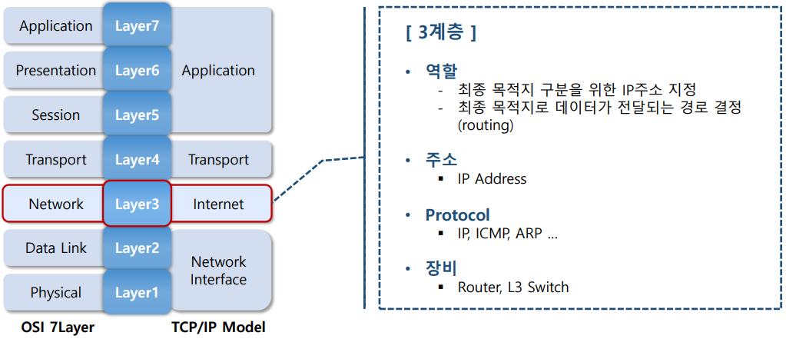
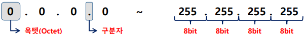
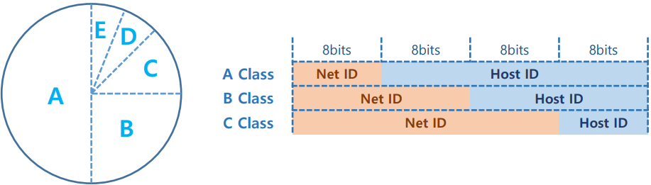
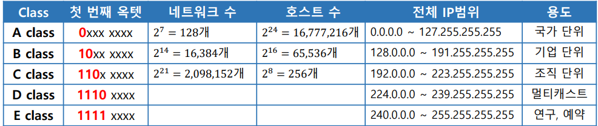
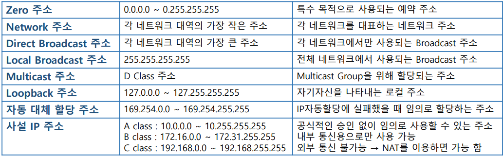
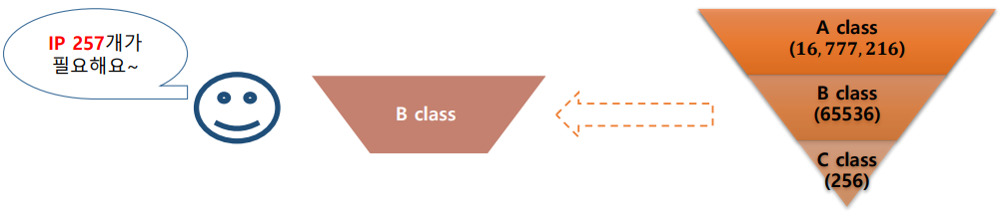
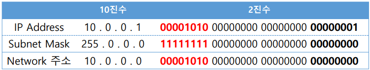
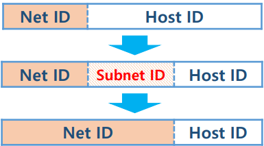
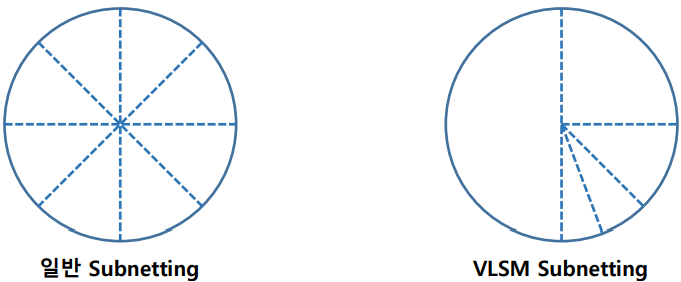
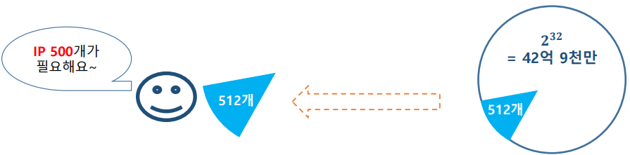

## Layer 3 Network

## IP Address

- <b>IP Address란? </b>

  - 전체 네트워크에서 장치들이 서로를 인식하고 <b>통신을 하기 위해서 사용하는 특수한 번호 </b>

  - IP 주소는 <b>고유한 값으로 사용</b>
  - 국제 인터넷 주소 관리 기구(ICANN)에서 관리 

  - IPv4 와 IPv6 가 있음 

- <b>IPv4 표현 </b>

  - 총 4byte(32bits)의 크기를 가짐 

  - 4개의 옥텟(Octet)으로 구분하여 사용 

  ​     -1byte(8bits)를 1옥텟이라 부름 

  ​     -옥텟과 옥텟사이를 온점( . ) 으로 구분 

  - 일반적으로 10진수로 표현 함 

  - IP의 총 개수 → 2 32 = 약 42억 9천만 개

- <b>IP Address 구성 방식</b>

  - Net(Network) ID와 Host ID로 구성되어 있음(2단계 주소 체계)

    

  - <b>Net ID : 네트워크 영역을 식별하기 위한 값 </b>

  -  <b>Host ID : 한 네트워크 영역 안에서 호스트를 식별하기 위한 값 </b>

  - 초기 IP는 Net ID 8bits , 나머지 24bits를 Host ID로 사용하였으나 네트워크 영역이 많아짐에 따라 현재는 Net ID 크기가 유동적으로 변함

- <b>IP주소 확인 순서</b>
  - Net ID를 이용하여 지정된 네트워크를 찾은 다음 네트워크 내부에서 Host ID를 이용하여 지정된 호스트를 식별 함

## Classful Network

- <b>Classful Network란?</b>

  - 개수가 제한되어 있는 <b>IP를 효율적으로 할당하고 관리하기 위해 도입된 IP관리 체계</b> 

  - <b>전체 IP를 지정된 크기대로 class라는 그룹으로 분리 함 </b>

  - 네트워크에서 필요한 IP의 개수대로 class에 지정된 동일한 양만큼 IP를 할당하는 방식 

    > IP 할당용 class → A, B, C 

  - A~C Class의 Net ID 크기를 다르게 사용 함 

    > 하나의Network 영역에서 할당 가능한 Host 크기가 달라짐

• <b>Class 별 Network 범위</b>

- <b>공인 IP</b> 

  - ICANN,인터넷 진흥원(KISA)등의 IP 주소 할당 공인기관에서 할당한 인터넷 상에서 사용할 수 있는 IP주소

  - WAN에서 유일하게 장비의 위치를 식별할 수 있는 IP주소 

  - 중복된 주소를 사용 하면 안됨

- <b>Bogon IP(특수목적 IP)</b> 

  - 할당되지 않았거나 특수한 목적으로 예약된 IP주소 

  - Bogon IP 목록은 RFC3330(IPv4), RFC4773(IPv6) 문서를 통해 공표

- <b>Bogon IP 종류</b>

## Classful Network 문제점

- 무조건 고정된 개수대로 IP를 할당해야 함 
- 효율적이고 체계적인 관리를 위해 도입 되었지만 낭비를 유발 함 
- IP 부족 문제가 심각해 짐

## 해결 방법

- ### <b>subnet (Sub network)</b>

  -  IP를 좀더 효율적으로 나누기 위해 하나의 네트워크를 분할하여 사용

  -  IP주소의 낭비를 줄이고 좀 더 효율적으로 할당하기 위해 제시된 기법 

  - 브로드캐스트 영역을 축소 함 → 트래픽을 감소시킴

  

- <b>Subnet Mask</b>

  - IP주소 같은 형식을 가짐

  - Net ID 와 Host ID를 구분하기 위한 용도 

  - Bit값이 1인 부분은 Net ID , 0인 부분은 Host ID로 구분
  - Subnet Mask의 0 또는 1은 반드시 연속적으로 배치되어야 함

- <b>Subnetting </b>

  - 하나의 네트워크 대역의 IP를 sub network로 분할하는 작업

  - 네트워크 세분화를 위한 IP 주소의 구성 변경

  - Host ID에 할당된 비트들을 추가적으로 Net ID로 사용

    

- <b>Subnetting 순서</b>

  1. 개수 확인

     > Network 나 Host 기준 필요한 개수 확인 

     > 필요한 개수가 포함되는 최소 2의 거듭 제곱 값으로 구하기

  2. Subnet Mask 구하기

     > 기존 할당 받은 Subnet Mask 가져오기

     > 필요 개수를 이용하여 Subnet Mask 변경 

  3. Network 영역 구하기

     > 할당 받은 IP 주소 가져오기

     > Subnet Mask에 대입해서 Network 영역 구하기

  4. Network 주소, Broadcast 주소, 할당 가능한 IP 범위 구하기

     > Network 주소는 Network 범위에서 가장 작은 IP 

     > Broadcast 주소는 Network 범위에서 가장 큰 IP

- ### <b>VLSM(Variable Length Subnet Mask)</b>

  - 가변 길이 Subnet Mask 
  - 하나의 네트워크 영역을 <b>서로 다른 크기로 Subnetting 하는 기법</b>
  - 일반 Subnetting 모두 같은 크기로 Subnet이 생성 됨 → IP낭비 현상 발생 
  - 필요한 크기에 맞춰서 Sub network를 생성 함 → Sub network마다 다양한 Subnet mask를 이용 함

- <b>VLSM 순서</b>

  1. 개수 확인 

     > 영역별 필요한 IP 개수 확인

  2. <b>Subnetting 순서 정하기</b>

     > IP가 가장 많이 필요한 영역부터 적게 필요한 영역 순으로 Subnetting

  3. Subnet mask 구하기

     > 2번에서 정한 순서대로 영역별 Subnet Mask 구하기

     > 일반 Subnetting(host기준) 방식과 동일 함

  4. Network 영역 구하기

  5. Network 주소, Broadcast 주소, 할당 가능한 IP 범위 구하기

- ### <b>Classless Network</b>

  - Class 개념을 없애버리고 전체 IP를 통합하여 필요한 개수만큼만 나눠서 할당 함 

  - Netmask를 가변적으로 이용하여 IP 주소에서 Net ID와 Host ID를 구분 함

    
