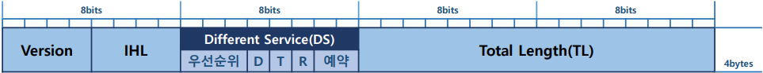

## 🗂️<b>IP (Internet Protocol)</b>

- <b>IP(Internet Protocol) </b>

  - OSI 7 Layer에서 3계층에 해당하는 프로토콜

  - Packet을 지정된 목적지 네트워크까지 전달하는 역할을 담당

  - <b>비 연결 지향적</b>

  - <b>비 신뢰성</b>

  - <b>종단간 연결 보장</b>

  - IP주소에 따라 네트워크간 전송경로를 제어

  - 필요에 따라 Fragment(단편화) 작업을 수행하기도 함 

    > Router가 연결하고 있는 MTU차이 때문에 지원 되는 기능

    > PC에서는 4계층을 통과하지 못하고 MTU 크기를 초과 할 때만 수행 됨 → ICMP

## 🗂️<b>IP Header</b>

- Header 크기 → Option필드의 크기에 따라 가변적 → 최소 20bytes ~ 최대 60bytes

- 0~4bytes Field

  

  - Version (4bits) 

    > IP 버전 정보 

    > IPv4 header의 version 필드는 항상 4로 고정

    > IPv6는 개발되면서 별도의 프로토콜을 발표 

  - IHL (4bits) 

    > IP Header Length 의 약어로 가변적인 IP header의 크기를 명시

    > 4개의 Bit로 표현되고 4bytes단위로 표시됨(최대 길이 값 60bytes)
    
  - Different Service(1byte) 

    > 데이터의 우선순위를 표시 → Router에서 우선순위를 확인하고 Routing을 수행 함

    > D → 지연, T → 처리율, R → 신뢰성

  - Total Length (2bytes) 

    > IP Packet의 전체 크기(IP Header + Payload)

    > IP Packet의 최대 크기는 MTU 값을 가짐 

    ※ MTU(Maximum Transmission Unit) : 최대 전송 단위

- 5~8bytes Field(3계층 Fragmentation과 관련된 Field)

  

  - Identification (2bytes) 

    > IP 계층에서 단편화(Fragmentation) 가 수행 되기 전 원본 데이터의 식별 값 

    > 통신의 시작 데이터는 Random Number로 할당되며 연속된 통신의 다음 데이터는 +1 증가한 값을 할당 받음 

  - IP Flags (3bits) 

    > 단편화 유무를 체크하기 위한 필드

    ＞ X : 사용하지 않는 bit 

    ＞ D(Don’t Fragment) : 단편화를 할 수 있는 경우 0, 할 수 없는 경우 1 값을 가짐 

    ＞ M (More Fragment) : 단편화 된 마지막 조각이면 0 , 추가로 조각이 있으면 1 값을 가짐

  - Fragment Offset (13bits) 

    > 단편화 된 데이터의 순서를 나타내기 위한 필드

    > IP Header를 제외한 Payload의 시작 크기 값을 순서 번호로 사용 함

    > 예) Payload의 크기가 2000인 경우 최대 MTU 크기 1500을 넘게 됨 ＞ IP 필수 Header 20bytes를 제외하고 1480bytes , 520bytes로 나누어서 데이터 전송

- 9~12bytes Field

  

  - Time to Live (1byte)

    > Network 환경에서 Packet이 생존할 수 있는 시간(통과할 수 있는 최대 Router 수)

    > Router가 데이터를 내보낼 때 TTL 값이 1씩 감소됨

    > TTL 값 0이 되는 장비에서 Packet 폐기

    > 초기 Default TTL값은 운영체제 종류에 따라 달라짐(윈도우:128, Linux/Unix:64 , 기타:255 등..)

    > Network Looping 현상을 방지하기 위해 사용Protocol (1byte) 

    <b>*TTL에서의 Time은 시간이 아니고 횟수의 의미로 혼동하지 말자</b>

  - Payload에 포함된 프로토콜 

    > 상위계층 프로토콜의 종류 → ICMP, UDP, TCP … 

  - Header Checksum (2bytes) 

    > IP Header의 오류나 변조여부를 확인하기 위한 값

    > Header를 word 단위(2bytes)로 checksum

- Variable Field

  

  - Options (0~40bytes)

    > IP packet을 제어 및 관리하기 위한 추가 정보 

    ＞ Source Routing → 출발지 경로 지정 

    ＞ Traceroute → 패킷 전송 경로 확인 

    ＞ Security → IP packet의 보안 등급 지정

    

    > Network Testing 이나 Debugging에 사용

    > Option 필드가 사용된 경우 IP Header의 전체 크기가 32bits 단위	가 되지 않으면 폐기 됨 

​				＞ Padding → 쓰레기 값으로 32bits 단위를 맞춰 줌

 

[맨 위로 이동하기](#){: .btn .btn--primary }{: .align-right}
