## 🗂️ARP(Address Resolution Protocol)

- <b>ARP(Address Resolution Protocol)</b>

  - 주소를 재 해석 해주는 프로토콜

  - <b>논리적인 주소(IP) 를 기반으로 물리적인 주소(MAC) 를 알아오는 기술 </b>

  - 3계층 프로토콜 이지만 IP 하위에서 동작하는 프로토콜 

  - 특정 프로그램에 의해 호출되었을 때만 동작 함

    > 주로 목적지 MAC 주소를 확인할 때 사용 됨

  - 다양한 네트워크 환경에서 동작할 수 있음 

  - ARP 동작

    > Request → Broadcast 

    > Reply → Unicast

- <b>ARP 종류</b>

  - ARP 

    > 논리적인 주소에 해당하는 장비의 물리적인 주소를 획득 

  - RARP 

    > 물리적인 주소에 해당하는 장비의 논리적인 주소를 획득 

  - <b>Gratuitous ARP</b>

    > IP 충돌 감지

    > Gateway 이중화

  - Proxy ARP

    > IP대역은 같지만 물리적인 장비로 분리된 네트워크 통신을 위해 사용 됨
  

## 🗂️ARP Header

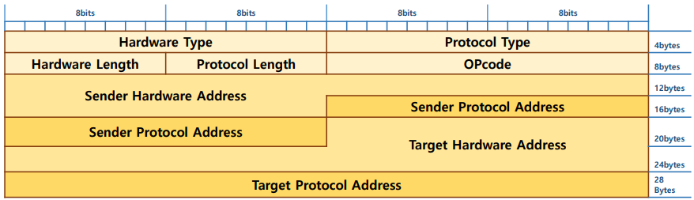

- Header 크기 → 28bytes(Ethernet 환경에서 사용된 경우) 
- 일반적으로 상위 계층이 존재하지 않으며 필요에 따라 운영체제에 의해 호출되어 사용 됨

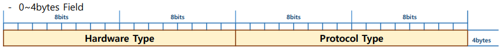

- Hardware Type (2bytes)

  - ARP가 동작할 Network 환경 정보

  - Ethernet 환경에서는 MAC 주소(1번 코드) 

    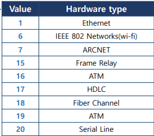

- Protocol Type (2bytes) 

  - 논리적인 주소의 종류 

  - 일반적으로 IPv4주소(0x0800)

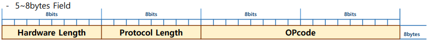

- Hardware Address Length (1byte) 

  - 지정된 물리적 주소의 크기 값 : MAC 주소의 크기(6bytes) 

- Protocol Address Length (1byte) 

  - 지정된 논리적 주소의 크기 값 : IP 주소의 크기(4bytes) 

- Opcode (2bytes) 

  - ARP packet의 종류 

  - ARP packet이 수행하는 동작이 지정 됨

    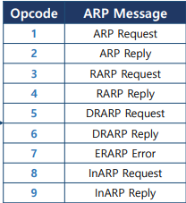

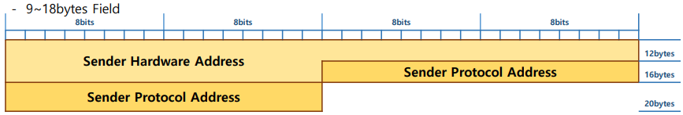

- Sender(Source) Hardware Address (6bytes) 

  - 보내는 시스템의 물리적 주소 

  - 자신의 MAC 주소

- Sender Protocol Address (4bytes) 

  - 보내는 시스템의 논리적 주소
  - 자신의 IP 주소

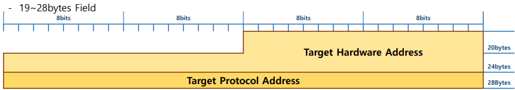

- Target(Destination) Hardware Address (6bytes) 

  - 받는 시스템의 물리적 주소 

  - 모르는 경우 00:00:00:00:00:00 값이 들어감 

    > 일반적으로 ARP Request Packet은 물리적 주소를 몰라서 보내는 것이기 때문에 기본 00:00:00:00:00:00 값 

- Target Protocol Address (4bytes) 

  - 받는 시스템의 논리적 주소 
  - 상대방의 IP 주소

## 🗂️ARP 동작 과정

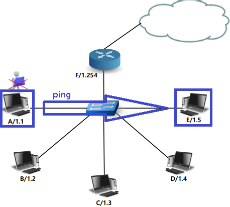

① A에서 E로 ping을 보내보지만 E의 MAC 주소를 몰라 reply가 오지 않는다.

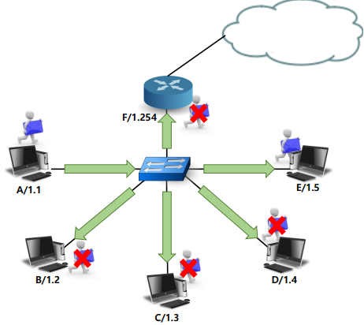

② MAC주소를 알아내기 위해 broadcast로 request를 한다.

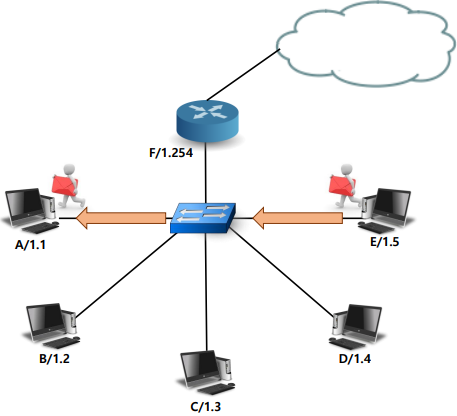

③  IP정보를 통해 E에서 reply로 MAC주소를 보낸다.

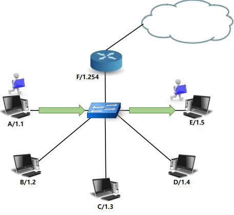

④ 몰랐던 E의 MAC주소를 알게되어 통신이 된다.

## 🗂️ARP Cache

- <b>ARP Cache</b> 

  - 시스템에서 사용할 IP에 해당하는 MAC주소를 일시적으로 저장하는 기능

  - 통신 속도의 향상을 위해 사용 됨 

  - 동적으로 알아온 정보는 일정 시간이 지나면 사라짐 

- <b>ARP Cache Table </b>

  - ARP Cache 정보를 기억하는 저장 공간 → Memory 

- <b>ARP Cache 종류</b>

  - 동적(dynamic) → ARP에 의해 획득된 정보 

  - 정적(Static) → 시스템에 의해 미리 지정된 정보

## 🗂️ARP 명령어

- 운영체제에서 기본적으로 지원되는 ARP관리 프로그램

  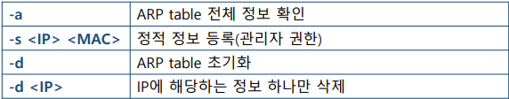

 

[맨 위로 이동하기](#){: .btn .btn--primary }{: .align-right}