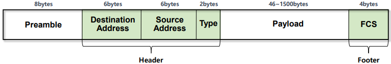

## 🗂️Ethernet Protocol

- <b>Ethernet Protocol</b> 

  - LAN을 위해 개발된 컴퓨터 네트워크 기술
  - 네트워크에 연결된 각 기기들이 고유의 MAC 주소를 가지고, 이 주소를 이용해 상호간에 데이터를 주고 받 을 수 있도록 만들어진 기술
  - LAN 네트워크의 90% 이상이 Ethernet 방식을 사용

- <b>Ethernet 종류</b>

  - <b>Ethernet v2 또는 DIX Ethernet(DIX 2) </b>

    -IEEE 표준화를 위해 진행 되었지만 기존의 v1과의 호환성을 위해 v2로 발표

  - <b>IEEE 802.3 </b>

    -EEE에서 DIX 사양에 기초하여 Ethernet을 위해 표준으로 제정한 프로토콜

- <b>Ethernet v2 vs IEEE 802.3</b>

  - 표준은 IEEE 802.3 이지만 <b>대부분의 통신에서 Ethernet v2 를 사용</b> 

  - 특별한 경우에만 IEEE 802.3 사용 

    -장비와 장비의 기능을 위해서 <b>장비 스스로 정보를 교환</b>해야 하는 경우

## <b>🗂️Ethernet v2 Frame</b>

- Preamble (8bytes) 

  - 데이터 신호 동기화 

    -동일한 패턴(101010...)의 신호를 7bytes 연속으로 보내서 데이터 전송을 알림

  - 2계층 header 의 시작을 알리는 역할

    -마지막 1byte의 1bit를 1로 만들어 2계층 Header가 시작됨을 알림(10101011) 

- Destination Address (6bytes) 

  - 목적지 MAC Address 
  - DMAC 이라 부르고 DA 로 표시함

- Source Address (6bytes) -

  -  출발지 MAC Address 
  -  SMAC 이라 부르고 SA 로 표시함 

- <b>Type (2bytes) </b>

  - 정확한 명칭은 Ether Type Code 
  - 상위 계층의 Protocol 코드 값(IP : 0x0800 , ARP : 0x0806 등..) -
  - 최소 코드 값은 16진수값 0x0600(1536) 부터 사용됨

- <b>Payload (46~1500bytes) </b>

  - 상위 계층에서 내려온 데이터 
  - 2계층의 Payload는 최대 1500bytes(MTU)까지만 사용 가능 

- FCS (4bytes) 

  - Frame Checksum Sequence 
  - 오류 체크를 위한 값 
  - Header부터 Payload까지의 값을 CRC32 알고리즘을 사용해서 계산한 결과값

 

[맨 위로 이동하기](#){: .btn .btn--primary }{: .align-right}