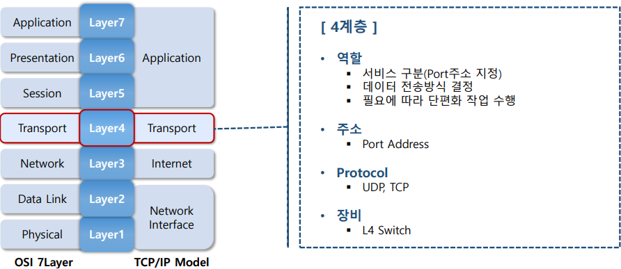
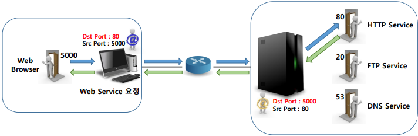
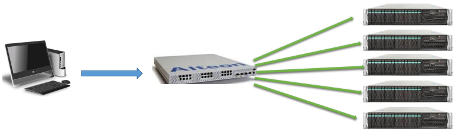

## 🗂️Layer 4 Transport

## 🗂️port Address

-  <b>Port Address</b>

  - <b>시스템 내부의 프로세스 또는 프로그램을 식별하기 위해 사용하는 식별 값 </b>

  - 프로그램 설계 시 사용할 port주소가 지정 됨 

  - IANA에서 관리 함

    > [Service Name and Transport Protocol Port Number Registry (iana.org)](https://www.iana.org/assignments/service-names-port-numbers/service-names-port-numbers.xml)

- <b>Port 주소 표현</b>
  - 2byte(16bit) 크기의 10진수 한 자리로 표기
  - Port 주소의 총 개수 → 2 16 = 65536개(0번 ~ 65535번)

- <b>Port 주소 구분</b>
  
  - 사용 목적에 따라 3가지로 분류해서 사용 됨
  - Well Known Service port(0~1023) → 잘 알려진 서비스 프로그램용으로 예약된 주소 
  - Registered Port(1024~49151) → Online용으로 개발된 프로그램의 네트워크 통신을 위해 할당하는 주소 
  - Dynamic/Private Port(49152~65535) → 등록하지 않고 임의로 사용할 수 있는 주소
  
- <b>Client 프로세스의 Port</b> 
  - 프로세스가 동작할 때 마다 관리 주체인 운영체제에 의해 임의 port가 할당 됨 
- <b>Server 프로세스의 Port </b>
  - 개발 단계에서 미리 지정된 port를 사용하도록 정의 함  잘 알려진 서비스용 서버 → well known Service port  상업용으로 개발된 서버 → registered port

## 🗂️Layer 4 장비

- <b>L4 Switch</b>
  - TCP/UDP port번호를 이용하여 트래픽을 서비스 별로 분류하여 포워딩하는 장비
  
  - 주요 기능 → Load Balancing 
  
- <b>Load Balancing</b>
  - 부하 분산 
  - 특정 시스템이 받게 되는 부하를 동일한 기능을 수행할 수 있는 여러 시스템으로 분산
  - Server Farm에서 필수적으로 사용하는 기능

 

[맨 위로 이동하기](#){: .btn .btn--primary }{: .align-right}

