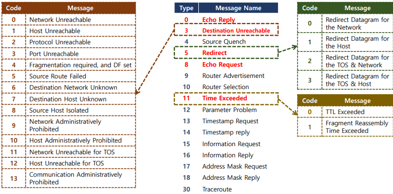
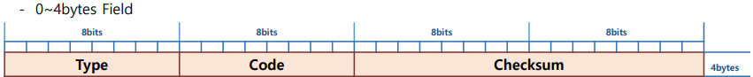
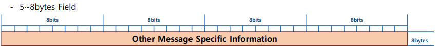
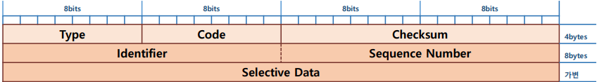
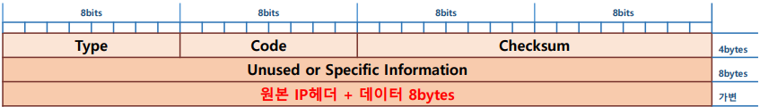

## 🗂️ICMP(Internet Control Message Protocol)

- <b>ICMP(Internet Control Message Protocol)</b>
  - 인터넷 제어 메시지 - 네트워크 관리 및 오류 보고를 위해 사용 됨
  - <b>IP의 비 신뢰성, 비 연결성의 단점을 보완하고자 사용되는 IP Supported Protocol</b>
  - IP보다 상위에서 동작하는 Layer 3 Protocol
  - 특정 프로그램에 의해 호출되었을 때만 동작 함
  - Message 형식으로 정보를 알림

- <b>Message 종류</b>

  - Type 필드의 값을 통해 구분 됨

  - 정보 교환 및 관리 메시지 

    > echo 요청/응답, Router 광고/응답, 정보 요청/응답, mask 요청/응답, 경로 추적 등.. 

  - 오류 보고 메시지 

    > 목적지 접근불가, 송신 속도 낮춤, 경로 재설정, 시간초과 등..

    

## 🗂️ICMP Header

- ICMP Header는 Other message에 따라 가변적인 크기를 가짐
- 필수 Header크기는 8bytes로 고정되어 있음
- 필수 필드는 단순하지만 ICMP 종류에 따라 추가 메시지 값이 달라짐

- <b>Type</b>

  - ICMP 메시지의 종류를 알려주는 값 

    > 8번 : ICMP Echo Request Message

    > 0번 : ICMP Echo Reply Message

    > 나머지 타입 번호들은 Error Message 용으로 사용됨

- <b>Code</b>

  - 메시지 종류에 따라 상세원인이나 세부정보가 필요한 경우 추가 값

  - 기본값 : 0 

    > Type의 세부 Code가 있으면 Code값 0의 정보를 의미 

    > Type의 세부 Code가 없으면 null 을 의미함 

  - Network Troubleshooting시 Code값을 이용해 정보를 알아냄 

- <b>Checksum </b>

  - ICMP Header 의 오류를 검사하기 위한 값

- <b>Other message specific information ... </b>

  - 선택적 추가 정보가 부여되는 필드

  - 메시지 종류에 따라 필드 구성이 달라지며 추가로 필요한 정보가 지정 됨 

  - MTU 최소 사이즈를 맞춰주기 위해 header 뒤에 쓰레기 값을 채워줌 

    > Error Message 의 경우 원본 데이터의 IP header + Payload 중 앞의 8byte 정보를 입력해 줌

  - 예) Echo Message : 연속으로 여러 번 보내기 때문에 식별 값이나 순서 번호 등을 적음

  - 예) Redirect Message : 경로 재설정 정보

- <b>정보 교환 및 관리 메시지 형식</b>

- <b>오류 보고 메시지 형식</b>
  - 오류를 발생시킨 원본의 정보를 알리기 위해 오류의 원본인 IP packet의 헤더와 payload의 8byte값을 ICMP data값으로 추가하여 메시지를 생성 함

 

[맨 위로 이동하기](#){: .btn .btn--primary }{: .align-right}
