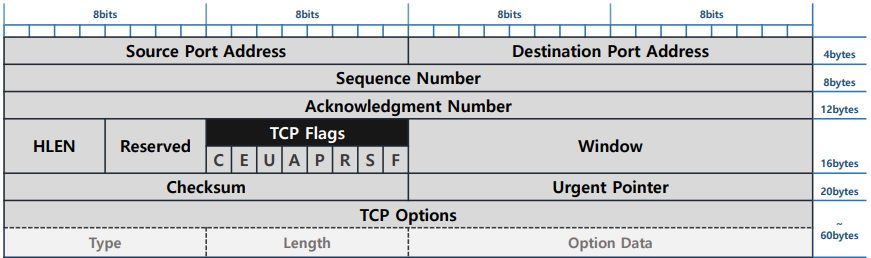
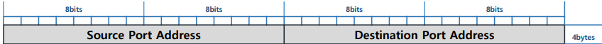
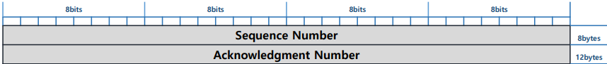
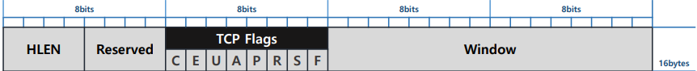
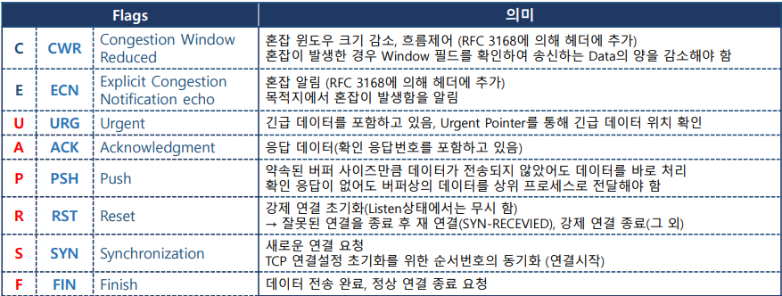
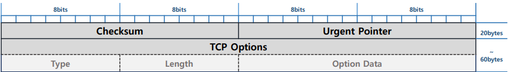
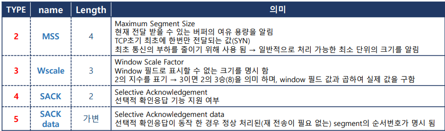
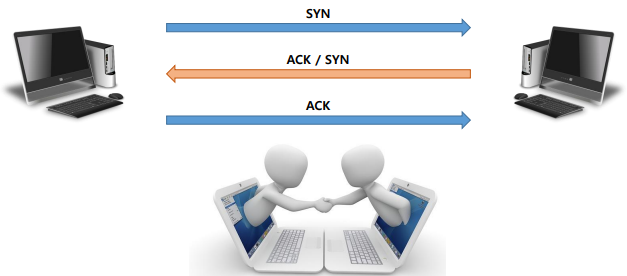

## 🗂️TCP (Transmission Control Protocol)

- <b>TCP(Transmission Control Protocol) </b>

  - OSI 7 Layer에서 4계층에 해당하는 프로토콜

  - 데이터 전달의 신뢰성을 최대한 보장

  - <b>연결 지향</b>

    > 데이터를 전달할 논리적인 연결을 먼저 구성 → 3way Handshake

    > 연결 설정 → 데이터 전송 → 연결 종료

  - <b>신뢰성 보장</b>

    > 순차적으로 데이터를 전송 함

    > 확인 응답 및 재전송

  - <b>흐름제어</b>

    > 데이터 전달에 지연 현상이 발생했을 때 데이터의 양을 조절 → Sliding Window

- <b>TCP를 이용하는 Service 종류</b>

  - 정확한 데이터 전달이 필요한 대부분의 서비스

  - 파일 전송 : FTP → TCP 20(data), TCP 21(Control) 

  - WEB 서비스 : HTTP → TCP 80

## 🗂️TCP Header

- Header 크기 → Option필드의 크기에 따라 가변적 → 최소 20byte ~ 최대 60byte 
- TCP의 동작을 지시하는 메시지를 생성하여 연결상태를 제어 함 → TCP Flags
- 하나의 연결을 통해 한 단위의 Data(Application Data)를 전달

- <b>0~4bytes Field</b>

  

  - Source Port Address(2bytes)

    > 출발지 Port 주소

  - Destination Port Address(2bytes)

    > 목적지 Port 주소

- <b>5~12bytes Field</b>

  

  - Sequence Number (4bytes) 

    > 순서화된 일련번호

    > 초기순서번호는 임의의 값으로 설정(ISN – Initial Sequence Number)

    > 전송되는 데이터의 크기를 누적시키며 순서를 알려 줌

  - Acknowledgment Number (4bytes)

    > 확인 응답 번호

    > 데이터를 정상적으로 수신한 뒤 예상하는 다음 Sequence Number를 알려 줌

    ​	＞ 받은 Sequence Number + Payload 크기 

    ​	＞ 최초 SYN에 대한 응답 : 수신한 Sequence Number + 1

- <b>13~16bytes Field</b>

  

  - HLEN (4bits)

    > TCP Header 길이 값

    > 4개의 Bit로 표현되고 4bytes단위로 표시됨(최대 길이 값 60bytes)

  - Reserved (4bits)

    > 예약된 Field

  - TCP Flags (1byte)

    > 논리적인 TCP 연결회선 제어 및 데이터 관리를 위해 사용

    > TCP 메시지의 종류를 명시 함

    > 1bit씩 메시지 종류가 지정되어 있고 해당 bit값이 설정되면 지정된 기능을 수행 

- TCP Flags 상세

  

  - Window (2bytes)

    > 통신의 상대방에게 자신의 버퍼 여유용량 크기를 지속적으로 알려 줌

    > 능동적인 흐름제어를 위해 사용 됨

    > Sliding Window 기법 사용

- <b>17bytes~Valiable Field</b>

  

  - Checksum

    > 4계층 Segment 전체와 3계층 정보 중 일부분에 대한 오류검사 값 

    > Pseudo Header 구성하여 오류 검출을 수행 함

  - Urgent Pointer 

    > 긴급 데이터의 마지막 위치를 나타내는 값

  - TCP Options

    > 지정된 구조에 따라 옵션 설정

    > Option 종류(1byte) + Option 길이(1byte) + Option Data

- <b>TCP Options(0~40bytes) </b>>

  - 기본적으로 필수 옵션이 사용 됨 

  - type → 옵션의 종류 
  - length(byte) → 옵션 data의 크기
  - option data → 옵션 값

## 🗂️3way Handshake

- TCP 통신 시 상호간의 연결을 통해 신뢰성을 보장하기 위한 기법
- TCP segment를 전달하기 전 목적지와의 통신상태를 확인
- 정상 통신이 가능하면 논리적인 양방향 연결을 맺은 후 Segment를 전송

## 🗂️TCP 확인 응답

- 일반 확인 응답

  - 출발지에서 Segment가 전달되면 반드시 목적지에서 전달 받았음을 확인 함

  - 출발지는 목적지의 확인응답 TCP 메시지를 전달 받아야지만 다음 순서의 데이터를 전달 할 수 있음

  - Segment : ACK → 1 : 1 

- 누적 확인 응답

  - TCP 연결 설정을 통해 한번에 보낼 수 있는 Segment의 양을 약속 함

  - 출발지 에서는 지정된 양에 해당하는 Segment를 목적지의 확인응답이 없어도 계속 전달 함

  - 목적지는 지정된 양의 Segment를 전달 받았을 때 하나의 확인응답을 전달 함

  - Segment : ACK → N : 1

- 선택적 확인 응답

  - 누적 확인응답의 문제점의 해결 → 중간에 손실된 Segment가 발생하면 정상적으로 전달받은 Segment까지 재전송이 해야 함

  - 누적 확인응답과 비슷하지만 확인응답을 할 때 재전송이 필요 없는 Segment의 정보를 알림으로 불 필요한 재전송을 방지 함

 

[맨 위로 이동하기](#){: .btn .btn--primary }{: .align-right}
