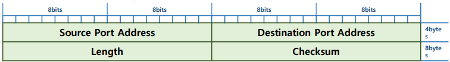

##  🗂️UDP (User Datagram Protocol)

- <b>UDP (User Datagram Protocol)</b>

  - 데이터의 빠른 전달을 보장하기 위해 사용 됨

  - 빠른 속도 보장을 위해 대부분의 기능을 제한 함

    > 비 신뢰성

    > 비 연결 지향성

    > 최소화된 Header

  - 단편화 크기 → 512bytes

    > 재 전송 시 빠른 처리를 위하여 작은 단위로 데이터를 생성 함

- <b>UDP를 이용하는 Service 종류</b>

  - 빠른 통신 속도가 필요한 서비스 → 실시간 통신, 음성 서비스에 많이 사용 됨 

  - 정보 해석 및 전달 서비스

    > DNS → UDP 53 , DHCP → UDP 67(S)/UDP 68(C) 

  - 빠른 파일 전송

    > TFTP → UDP 69

- <b>UDP Header</b>

  - Header의 크기 → (고정) 8 bytes

    

  - Source Port Address(2bytes)

    > 출발지 서비스 주소 (Port 주소) 

  - Destination Port (2bytes) 

    > 목적지 서비스 주소 (Port 주소) 

  - Length (2bytes)

    > Header + Payload 크기

  - Checksum (2bytes)

    > 4계층 Segment 전체와 3계층 정보 중 일부분에 대한 오류검사 값

    > Pseudo header를 구성하여 오류 검출을 수행 함

##  Pseudo Header

- <b> Pseudo Header</b>
  - Layer 4의 오류검출
  - 오류검출 용 임시 Header를 이용 → Pseudo Header(12bytes) 
  - 보안, 기능성이 떨어지는 IP의 오류검출을 함께 수행
  - IP의 일정 정보를 포함한 헤더를 생성한 후 TCP/UDP Segment에 Encapsulation 후 오류검출 수행
  - 초기상태의 checksum = 0 
  - 오류검출 값을 획득한 후 Pseudo Header를 삭제 → 실 통신에는 Segment만 전달 됨

 

[맨 위로 이동하기](#){: .btn .btn--primary }{: .align-right}
