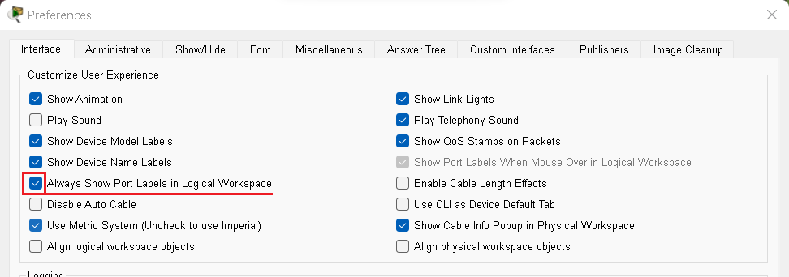
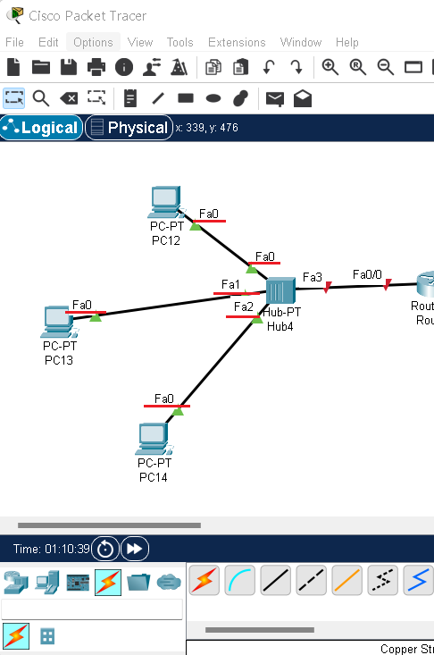

## 🗂️라우터 생성


> Packet Tracer를 실행시키면 위와 같은 화면이 나오는데 라우터 설정을 연습해 볼 것이다


> 위 사진과 같이 아래쪽에 보면 Network Device 메뉴에 Roter가 있고 그 중에서 PT-Router를 자주 사용하니 위치를 잘 알아두자


> PT router를 마우스로 드래그하면 위와 같이 라우터가 생성된다


> 생성된 router를 클릭하면 라우터 설정창이 생기고 CLI를 클릭하고 기다리면 아래 화면과 같이 질문이 나오는데 no라고 답하자

```
Would you like to enter the initial configuration dialog? [yes/no]: no
```

## 🗂️모드 전환하기

- 라우터 설정하기에 앞서 가장 먼저 모드 전환에 익숙해져야 한다 아래 그림과 같이 4가지 모드가 있고 각 모드마다 지정된 설정이 있다

.png)


```
Router>
Router>enable -> Router#
Router#configure terminal -> Router(config)#
Router(config)#interface f0/0 -> Router(config-if)#
```


```
Router(config-if)#exit -> Router(config)#
Router(config)#exit -> Router#
Router#exit -> Router>
```

## 🗂️No ip domain-lookup


>  라우터 설정을 하다보면 오타가 발생 할 때 위 사진과 같은 상황이 발생한다
>
> 이렇게 된 경우 기다려야 하는데 다음과 같이 설정하면 더이상 기다리지 않아도 된다

```
Router>enable
Router#Configure terminal
Router(config)#no ip domain-lookup
```

>  설정한 뒤 다시 해보니 아래처럼 나오고 기다리지 않게 된다


>  이렇게 no ip domain-lookup으로 설정하는 방법이 있고 Ctrl+Shift+6를 누르면 바로 풀려서 기다리지 않아도 되니 참고 하도록 하자

## 🗂️호스트 이름 변경

```
Router>enable
Router#Configure terminal
Router(config)#hostname R100
R100(config)#
```


- 재시작후 변경한 정보가 남아 있는지 확인

```
R100(config)#exit
R100#reload
System configuration has been modified. Save? [yes/no]:no
Proceed with reload? [confirm]  엔터입력
```


- 변경후 다시 저장

```
Router(config)#hostname R100
R100(config)#exit
R100#
R100#copy running-config startup-config  --> RAM 의 설정을 NVRAM : 비활성 메모리로 복사
Destination filename [startup-config]?  엔터입력
Building configuration...
[OK]
```

- 재시작 후 확인

```
R100#reload
System configuration has been modified. Save? [yes/no]:no
Proceed with reload? [confirm]
```


## 🗂️비밀번호 설정하기

```
R100(config)#enable password cisco
R100>enable 
Password:cisco 입력 
```


- 설정한 비밀 번호 확인

  ```
  R100#sh running-config
  ```


## 🗂️우선순위가 높은 암호화된 암호 설정하기

```
R100(config)#enable secret 1234
```


> 먼저 설정 했던 비밀번호인 cisco를 입력하면 안되고 다시 설정한 1234를 입력해야 된다.

- 설정한 비밀 번호 다시 확인

  ```
  R100#sh running-config
  ```

  

  

## 🗂️console 접근시 비밀번호 만들기

```
R100(config)#line console 0
R100(config-line)#password 1234
R100(config-line)#login
```


## 🗂️사용자 만들기

```
R100(config)#username test privilege 0 secret 1111
R100(config)#line console 0
R100(config-line)#login local
```


## 🗂️port label 항상 보이게 옵션변경


> options -> Preferences 클릭



> Always Show Port Labels in Logical Workspace 체크하기



> 위 그림처럼 port label이 항상 보여 작업하기 편리해진다


<br>

[맨 위로 이동하기](#){: .btn .btn--primary }{: .align-right}
