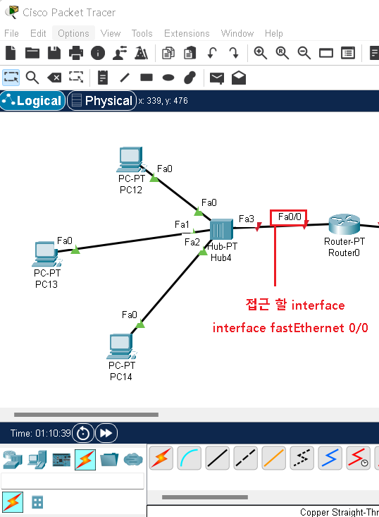
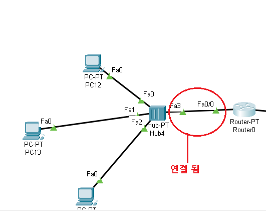
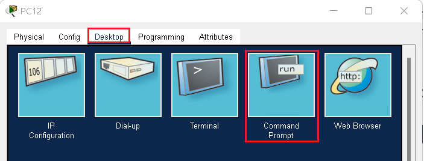
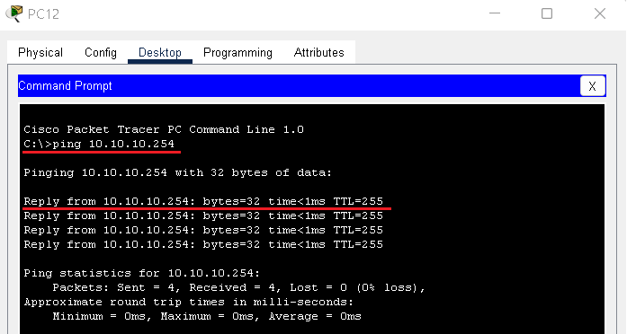
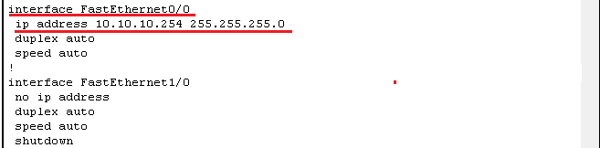
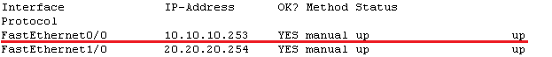
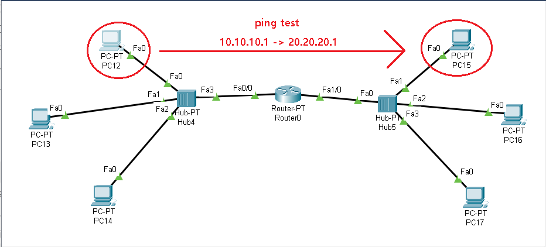
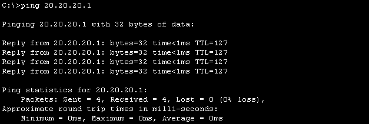
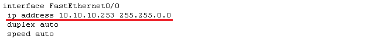
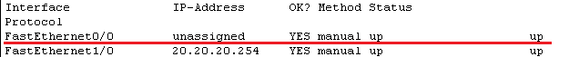

## 🗂️Packet Tracer를 이용한 실습

- <span style="color:blue"><b>구성도</b></span>

-16605575660291.png)

- Packet Tracer에서 위 구성도 처럼 만들어보기


## 🗂️pc 주소 설정


> 주소 설정할 pc를 클릭후 Desktop에서 IP Configuration 클릭


> 나머지 컴퓨터에도 해당하는 주소를 모두 입력한다.

## 🗂️Interface 설정

- 설정할 interface에 접근하여 주소입력 및 통신연결하기

  

```
Router>
Router>enable 
Router#configure terminal 
Router(config)#interface fastEthernet 0/0
Router(config-if)#ip address 10.10.10.254 255.255.255.0
Router(config-if)#no shutdown
```



- <span style="color:blue"><b>연결 확인</b></span>

  - ping test

    

    

  - 명령어를 통한 입력값 점검

    ```
    Router#show running-config
    ```

  

  ```
  Router#show ip interface brief
  ```

  

- 오른쪽도 같은 방법으로 통신 연결후 ping test


> 연결 확인후 pc끼리 ping test





> 나머지 pc들도 각자 확인해보자

## 🗂️Interface  수정, 설정 삭제

- <span style="color:blue"><b>수정</b></span>

  - 수정은 덮어씌우면 된다

  ```
  Router(config)#interface fastEthernet 0/0
  Router(config-if)#ip address 10.10.10.253 255.255.0.0
  Router#show running-conf
  ```

  

> 변경된 것 확인

- <span style="color:blue"><b>삭제</b></span>

  ```
  Router(config)#interface fastEthernet 0/0
  Router(config-if)#no ip address
  Router#show ip interface brief
  ```

  



> 삭제 확인


<br>

[맨 위로 이동하기](#){: .btn .btn--primary }{: .align-right}