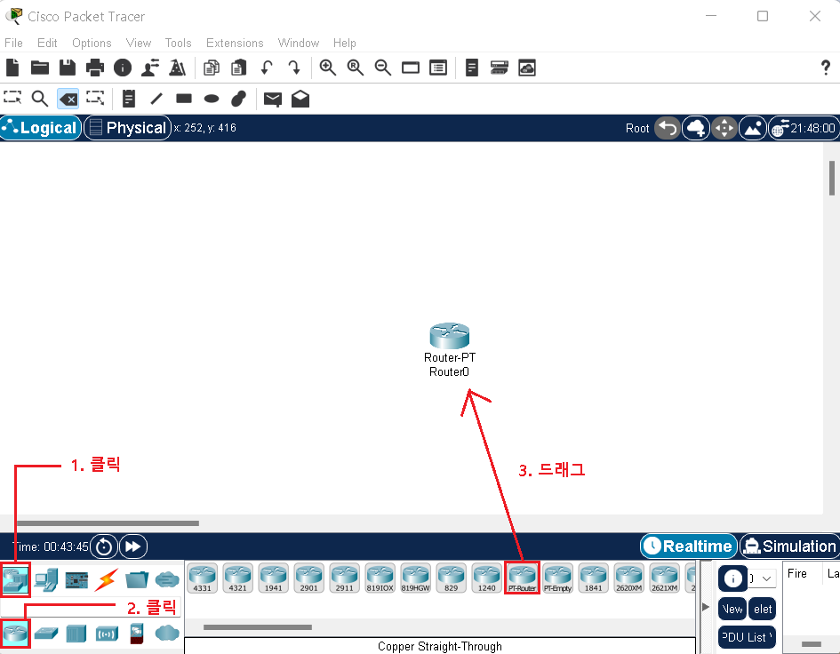
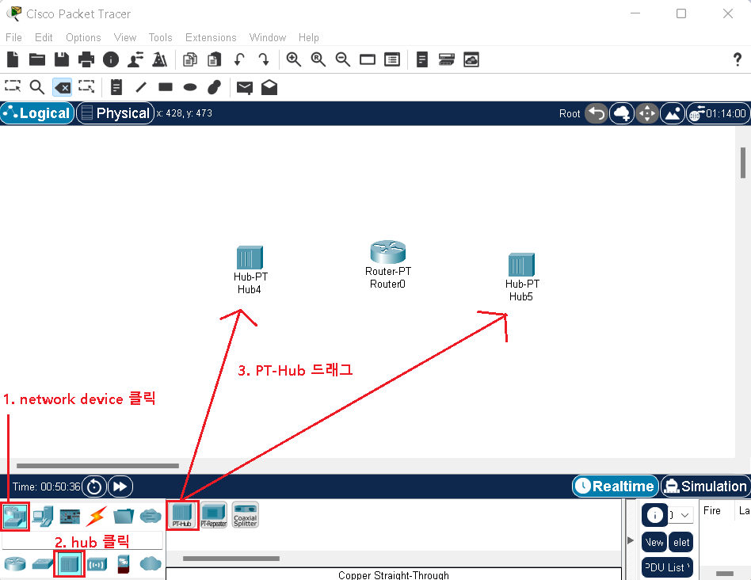
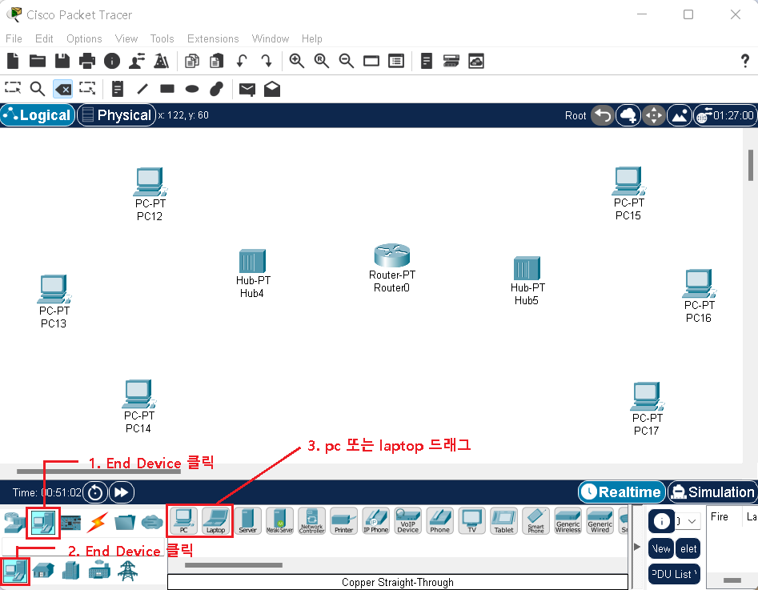
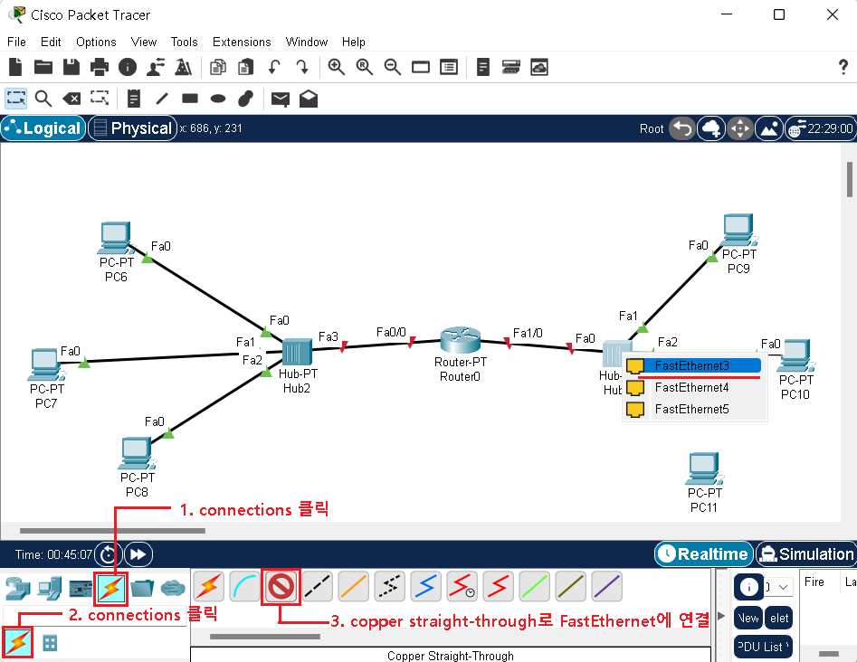
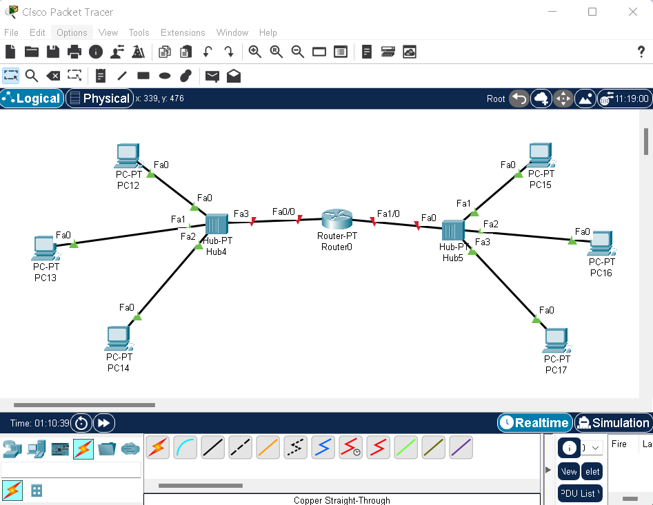
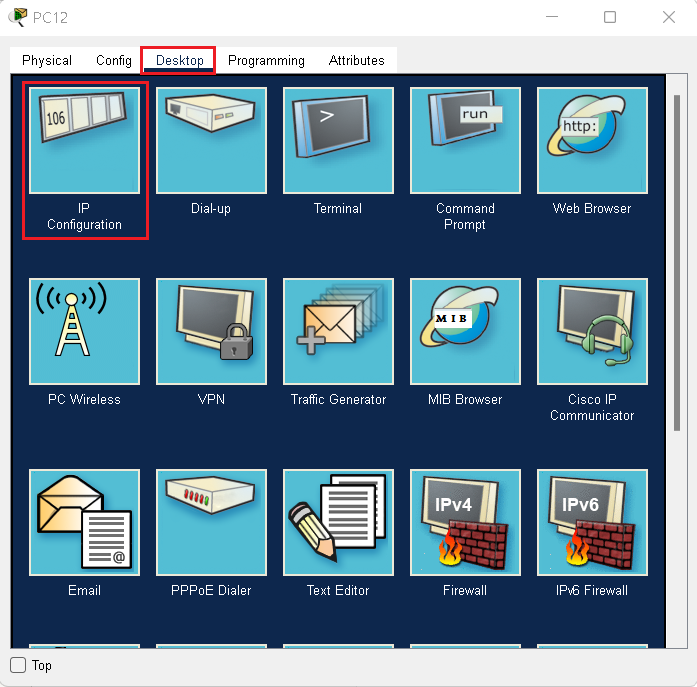
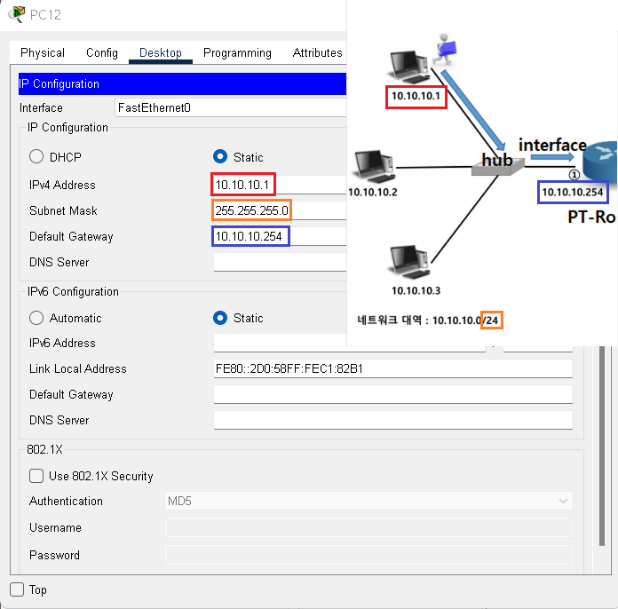

## Static Routing

- Static
  - 관리자가 직접 경로를 지정해 설정해 주는 방식
  - 관리자의 의도대로 세부 경로 설정이 가능
  - 부하가 적으나 문제 발생 시 실시간 대응이 어려움

## Packet Tracer를 이용한 실습

- 구성도

-16605575660291.png)

- Packet Tracer에서 위 구성도 처럼 만들어보기

## pc 주소 설정

> 주소 설정할 pc를 클릭후 Desktop에서 IP Configuration 클릭

> 나머지 컴퓨터에도 해당하는 주소를 모두 입력한다.

> 

##