## 🗂️Static Routing

- 관리자가 직접 경로를 지정해 설정해 주는 방식 

- 관리자의 의도대로 세부 경로 설정이 가능 

- 부하가 적으나 문제 발생 시 실시간 대응이 어려움


## 🗂️Packet Tracer를 이용한 실습

- 구성도

  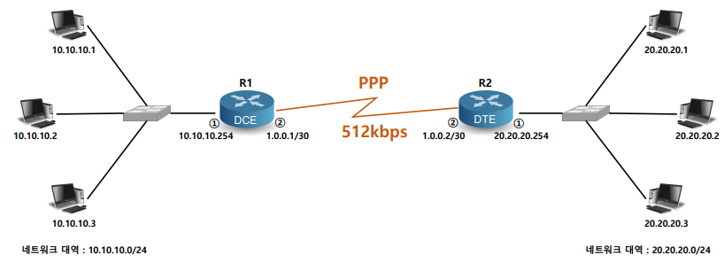

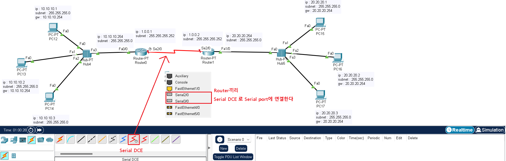


- pc 주소 설정

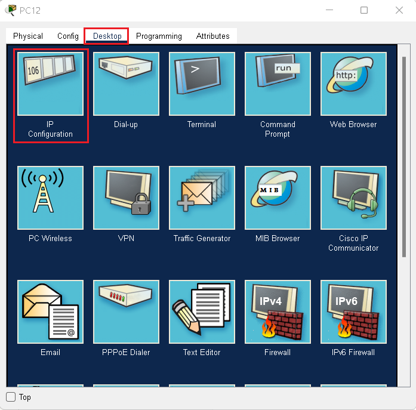

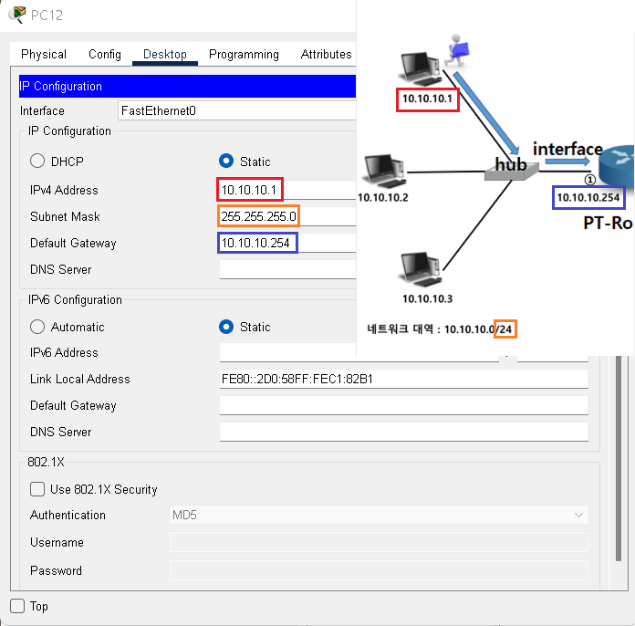

> 나머지 pc들도 동일하게 주소 설정한다

- Router 설정

  - 왼쪽 Router

    ```
    Router>enable
    Router#configure terminal
    Router(config)#interface fastEthernet 0/0
    Router(config-if)#ip address 10.10.10.254 255.255.255.0
    Router(config-if)#no shutdown
    Router(config)#interface serial 2/0
    Router(config-if)#ip address 1.0.0.1 255.255.255.252
    Router(config-if)#encapsulation ppp
    Router(config-if)#bandwidth 512
    Router(config-if)#no shutdown
    ```

  - 입력값 확인

    ```
    Router#show ip interface brief
    ```

    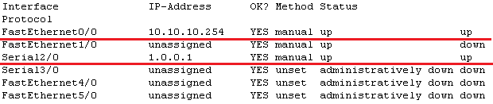

  - 인터페이스 세부 정보 확인

    ```
    Router#sh interfaces s2/0
    ```

    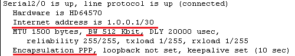

  - 오른쪽 Router

    ```
    Router>enable
    Router#configure terminal
    Router(config)#interface serial 2/0
    Router(config-if)#ip address 1.0.0.2 255.255.255.252
    Router(config-if)#encapsulation ppp
    Router(config-if)#bandwidth 512
    Router(config-if)#no shutdown 
    Router(config)#interface fastEthernet 1/0
    Router(config-if)#ip address 20.20.20.254 255.255.255.0
    Router(config-if)#no shutdown
    ```

  - 입력값 확인

    ```
    Router#show ip interface brief
    ```

  - 인터페이스 세부 정보 확인

    ```
    Router#sh interfaces s2/0
    ```

    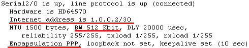

- Routing 설정

  - 통신 확인

    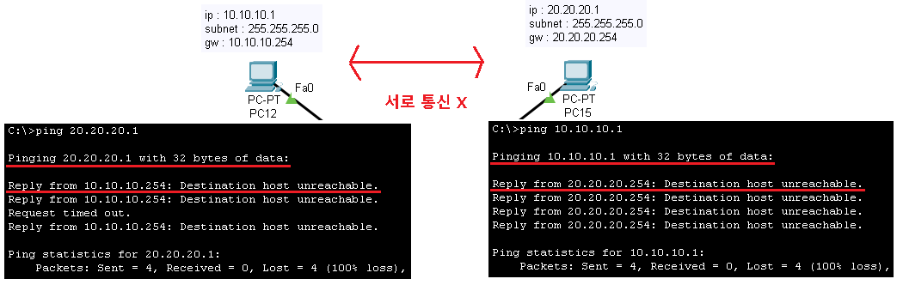

  - Routing table 설정(왼쪽 Router)

    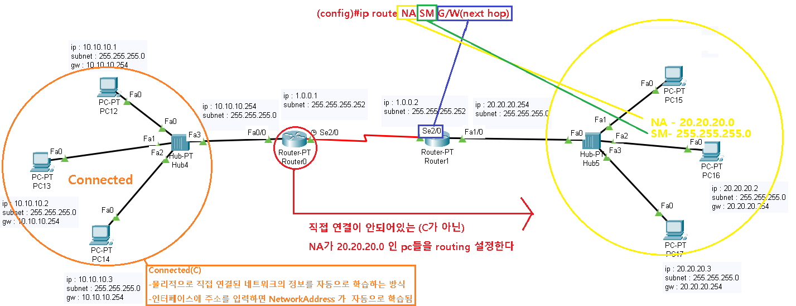

    ```
    Router(config)#ip route 20.20.20.0 255.255.255.0 1.0.0.2
    ```

  -  Routing table 설정(오른쪽 Router)

    

    ```
    Router(config)#ip route 10.10.10.0 255.255.255.0 1.0.0.1
    ```

  -  통신확인

    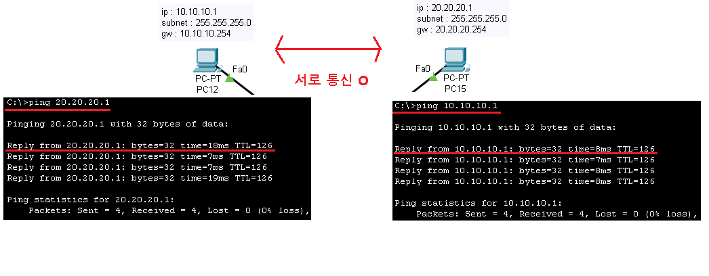

  - Routing table 정보 확인

    ```
    Router#show ip route
    ```

    > 왼쪽 router

    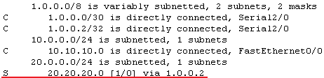

    > 오른쪽 router

    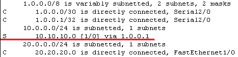

  

  

## Default route

-  Default Routing 
  - Connect 를 제외한 모든 네트워크를 한 방향으로 보내도록 설정
  - 하나의 네트워크에서 외부의 네트워크로 나가고 들어오는 경로가 오직 하나 뿐인 경우 설정 -> stub network
  - 전체 네트워크(0.0.0.0/0) 설정

- 구성도


> default route 설정을 하지 않으면 R1에서 route 설정을 하나 하나 전부 해야 하기때문에 번거롭다

- Default Routing 설정하기

  - R1 

  ```
  Router(config)#ip ro 0.0.0.0 0.0.0.0 2.1.1.2
  Router#show ip route
  ```

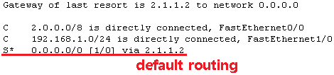

- 통신확인

  - 나머지 routing 설정은 마저 끝낸후 통신확인

    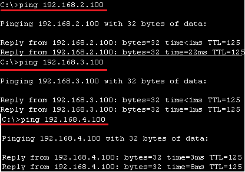

    > R1에서 default routing 한번만 설정해도 전부 통신이 잘 되는것을 확인 할 수 있다 

## Loopback interface

- Loopback interface

  - 여러개의 라우터를 동시에 테스트 할때 많이 사용

  - 매번 네트워크를 만들어서 라우팅 테이블 만들기가 불편하니까 논리적으로 인터페이스 생성

    ```
    Router(config)#int loopback 0
    Router(config-if)#ip address 192.168.22.254 255.255.255.0
    Router#show ip interface brief
    ```

    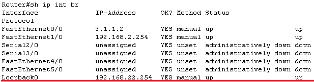

<br>

[맨 위로 이동하기](#){: .btn .btn--primary }{: .align-right}
