## 🗂️VLAN (Virtual LAN)

- <span style="color:blue"><b>VLAN (Virtual LAN)</b></span>

  - L2 Switch부터 제공되는 가상의 LAN을 구성하는 기능

  - <span style="color:red"><b>논리적인 네트워크(Broadcast Domain) 분리 기술</b></span>

    > 물리적인 분할 → 물리적인 장비(Router)를 통한 분리

  - 식별자(Number)를 이용하여 Network이름을 지정함

  - Switch Port에 VLAN에 대한 정보를 설정 함

    > 지정된 port로 전달되는 트래픽에 추가정보(VLAN)를 Tagging 함

- <span style="color:blue"><b>VLAN 사용 목적</b></span>

  - <span style="color:red"><b>네트워크(Broadcast Domain) 분리</b></span>

  - Broadcast Traffic 축소

  - 보안

    > 네트워크가 분리되므로 정책을 통해 허용된 대상만 접근하게 함

  - 유연성

    > 기존 topology의 큰 물리적인 변화가 없어도 네트워크 구조를 변경할 수 있음

## 🗂️VLAN 할당 방식

- <span style="color:blue"><b>Static VLAN </b></span>
  
  - <span style="color:red"><b>관리자가 직접 모든 포트에 VLAN에 관련된 정보를 설정</b></span>
  - 기본적인 설정 방식(권장)
  - 장점 : 한 장비의 문제가 전체 네트워크에 영향을 미치지 않음
  - 단점 : 모든 관리와 설정을 관리자가 직접 수행해야 함
  
- <span style="color:blue"><b>Dynamic VLAN</b></span>

  - VLAN 할당을 수행하는 <span style="color:red"><b>외부 장비(프로그램) 등을 사용하여 VLAN에 관련된 정보를 자동으로 설정</b></span>

    > VMPS(VLAN Membership Policy Server)

    > 장비의 MAC 주소 기반으로 해당 포트에 할당할 VLAN정보를 미리 구성함 

  - 장점

    > VLAN을 사용하는 장비가 접속되었을 때 자동으로 VLAN 정보가 설정 됨

    > 이동이 잦은 업무 환경일 경우 효율적임

  - 단점

    > VMPS에 장애가 발생하면 VLAN을 이용하는 모든 네트워크 서비스에 장애가 발생 함

## 🗂️VLAN PORT MODE

- <span style="color:blue"><b>VLAN PORT MODE</b></span>
  
  - VLAN이 설정되는 Switch port의 동작 방식을 결정함
  
- <span style="color:blue"><b>Access Port Mode</b></span>

  - 하나의 VLAN 통신을 지원하는 port 

    > access mode로 동작하는 port에 vlan 번호를 할당 함

  - End device와 직접 연결되는 port

  - VLAN 정보를 제거하고 데이터 전송

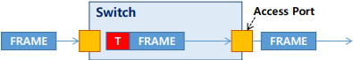


- <span style="color:blue"><b>Trunk Port Mode</b></span>

  - 여러 VLAN 트래픽이 전달될 수 있음

    > 설정을 통해 허용하는 VLAN 트래픽을 제한할 수 있음

  - Switch간/Router와 연결되는 port에 설정하는 mode

    > 동일한 Tagging Protocol이 설정되어야 함

  - VLAN 정보를 데이터와 함께 전송

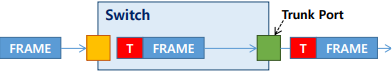

## 🗂️VLAN Tagging Protocol

- <span style="color:blue"><b>TAG</b></span>

  - Switch를 통해 전달되는 데이터(Frame)에 VLAN정보를 추가하는 동작

  - 종류

    > 표준 → IEEE 802.1q (dot1q)(권장)

    > cisco 전용 → ISL

- <span style="color:blue"><b>802.1q</b></span>
  
  - 프레임 헤더의 Source Address 와 Type 필드 사이에 4byte VLAN정보 필드를 추가 함
  - Native VLAN을 지원 함 → Tagging하지 않는 VLAN

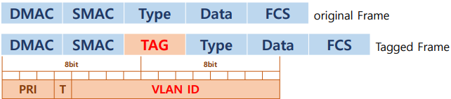

- <span style="color:blue"><b>ISL</b></span>

  - Cisco에서 개발한 Trunking Protocol

  - 원본 프레임의 변형 없이 Encapsulation을 통해 VLAN정보를 덧붙임

    > Encapsulation 동작을 수행하는 전용의 chipset을 사용 → ASIC(Application Specific Integrated  Circuits)

  - 확장 VALN, Native VLAN을 지원하지 않음

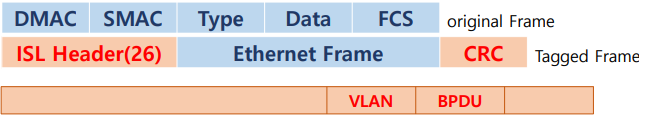

## 🗂️Native VLAN

- <span style="color:blue"><b>Native VLAN</b></span>

  - VLAN 정보가 없는 프레임을 전송하는 VLAN

    > Tagging 되지 않은 모든 프레임을 Switch에 설정된 Native VLAN의 소속으로 간주 함

    > 프레임을 Tagging 하지 않고 Native VLAN으로 지정된 Port로 전달 함 

  - Tag없이 통신하는 VLAN

  - VLAN을 구성한 모든 Switch의 Native VLAN의 번호가 일치해야 함 → Looping 발생

- <span style="color:blue"><b>사용 목적</b></span>

  - Switch와 Hub가 같이 사용되는 통신 환경에서 호환성을 제공

    > Switch-Hub-Switch연결 구간에 Hub에 연결된 사용자는 Untag되지 않은 프레임을 전달 받음

    > VLAN tag를 인식하지 못하는 host는 Ethernet Frame의 형식오류라 인식하고 데이터를 폐기함

    > Tag없이 통신이 가능한 VLAN이 필요하게 됨

  - Voice 트래픽 전달

    > Tag, Untag의 작업의 부하를 줄여서 데이터 전달 속도를 향상 함

## 🗂️Access port mode 실습

- <span style="color:blue"><b>구성도</b></span>

  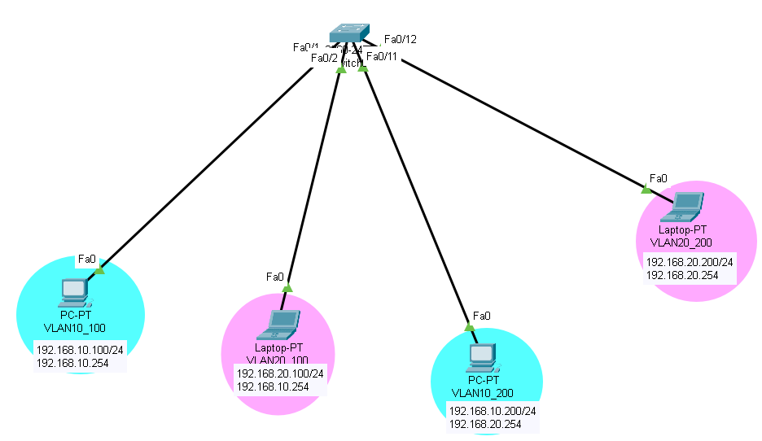

- <span style="color:blue"><b>설정하기</b></span>

  - VLAN 생성

    ```
    Switch(config)#vlan 10
    Switch(config-vlan)#exit
    Switch(config)#vlan 20
    Switch(config-vlan)#exit
    Switch#sh vlan brief 
    ```

    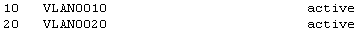

  - switchport 에서 VLAN 을 지정

    ```
    Switch(config)#int f0/1
    Switch(config-if)#switchport mode access 
    Switch(config-if)#switchport access vlan 10
    
    Switch(config-if)#int f0/2
    Switch(config-if)#switchport mode access 
    Switch(config-if)#switchport access vlan 20
    
    Switch(config)#int f0/11
    Switch(config-if)#switchport mode access 
    Switch(config-if)#switchport access vlan 10
    
    Switch(config-if)#int f0/12
    Switch(config-if)#switchport mode access 
    Switch(config-if)#switchport access vlan 20
    
    Switch#sh vlan brief
    ```

    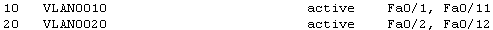

## 🗂️Trunk port mode 실습

- <span style="color:blue"><b>Trunk port mode 의 필요성 </b></span>
  - 매번 VLAN 이 증가할때 마다 링크를 늘리는것은 무리이므로 여러개의 VLAN frame  이 동시에 이동할수 있도록 하는것
- <span style="color:blue"><b>구성도</b></span>

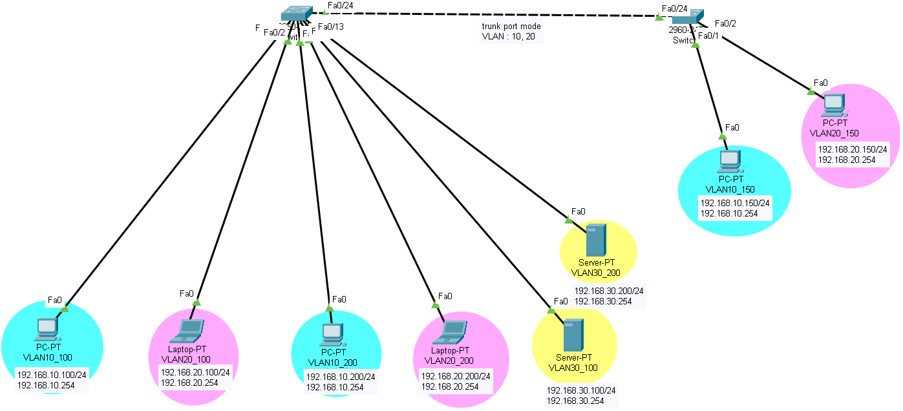

- <span style="color:blue"><b>설정하기</b></span>

  - 왼쪽 스위치

    ```
    SW_L(config-if)#switchport mode trunk
    SW_L(config-if)#switchport trunk allowed vlan 10,2
    ```

  - 오른쪽 스위치

    ```
    SW_R(config)#int f0/24
    SW_R(config-if)#switchport mode trunk
    SW_R(config-if)#switchport trunk allowed vlan 10,20
    ```

  - trunk 정보 확인

    ```
    SW_R#sh interfaces trunk
    ```

    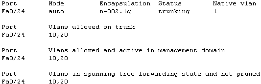

  - access port 정보 확인

    ```
    SW_R#sh interfaces f0/1 switchport
    ```

    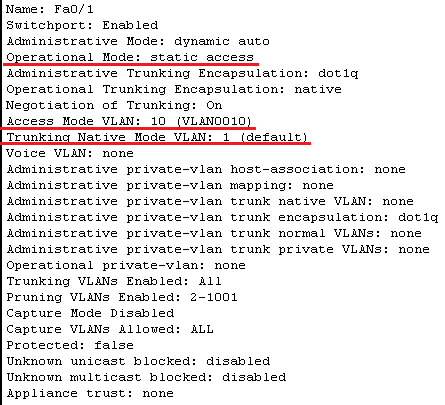

  - trunk port 정보 확인

    ```
    SW_R#sh interfaces f0/24 switchport
    ```

    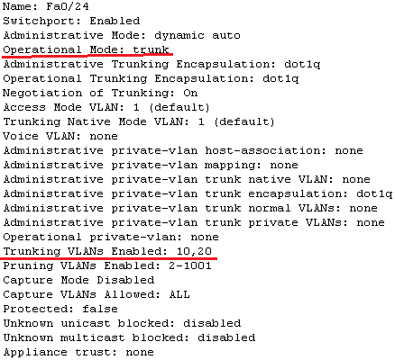

## 🗂️Native VLAN 실습

- <span style="color:blue"><b>구성도</b></span>

  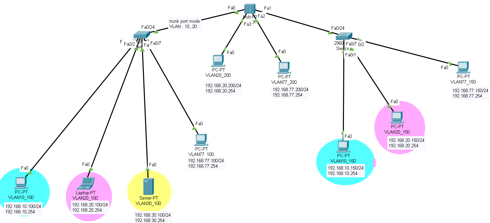

- <span style="color:blue"><b>설정하기</b></span>

  - 왼쪽 스위치

    ```
    SW_L(config)#int f0/7
    SW_L(config-if)#switchport mode access 
    SW_L(config-if)#switchport access vlan 77
    % Access VLAN does not exist. Creating vlan 77   -- 없으면 VLAN  자동생성되면서 등록
    
    SW_L(config-if)#switchport trunk native vlan 77
    SW_L(config-if)#switchport trunk allowed vlan add 77
    ```

  - 오른쪽 스위치

    ```
    SW_R(config)#int f0/24
    SW_R(config-if)#switchport mode accessL
    SW_R(config-if)#switchport access vlan 77
    % Access VLAN does not exist. Creating vlan 77   -- 없으면 VLAN  자동생성되면서 등록
    
    SW_R(config-if)#switchport trunk native vlan 77
    SW_R(config-if)#switchport trunk allowed vlan add 77
    ```

  - trunk 정보 확인

    ```
    SW_R#sh interfaces trunk
    ```

    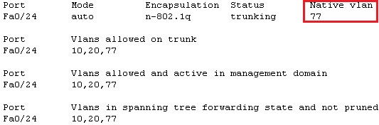

## 🗂️Inter VLAN

- <span style="color:blue"><b>Inter VLAN</b></span>

  - VLAN으로 분리된 Broadcast Domain간 통신을 가능하게 함

    > Multi Layer Switch 또는 Routing를 이용하여 VLAN을 Routing 하는 기술

  - 조건 → Routing기능을 지원하는 장비가 필요 함

-  <span style="color:blue"><b>Inter VLAN 방식</b></span>

  - Router를 이용한 Inter VLAN

    > 물리적인 인터페이스를 논리적으로 나눈 sub interface를 이용하여 설정

    > Sub interface 에는 Trunk 설정이 가능함 → 하나의 VLAN gateway설정이 가능 함

  - Multilayer Switch를 이용한 Inter VLAN

    > L3 기능이 지원 가능한 Switch를 이용해 Routing 수행 

    > SVI(Switch Virtual Interface) 

    ​	＞VLAN에 논리적으로 연결되는 가상의 Interface를 생성하여 통신을 지원하는 방식

    ​	＞내부 VLAN의 Gateway설정에 사용 됨

    > Routed port

    ​	＞물리적인 L2 Port에 L3 기능을 활성화 하여 통신을 지원하는 방식

    ​	＞Multilayer Switch간을 연결하거나 Router, 서버와의 연결에 사용 됨

## 🗂️Inter VLAN 실습

- <span style="color:blue"><b>구성도</b></span>

  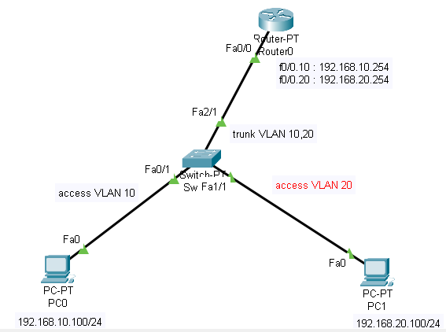

- <span style="color:blue"><b>설정하기</b></span>

  - VLAN 설정

    ```
    L2_SW1(config)#vlan 10
    L2_SW1(config)#vlan 20
    
    L2_SW1#sh vlan br
    ```

    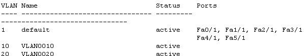

  - access mode

    ```
    L2_SW1(config)#int f0/1
    L2_SW1(config-if)#switchport mode access
    L2_SW1(config-if)#switchport access vlan 10
    
    L2_SW1(config-if)#int f1/1
    L2_SW1(config-if)#switchport mode access
    L2_SW1(config-if)#switchport access vlan 20
    
    L2_SW1#sh vlan br
    ```

    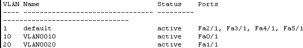

  - router 서브인터페이스 설정

    ```
    R1(config)#int f0/0.10
    R1(config-subif)#encapsulation dot1q 10
    R1(config-subif)#ip addr 192.168.10.254 255.255.255.0
    
    R1(config)#int f0/0.20
    R1(config-subif)#encapsulation dot1Q 20
    R1(config-subif)#ip addr 192.168.20.254 255.255.255.0
    
    R1(config-subif)#do sh ip int br
    ```

    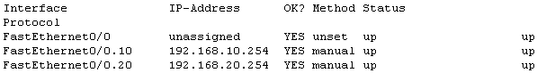

  - switch port에 trunk 설정

    ```
    L2_SW1(config)#int f2/1
    L2_SW1(config-if)#switchport mode trunk
    L2_SW1(config-if)#switchport trunk allowed vlan add 10
    L2_SW1(config-if)#switchport trunk allowed vlan add 20
    
    L2_SW1#sh interfaces trunk
    ```

    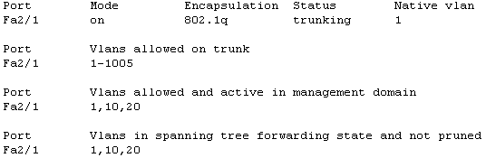

- <span style="color:blue"><b>test</b></span>

  - ping 192.168.10.100 -> 192.168.10.254

    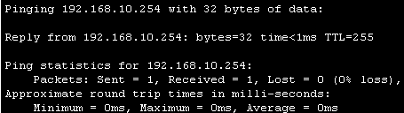

  - ping 192.168.10.100 -> 192.168.20.254

    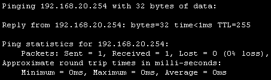

  - ping 192.168.10.100 -> 192.168.20.100

    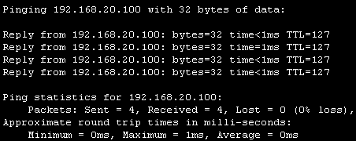

<br>

[맨 위로 이동하기](#){: .btn .btn--primary }{: .align-right}