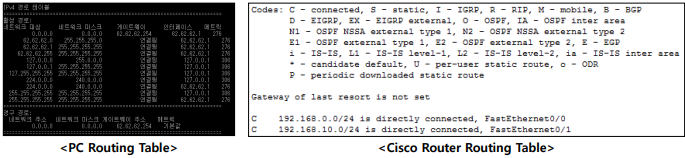
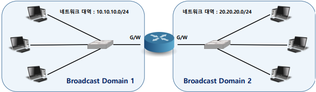
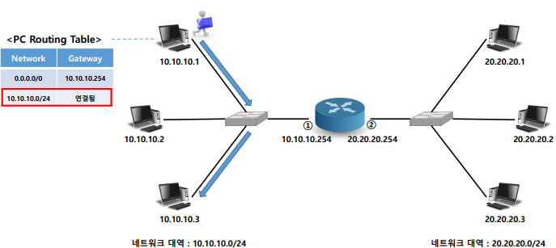
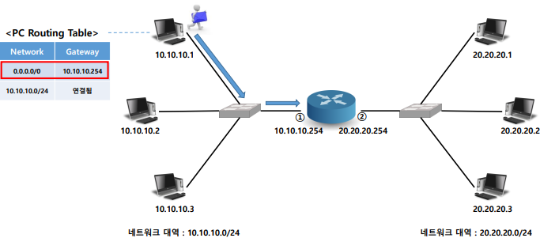
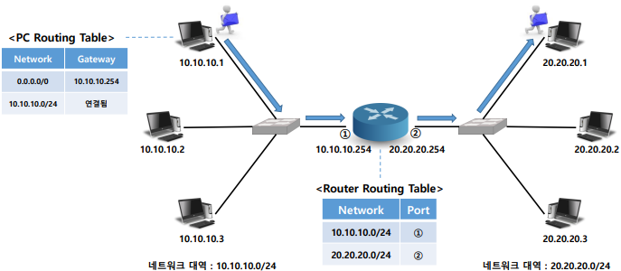

## 🗂️Router

- <b>Routing </b>

  - 최적의 경로를 결정하여 목적지까지 전송하는 일련의 과정 

  - Routing Algorithm 을 이용하여 최적 경로를 결정

  - 최적의 경로를 학습하여 Routing Table에 기록 →<b> 경로(route) 학습</b>

  - <b>Routing Table 정보를 이용하여 데이터를 다음 경로로 전달</b>(경로 정보가 없으면 Packet을 폐기함)

- <b>Routing Table </b>
  - <b>Routing 경로를 기록</b>하기 위해 사용되는 Table 
  - Packet의 목적지가 결정되면 가장먼저 Routing Table을 확인
  - 목적지 IP 주소가 해당되는 Network 영역을 Routing Table에서 찾아 설정된 경로로 내보내 줌

- <b>Router</b>

  - <b>Routing을 통해 최적의 경로를 찾아 목적지로 전달될 수 있도록 연결된 다음 장비로 전송해 주는 장비</b>

  - 결정된 경로를 Routing Table에 기록하여 관리

  - Broadcast Domain을 줄여주는 역할 

    > Router는 기본적으로 Broadcast 데이터를 차단함

  - 네트워크영역을 구분해 주는 역할

  - G/W(Gateway) : 네트워크 영역의 통로(다른 네트워크와 연결된 장비)

## 🗂️Router 통신 방식

- 목적지가 정해지면 PC의 Routing Table 에서 경로 확인
  - 같은 네트워크 영역인 경우 해당 목적지로 전송

- 목적지가 정해지면 PC의 Routing Table 에서 경로 확인 
  - 다른 네트워크 영역인 경우 Gateway로 전송

- Router로 데이터가 들어오면 Routing Table에서 목적지 네트워크 확인
  - 없으면 데이터 폐기
  - 있으면 해당 경로로 데이터 전송

## 🗂️Router 분류

- Fixed 형 Router

  - 기본 인터페이스가 제공되고 인터페이스를 더 이상 확장할 수 없는 Router

- Module 형 Router 

  - 기본 인터페이스 외 추가로 인터페이스를 확장할 수 있는 Router

  - Module : Router에 추가로 장착할 수 있게 만들어진 확장형 장치

  - Slot : Module 을 장착할 수 있는 공간

## 🗂️명칭

- <b>Module 명칭</b>

  - Module 의 Size 와 종류를 알 수 있게 명칭을 지정 

    

    

    ① <b>Module Size </b>

    > NM : Size가 큰 Module 

    > WIC : Size 가 작은 Module 

    ② <b>장착된 인터페이스 개수 </b>

    ③ <b>인터페이스 타입 </b>

    > E : Ethernet Interface

    > T : Serial Interface

- <b>Interface 명칭</b>

  - 장비에 부착된 인터페이스를 구분하기 위한 이름 또는 번호

    

    ① <b>Interface Type</b>

    > Ethernet , FastEthernet , Serial 등.. 

    ②<b> Slot Number</b>

    > Module 형 Router의 Slot 번호 (Fixed 형은 생략 가능)

    ③ <b>Module Number</b>

    > Module 내 추가 확장 Slot이 있는 경우 사용 (없는 경우 생략 가능)

    ④<b> Interface Number</b>

    > Interface 번호

    <b>*번호 부여 규칙 : 0번부터 부여하며 오른쪽 -> 왼쪽 , 아래 -> 위 순으로 부여</b>

- <b>Router Interface 종류</b>
  - Console Port : Console Cable을 이용해 PC와 직접 연결하여 Router를 근거리에서 관리
  - Auxiliary Port : 모뎀을 통해 연결하여 Router를 원거리에서 관리 
  - Ethernet Port : LAN(UTP Cable)을 연결하여 사용하기 위한 Port 
  - Serial Port : WAN(Serial Cable)을 연결하여 사용하기 위한 Port

- <b>Router Memory </b>

  - <b>ROM </b>

    > 부팅에 필요한 Bootstrap 정보가 저장되어 있음 

  - <b>Flash</b>

    > HDD 역할의 메모리  운영체제(IOS)를 저장하는 용도로 사용

  - <b>RAM </b>

    > 휘발성 메모리 

    > Running-config (Active Config) 설정 파일에 설정한 내용을 임시로 저장 

    > 시스템 자체에서 관리되는 메모리 

  - <b>NVRAM</b> 

    > 비 휘발성 메모리

    > Startup-config 설정 파일을 이용해 설정한 내용을 지속 저장

    > 관리자가 직접 저장해 줘야 함

 

[맨 위로 이동하기](#){: .btn .btn--primary }{: .align-right}