## 🗂️Dynamic Routing

- <span style="color:blue"><b>Dynamic Routing</b></span>
  - 사용자에 의해 지정된 Protocol로 같은 프로토콜이 설정된 장비간 정보를 주고받아서 최적의 경로를 선택 하고 관리하는 방식
  - 네트워크 변화에 대해 실시간으로 반응 함
  - Background Traffic의 발생 비율이 높음 → 서비스에 부하를 줄 수 있음
  - 일반적으로 WAN 또는 LAN 내부 Routing(8~10대 이상)을 위해 설정

## 🗂️Dynamic Routing - RIP

- <span style="color:blue"><b>RIP (Routing Information Protocol)</b></span> 

  - 동일한 Protocol을 사용하는 인접장비와 <span style="color:red"><b>Connected Network 정보를 교환</b></span> 함

    > Multicast Group → 224.0.0.9 

  - <span style="color:red"><b>최단 거리(Hop Count) 기준으로 경로를 선택</b></span>

    > Hop Count 를 Metric 값으로 사용 

  - Version 1

    > Classful Routing → <b>네트워크주소</b>와 <b>Hop count</b>를 전달 함 

  - Version 2

    > Classless Routing → <b>네트워크주소</b>와 <b>서브넷 마스크</b>와 <b>Hop count</b>를 함께 전달 함

  - 30초 주기로 경로 정보를 교환하기 때문에 변화가 적용되는 속도(Convergence Time)가 느림

  - 경로 계산 알고리즘 → Bellman-Ford(B-F) Algorithm 

  - 네트워크 정보를 학습한 인터페이스 방향으로 동일한 네트워크 정보를 재 전달하지 않음 → Split Horizon

- <span style="color:blue"><b>RIPv2 설정</b></span>

  - Routing Protocol 지정

    ```
    R1(config)# router rip
    ```

  - 광고할 네트워크 정보 설정 

    ```
    R1(config-router)# network [네트워크 이름]
    ```

  - RIP version 2 설정 

    ```
    R1(config-router)# version 2
    ```

  - Classless 방식으로 광고하도록 설정

    ```
    R1(config-router)# no auto-summary
    ```

  - (Option) 불필요한 Interface로 광고하지 않도록 설정

    ```
    R1(config-router)# passive-interface [인터페이스 이름]
    ```

  - (Option) Default Gateway 광고

    ```
    R1(config-router)# default-information originate
    ```

    

## 🗂️RIP 실습

- <span style="color:blue"><b>구성도</b></span>

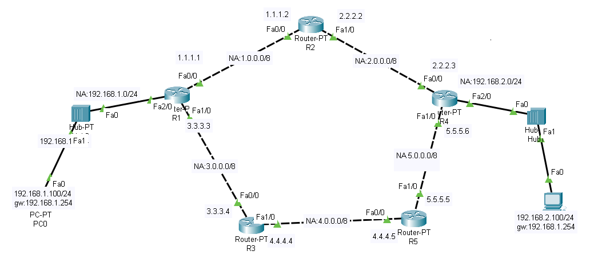

- <span style="color:blue"><b>RIP</b></span>

  - R1

    ```
    R1(config)#router rip
    R1(config-router)#network 1.0.0.0
    R1(config-router)#network 3.0.0.0
    R1(config-router)#network 192.168.1.0
    ```

  - R2

    ```
    R2(config)#router rip 
    R2(config-router)#network 1.0.0.0
    R2(config-router)#network 2.0.0.0
    ```

  - R3

    ```
    R3(config)#router rip 
    R3(config-router)#network 3.0.0.0
    R3(config-router)#network 4.0.0.0
    ```

  - R4

    ```
    R4(config)#router rip 
    R4(config-router)#network 5.0.0.0
    R4(config-router)#network 2.0.0.0
    R4(config-router)#network 192.168.2.0
    ```

  - R5

    ```
    R5(config)#router rip 
    R5(config-router)#network 5.0.0.0
    R5(config-router)#network 4.0.0.0
    ```

- <span style="color:blue"><b>routing table 확인</b></span>

  ```
  R5#show ip route
  ```

  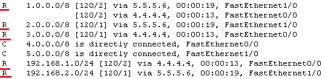

  > 나머지도 반복하여 확인

- <span style="color:blue"><b>RIP 버전 2</b></span>

  ```
  R1(config)#router rip 
  R1(config-router)#version 2
  R1(config-router)#no auto-summary
  ```

  > 나머지 R2,R3,R4,R5에 반복하여 설정

- <span style="color:blue"><b>passive-interface</b></span>
  
  - 필요없는 interface로 광고하는 것을 막는 기
  
    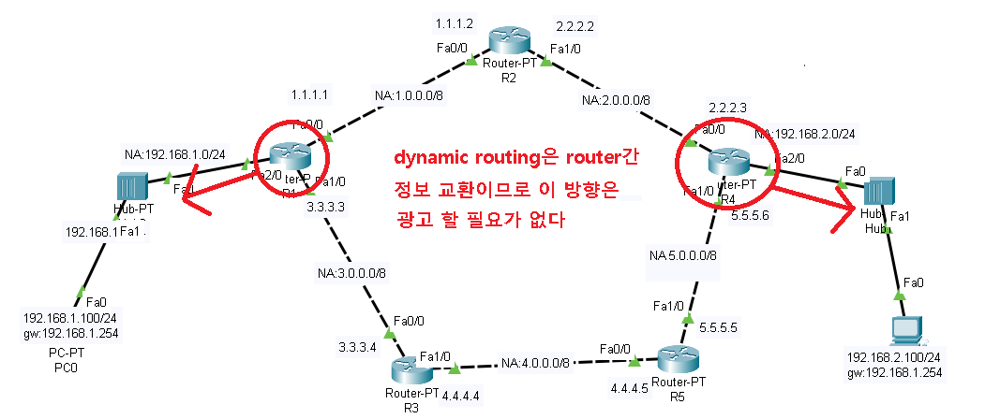
  
    ```
    R1(config)#router rip
    R1(config-router)#passive-interface fastEthernet 2/0
    R4(config)#router rip 
    R4(config-router)#passive-interface fastEthernet 2/0
    ```
  
    
  
- <span style="color:blue"><b>RIP 정보 확인</b></span>

  ```
  R1#sh ip protocols
  ```

  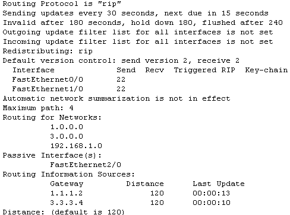

  ```
  R1#sh ip rip database
  ```

  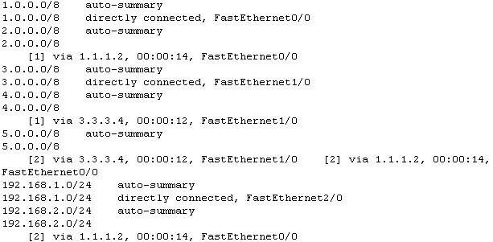


## 🗂️OSPF

- <span style="color:blue"><b>OSPF (Open Shortest Path First Protocol) (AD : 110)</b></span>
  - IETF 표준 Routing Protocol
  - 동일한 Protocol을 사용하는 인접장비와 <span style="color:red"><b>Link 상태 정보(interface 정보)를 교환</b></span> 함
  - Multicast Group → 224.0.0.5, 224.0.0.6(DR/BDR)
  - <span style="color:red"><b>빠른 속도(Link State) 기준으로 경로를 선택</b></span>
  - 모든 장비의 Interface상태를 Topology Database에 기록한 뒤 각 Line에 드는 비용(Cost) 값을 계산하 여 최적 경로 결정하고 Routing Table에 기록
  - Metric → Cost(Bandwidth, 전송속도) → 속도를 기준으로 경로를 선택 함
  - 큰 범위의 네트워크에서 사용 함 → 정보 교환의 거리 제한이 없음
  - 상태변화가 발생될 때마다 상태를 광고하기 때문에 수렴시간이 빠름
  - 부하가 많이 발생하는 단점을 보완하기 위해 영역을 나누어 관리
  - 계층적인 구조를 가짐

- <span style="color:blue"><b>OSPF의 계층적인 구조</b></span>
  - Routing 정보를 교환할 영역을 구분
  - Routing 동작을 위해 발생되는 back ground traffic의 부하를 줄임

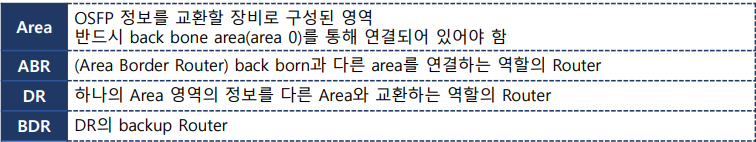

- <span style="color:blue"><b>Single Area OSPF</b></span>
  - Back born area만 존재하는 OSPF

- <span style="color:blue"><b>Multi Area OSPF </b></span>
  - Back born area에 하위 area가 계층적인 구조로 연결된 OSPF

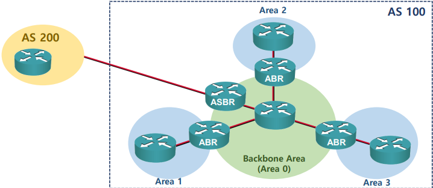

- <span style="color:blue"><b>OSPF 동작 방식</b></span>
  1. 모든 이웃에 Hello 메시지를 보내서 이웃 정보를 등록(주기 2초) 
  2. LSA(Link-State Advertisement) 메시지를 보내 Interface 상태정보를 광고 
  3. 전체 영역의 LSA 메시지를 받아 Database에 기록
  4. SPF Algorithm을 이용해 각 라인의 Cost 값 계산
  5. 가장 적은 Cost 값을 가진 경로를 Routing Table에 등록

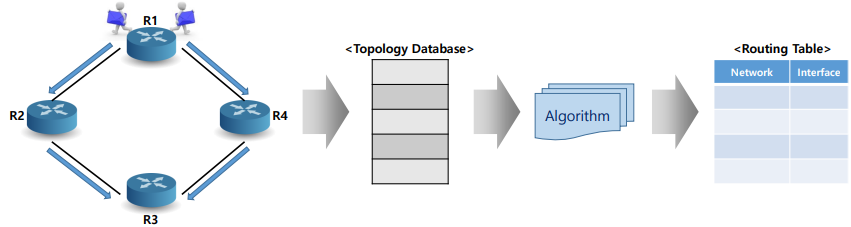

- <span style="color:blue"><b>OSPF 설정</b></span>

  - Routing Protocol 선택  process-id → 한 Router에서 OSPF를 다중으로 동작시킬 때 각 OSPF를 구별하기 위한 식별 값

    ```
    R1(config)# router ospf <process-id>
    ```

  - 교환할 Link(interface)정보 설정  area-id : 하나의 OSPF 안에서 영역을 구분하기 위한 정보

    ```
    R1(config-router)# network <광고할 interface IP | Network> <Wildcard Mask> area <area-id>
    ```

  - (Option) 정보를 전달하지 않을 인터페이스 설정

    ```
    R1(config-router)# passive-interface <인터페이스 이름>
    ```

  - (Option) Default Gateway 광고

    ```
    R1(config-router)# default-information originate [always]
    ```

## 🗂️Wildcard Mask

- <span style="color:blue"><b>Wildcard Mask</b></span>

  - 특정 IP주소나 네트워크 범위를 추출하기 위해 사용하는 필터 값

  - Subnet Mask로 표현할 수 없는 부분을 나타내기 위해 사용

    > Wildcard mask의 bit는 연속되지 않아도 됨

  - <span style="color:red"><b>Bit 값이 0인 부분은 정해진 Bit 값과 반드시 일치해야 함</b></span> 

  - <span style="color:red"><b>Bit 값이 1인 부분은 일치하지 않아도 됨(0 또는 1이 될 수 있음)</b></span>

    

  - 예) 짝수 IP 만 추출하기 위한 Wildcard Mask 

    0000 0000 . 0000 0000 . 0000 0000 . <u>1111 111</u>0

    > Subnet Mask로는 표현할 수 없음 


- ex1) 200.200.200.0  와일드카드 마스크 0.128.0.0 에 해당하는 주소를 작성

  ```
  11001000.(1)1001000.11001000.00000000	200.200.200.0	NA
  
  11001000.(0)1001000.11001000.00000000	200.72.200.0	
  11001000.(1)1001000.11001000.00000000	200.200.200.0	
  
  00000000.(1)0000000.00000000.00000000	0.128.0.0	WM
  ```

  

- ex2) 100.100.100.100 와일드카드 마스크 0.0.6.0 에 해당하는 주소를 작성

  ```
  01100100.01100100.01100(10)0.01100100 100.100.100.100 
  
  01100100.01100100.01100(00)0.01100100 
  01100100.01100100.01100(01)0.01100100 
  01100100.01100100.01100(10)0.01100100 
  01100100.01100100.01100(11)0.01100100 
  
  00000000.00000000.00000(11)0.00000000 0.0.6.0 WM
  ```

  

- ex3) 100.100.100.100 와일드카드 마스크 0.0.129.0 에 해당하는 주소를 작성

  ```
  01100100.01100100.(0)110010(0).01100100 100.100.100.100 
  
  01100100.01100100.(0)110010(0).01100100 
  01100100.01100100.(0)110010(1).01100100
  01100100.01100100.(1)110010(0).01100100 
  01100100.01100100.(1)110010(1).01100100  
  
  00000000.00000000.(1)000000(1).00000000 0.0.129.0 WM
  ```

  

- <span style="color:blue"><b>Subnet Mask</b></span> <span style="color:red"><b>vs</b></span> <span style="color:blue"><b>WIldcard Mask</b></span>

  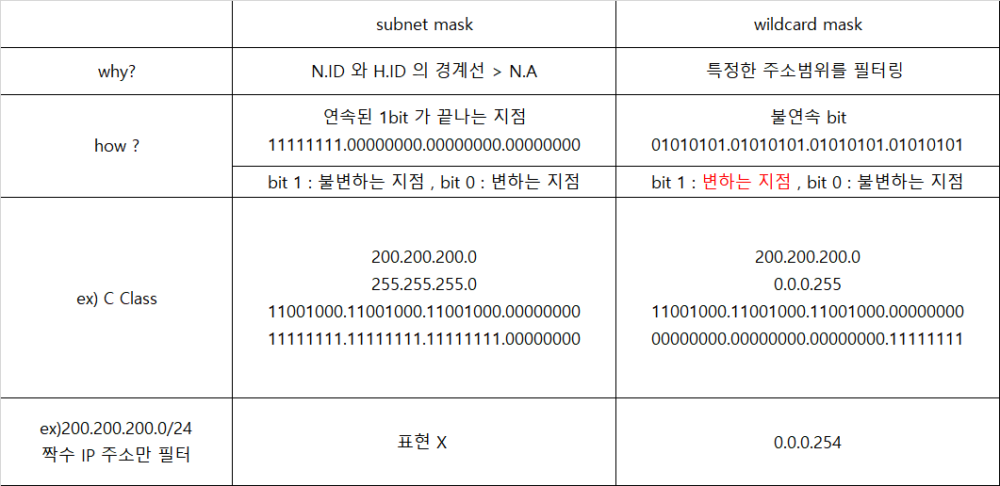

  

## 🗂️OSPF 실습

- <span style="color:blue"><b>구성도</b></span>

  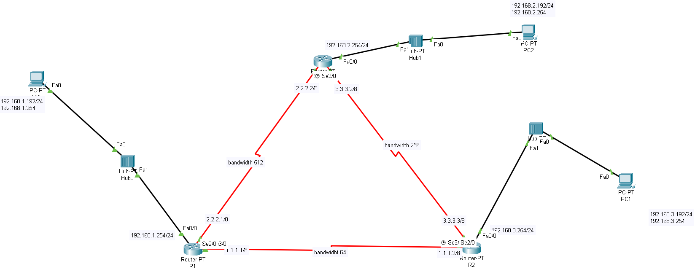

- <span style="color:blue"><b>설정</b></span>

  - R0

    ```
    Router0(config)#router ospf 1  -> 여러개의 ospf 를 동시에 동작
    Router0(config-router)#passive-interface fastEthernet 0/0
    Router0(config-router)#network 2.2.2.2 0.0.0.0 area 0
    Router0(config-router)#network 3.3.3.2 0.0.0.0 area 0
    Router0(config-router)#network 192.168.2.254 0.0.0.0 area 0
    ```

  - R1

    ```
    Router1(config)#router ospf 1
    Router1(config-router)#passive-interface fastEthernet 0/0
    Router1(config-router)#network 192.168.1.254 0.0.0.0 area 0
    Router1(config-router)#network 2.2.2.1 0.0.0.0 area 0
    Router1(config-router)#network 1.1.1.1 0.0.0.0 area 0
    ```

  - R2

    ```
    Router2(config)#router ospf 1
    Router2(config-router)#passive-interface fastEthernet 0/0
    Router2(config-router)#network 1.1.1.2 0.0.0.0 area 0
    Router2(config-router)#network 3.3.3.3 0.0.0.0 area 0
    Router2(config-router)#network 192.168.3.254 0.0.0.0 area 0
    ```

    

- <span style="color:blue"><b>OSPF 설정 확인</b></span>

  -  Routing Protocol 정보 확인

    ```
    R1# show ip protocols
    ```

  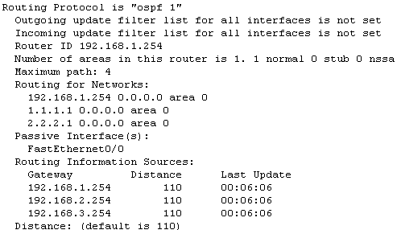

  - Neighbor Table 정보 확인

    ```
    R1# show ip ospf neighbor
    ```

    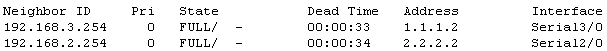

    

- <span style="color:blue"><b>Routing 경로 추적</b></span>

  

```
Command Prompt
C:\>tracert 192.168.3.192
```

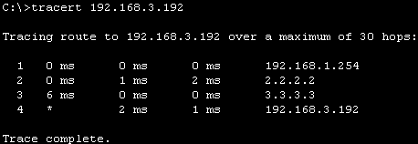

## 🗂️OSPF 계층구조 실습

- <span style="color:blue"><b>구성도</b></span>

  

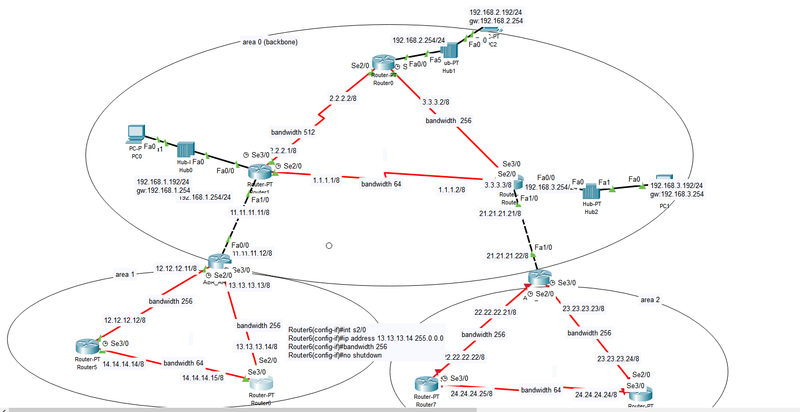

- <span style="color:blue"><b>설정</b></span>

  -166122104938720.png)

  - ABR_AREA1(경계선 router)

    ```
    ABR_AREA1(config)#router ospf 1
    ABR_AREA1(config-router)#network 11.11.11.12 0.0.0.0 area 0
    ABR_AREA1(config-router)#network 13.13.13.13 0.0.0.0 area 1
    ABR_AREA1(config-router)#network 12.12.12.11 0.0.0.0 area 1
    ABR_AREA1#sh run (show running-config)
    ```

    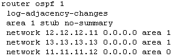

  - Router5

    ```
    Router5(config)#router ospf 1
    Router5(config-router)#network 12.12.12.12 0.0.0.0 area 1
    Router5(config-router)#network 14.14.14.14 0.0.0.0 area 1
    Router5# sh run
    ```

    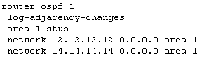

  - Router6

    ```
    Router6(config)#router ospf 1
    Router6(config-router)#network 13.13.13.14 0.0.0.0 area 1
    Router6(config-router)#network 14.14.14.15 0.0.0.0 area 1
    ```

    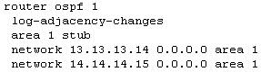

- <span style="color:blue"><b>Routing table 축약</b></span>

  - ABR(area 경계 라우터) - 축약 안함

    ```
    ABR_AREA1(config)#router ospf 1
    ABR_AREA1(config-router)#area 1 stub no-summary
    ```

    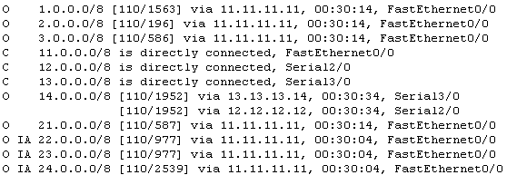

  - IR(area 내부 라우터) - 축약함

    ```
    Router5(config)#router ospf 1
    Router5(config-router)#area 1 stub
    
    Router6(config)#router ospf 1
    Router6(config-router)#area 1 stub
    ```

    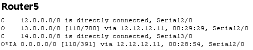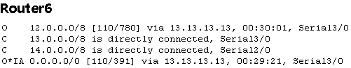


<br>

[맨 위로 이동하기](#){: .btn .btn--primary }{: .align-right}
